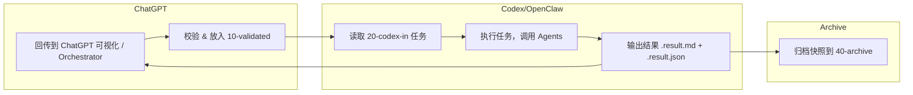

# TVT-OpenClaw-Agent 双轨文件流 + ChatGPT/Codex 闭环流程

## 总体说明
这份文档说明了 TVT Agent 项目中 ChatGPT 与 Codex/OpenClaw 双轨文件流的设计，包含 Markdown 人类可读文档、JSON envelope 交接、任务驱动、结果回传及归档机制。

## 流程图


## 流程说明

### 1. ChatGPT 生成文档
- 输出 Markdown (`00-source/*.md`) 供人类审阅
- 输出 JSON envelope (`00-source/*.envelope.json`) 供 Codex 消费
- 包含 block 类型：heading, paragraph, list, code, mermaid, table

### 2. 校验阶段
- 检查必填字段完整性：project, thread, document metadata
- 校验 block 类型合法
- 校验代码块和 Mermaid 块闭合
- 校验通过后放入 `10-validated/`

### 3. Codex 任务生成
- 建立 `.task.json` 描述文件放入 `20-codex-in/`
- 内容示例：
```json
{
  "task_type": "ingest_document",
  "input_envelope": "../10-validated/tvt-openclaw-agent-dualtrack-v1.envelope.json",
  "expected_outputs": [
    "../30-codex-out/tvt-openclaw-agent-dualtrack-v1.result.md",
    "../30-codex-out/tvt-openclaw-agent-dualtrack-v1.result.json"
  ]
}
```

### 4. Codex 执行
- 读取 task.json
- 消费 envelope 执行 Agents 调用
- 输出两份结果：人类可读 `.result.md` + 机器可解析 `.result.json`
- `.result.json` 增加 execution metadata：codex_task_id, executed_at, status, orchestrator

### 5. ChatGPT 消费结果
- 读取 `.result.json` 生成对话渲染
- 可以嵌入对话或 Orchestrator 控制循环
- 支持多轮 Agent 调度及策略迭代

### 6. 归档
- 完整快照存入 `40-archive/`
- 保留每次任务输入、输出和校验版本

## 建议目录结构
```
docs/
  handoff/
    projects/tvt/
      manifest.json
      threads/openclaw-agent-dualtrack/
        00-source/
          tvt-openclaw-agent-dualtrack-v1.md
          tvt-openclaw-agent-dualtrack-v1.envelope.json
        10-validated/
          tvt-openclaw-agent-dualtrack-v1.envelope.json
        20-codex-in/
          tvt-openclaw-agent-dualtrack-v1.task.json
        30-codex-out/
          tvt-openclaw-agent-dualtrack-v1.result.md
          tvt-openclaw-agent-dualtrack-v1.result.json
        40-archive/
          tvt-openclaw-agent-dualtrack-v1.snapshot.md
```
