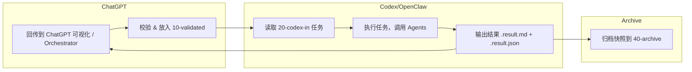

# TVT OpenClaw 当前线程完整备份 对话完整备份

## 元数据
- session_id: `019cc635-722d-7e13-ac56-26686ac3fe22`
- session_file: `/Users/yannian/.codex/sessions/2026/03/07/rollout-2026-03-07T10-52-02-019cc635-722d-7e13-ac56-26686ac3fe22.jsonl`
- workspace: `/Users/yannian/ainur`
- exported_at: `2026-03-08T20:06:16+08:00`

## 说明
这是一份基于 Codex 本地 session JSONL 导出的完整线程备份。
内容按时间顺序保留用户消息、助手消息、commentary、工具调用和工具输出，便于本地归档或拖回 ChatGPT 做宏观讨论。

## 时间顺序记录
### 2026-03-07T02:55:02.510Z 用户 / message

我想你找个或者做个对话记录整理备份的skill，把我们的对话内容按照时间顺序持续写入备份到一个用“线程名字”“日期”定名的文档当中，供我自己查找或者共享给别人，帮我设计和提出执行方案

### 2026-03-07T02:55:08.100Z 助手 / commentary

我会先用 `skill-creator` 看一下这个仓库里已有的技能约定和结构，再基于你要的“持续归档对话到可共享文档”的目标给出一个可执行方案。

### 2026-03-07T02:55:10.550Z 助手 / commentary

我会先用 `skill-creator` 看一下这个仓库里已有的技能约定和结构，再基于你要的“持续归档对话到可共享文档”的目标给出一个可执行方案。

### 2026-03-07T02:55:10.550Z 工具 / call

exec_command({"cmd":"sed -n '1,220p' /Users/yannian/.codex/skills/.system/skill-creator/SKILL.md","workdir":"/Users/yannian/ainur","yield_time_ms":1000,"max_output_tokens":4000})

### 2026-03-07T02:55:10.550Z 工具 / output

Chunk ID: f4fc22
Wall time: 0.0512 seconds
Process exited with code 0
Original token count: 2619
Output:
---
name: skill-creator
description: Guide for creating effective skills. This skill should be used when users want to create a new skill (or update an existing skill) that extends Codex's capabilities with specialized knowledge, workflows, or tool integrations.
metadata:
  short-description: Create or update a skill
---

# Skill Creator

This skill provides guidance for creating effective skills.

## About Skills

Skills are modular, self-contained folders that extend Codex's capabilities by providing
specialized knowledge, workflows, and tools. Think of them as "onboarding guides" for specific
domains or tasks—they transform Codex from a general-purpose agent into a specialized agent
equipped with procedural knowledge that no model can fully possess.

### What Skills Provide

1. Specialized workflows - Multi-step procedures for specific domains
2. Tool integrations - Instructions for working with specific file formats or APIs
3. Domain expertise - Company-specific knowledge, schemas, business logic
4. Bundled resources - Scripts, references, and assets for complex and repetitive tasks

## Core Principles

### Concise is Key

The context window is a public good. Skills share the context window with everything else Codex needs: system prompt, conversation history, other Skills' metadata, and the actual user request.

**Default assumption: Codex is already very smart.** Only add context Codex doesn't already have. Challenge each piece of information: "Does Codex really need this explanation?" and "Does this paragraph justify its token cost?"

Prefer concise examples over verbose explanations.

### Set Appropriate Degrees of Freedom

Match the level of specificity to the task's fragility and variability:

**High freedom (text-based instructions)**: Use when multiple approaches are valid, decisions depend on context, or heuristics guide the approach.

**Medium freedom (pseudocode or scripts with parameters)**: Use when a preferred pattern exists, some variation is acceptable, or configuration affects behavior.

**Low freedom (specific scripts, few parameters)**: Use when operations are fragile and error-prone, consistency is critical, or a specific sequence must be followed.

Think of Codex as exploring a path: a narrow bridge with cliffs needs specific guardrails (low freedom), while an open field allows many routes (high freedom).

### Anatomy of a Skill

Every skill consists of a required SKILL.md file and optional bundled resources:

```
skill-name/
├── SKILL.md (required)
│   ├── YAML frontmatter metadata (required)
│   │   ├── name: (required)
│   │   └── description: (required)
│   └── Markdown instructions (required)
├── agents/ (recommended)
│   └── openai.yaml - UI metadata for skill lists and chips
└── Bundled Resources (optional)
    ├── scripts/          - Executable code (Python/Bash/etc.)
    ├── references/       - Documentation intended to be loaded into context as needed
    └── assets/           - Files used in output (templates, icons, fonts, etc.)
```

#### SKILL.md (required)

Every SKILL.md consists of:

- **Frontmatter** (YAML): Contains `name` and `description` fields. These are the only fields that Codex reads to determine when the skill gets used, thus it is very important to be clear and comprehensive in describing what the skill is, and when it should be used.
- **Body** (Markdown): Instructions and guidance for using the skill. Only loaded AFTER the skill triggers (if at all).

#### Agents metadata (recommended)

- UI-facing metadata for skill lists and chips
- Read references/openai_yaml.md before generating values and follow its descriptions and constraints
- Create: human-facing `display_name`, `short_description`, and `default_prompt` by reading the skill
- Generate deterministically by passing the values as `--interface key=value` to `scripts/generate_openai_yaml.py` or `scripts/init_skill.py`
- On updates: validate `agents/openai.yaml` still matches SKILL.md; regenerate if stale
- Only include other optional interface fields (icons, brand color) if explicitly provided
- See references/openai_yaml.md for field definitions and examples

#### Bundled Resources (optional)

##### Scripts (`scripts/`)

Executable code (Python/Bash/etc.) for tasks that require deterministic reliability or are repeatedly rewritten.

- **When to include**: When the same code is being rewritten repeatedly or deterministic reliability is needed
- **Example**: `scripts/rotate_pdf.py` for PDF rotation tasks
- **Benefits**: Token efficient, deterministic, may be executed without loading into context
- **Note**: Scripts may still need to be read by Codex for patching or environment-specific adjustments

##### References (`references/`)

Documentation and reference material intended to be loaded as needed into context to inform Codex's process and thinking.

- **When to include**: For documentation that Codex should reference while working
- **Examples**: `references/finance.md` for financial schemas, `references/mnda.md` for company NDA template, `references/policies.md` for company policies, `references/api_docs.md` for API specifications
- **Use cases**: Database schemas, API documentation, domain knowledge, company policies, detailed workflow guides
- **Benefits**: Keeps SKILL.md lean, loaded only when Codex determines it's needed
- **Best practice**: If files are large (>10k words), include grep search patterns in SKILL.md
- **Avoid duplication**: Information should live in either SKILL.md or references files, not both. Prefer references files for detailed information unless it's truly core to the skill—this keeps SKILL.md lean while making information discoverable without hogging the context window. Keep only essential procedural instructions and workflow guidance in SKILL.md; move detailed reference material, schemas, and examples to references files.

##### Assets (`assets/`)

Files not intended to be loaded into context, but rather used within the output Codex produces.

- **When to include**: When the skill needs files that will be used in the final output
- **Examples**: `assets/logo.png` for brand assets, `assets/slides.pptx` for PowerPoint templates, `assets/frontend-template/` for HTML/React boilerplate, `assets/font.ttf` for typography
- **Use cases**: Templates, images, icons, boilerplate code, fonts, sample documents that get copied or modified
- **Benefits**: Separates output resources from documentation, enables Codex to use files without loading them into context

#### What to Not Include in a Skill

A skill should only contain essential files that directly support its functionality. Do NOT create extraneous documentation or auxiliary files, including:

- README.md
- INSTALLATION_GUIDE.md
- QUICK_REFERENCE.md
- CHANGELOG.md
- etc.

The skill should only contain the information needed for an AI agent to do the job at hand. It should not contain auxiliary context about the process that went into creating it, setup and testing procedures, user-facing documentation, etc. Creating additional documentation files just adds clutter and confusion.

### Progressive Disclosure Design Principle

Skills use a three-level loading system to manage context efficiently:

1. **Metadata (name + description)** - Always in context (~100 words)
2. **SKILL.md body** - When skill triggers (<5k words)
3. **Bundled resources** - As needed by Codex (Unlimited because scripts can be executed without reading into context window)

#### Progressive Disclosure Patterns

Keep SKILL.md body to the essentials and under 500 lines to minimize context bloat. Split content into separate files when approaching this limit. When splitting out content into other files, it is very important to reference them from SKILL.md and describe clearly when to read them, to ensure the reader of the skill knows they exist and when to use them.

**Key principle:** When a skill supports multiple variations, frameworks, or options, keep only the core workflow and selection guidance in SKILL.md. Move variant-specific details (patterns, examples, configuration) into separate reference files.

**Pattern 1: High-level guide with references**

```markdown
# PDF Processing

## Quick start

Extract text with pdfplumber:
[code example]

## Advanced features

- **Form filling**: See [FORMS.md](FORMS.md) for complete guide
- **API reference**: See [REFERENCE.md](REFERENCE.md) for all methods
- **Examples**: See [EXAMPLES.md](EXAMPLES.md) for common patterns
```

Codex loads FORMS.md, REFERENCE.md, or EXAMPLES.md only when needed.

**Pattern 2: Domain-specific organization**

For Skills with multiple domains, organize content by domain to avoid loading irrelevant context:

```
bigquery-skill/
├── SKILL.md (overview and navigation)
└── reference/
    ├── finance.md (revenue, billing metrics)
    ├── sales.md (opportunities, pipeline)
    ├── product.md (API usage, features)
    └── marketing.md (campaigns, attribution)
```

When a user asks about sales metrics, Codex only reads sales.md.

Similarly, for skills supporting multiple frameworks or variants, organize by variant:

```
cloud-deploy/
├── SKILL.md (workflow + provider selection)
└── references/
    ├── aws.md (AWS deployment patterns)
    ├── gcp.md (GCP deployment patterns)
    └── azure.md (Azure deployment patterns)
```

When the user chooses AWS, Codex only reads aws.md.

**Pattern 3: Conditional details**

Show basic content, link to advanced content:

```markdown
# DOCX Processing

## Creating documents

Use docx-js for new documents. See [DOCX-JS.md](DOCX-JS.md).

## Editing documents

For simple edits, modify the XML directly.

**For tracked changes**: See [REDLINING.md](REDLINING.md)
**For OOXML details**: See [OOXML.md](OOXML.md)
```

Codex reads REDLINING.md or OOXML.md only when the user needs those features.

**Important guidelines:**

- **Avoid deeply nested references** - Keep references one level deep from SKILL.md. All reference files should link directly from SKILL.md.
- **Structure longer reference files** - For files longer than 100 lines, include a table of contents at the top so Codex can see the full scope when previewing.

## Skill Creation Process

Skill creation involves these steps:

1. Understand the skill with concrete examples
2. Plan reusable skill contents (scripts, references, assets)

### 2026-03-07T02:55:15.702Z 助手 / commentary

我已经确认这个任务确实应该走 `skill-creator`。接下来我查一下现有 skills 里有没有接近“对话导出/备份/归档”的现成能力，再决定是复用还是新建。

### 2026-03-07T02:55:15.796Z 助手 / commentary

我已经确认这个任务确实应该走 `skill-creator`。接下来我查一下现有 skills 里有没有接近“对话导出/备份/归档”的现成能力，再决定是复用还是新建。

### 2026-03-07T02:55:15.796Z 工具 / call

exec_command({"cmd":"rg -n \"backup|archive|conversation|chat|thread|dialog|对话|归档|导出\" /Users/yannian/.codex/skills -g 'SKILL.md'","workdir":"/Users/yannian/ainur","yield_time_ms":1000,"max_output_tokens":4000})

### 2026-03-07T02:55:15.796Z 工具 / call

exec_command({"cmd":"rg --files /Users/yannian/.codex/skills","workdir":"/Users/yannian/ainur","yield_time_ms":1000,"max_output_tokens":3000})

### 2026-03-07T02:55:15.942Z 工具 / output

Chunk ID: 1901bd
Wall time: 0.0515 seconds
Process exited with code 0
Original token count: 529
Output:
/Users/yannian/.codex/skills/atlas/SKILL.md:52:uv run --python 3.12 python "$ATLAS_CLI" open-tab "https://chatgpt.com/"
/Users/yannian/.codex/skills/chatgpt-apps/SKILL.md:2:name: chatgpt-apps
/Users/yannian/.codex/skills/chatgpt-apps/SKILL.md:31:   - `apps-sdk/build/chatgpt-ui`
/Users/yannian/.codex/skills/chatgpt-apps/SKILL.md:62:- `Use $chatgpt-apps with $openai-docs to scaffold a ChatGPT app for <use case> with a <TS/Python> MCP server and <React/vanilla> widget.`
/Users/yannian/.codex/skills/chatgpt-apps/SKILL.md:63:- `Use $chatgpt-apps with $openai-docs to adapt the closest official Apps SDK example into a ChatGPT app for <use case>.`
/Users/yannian/.codex/skills/chatgpt-apps/SKILL.md:64:- `Use $chatgpt-apps and $openai-docs to refactor this Apps SDK demo into a production-ready structure with tool annotations, CSP, and URI versioning.`
/Users/yannian/.codex/skills/chatgpt-apps/SKILL.md:65:- `Use $chatgpt-apps with $openai-docs to plan tools first, then generate the MCP server and widget code.`
/Users/yannian/.codex/skills/chatgpt-apps/SKILL.md:132:- Group demo tools by learning objective: data into the widget, widget actions back into the conversation or tools, host/layout environment signals, and lifecycle/streaming behavior.
/Users/yannian/.codex/skills/notion-knowledge-capture/SKILL.md:3:description: Capture conversations and decisions into structured Notion pages; use when turning chats/notes into wiki entries, how-tos, decisions, or FAQs with proper linking.
/Users/yannian/.codex/skills/notion-knowledge-capture/SKILL.md:5:  short-description: Capture conversations into structured Notion pages
/Users/yannian/.codex/skills/notion-knowledge-capture/SKILL.md:10:Convert conversations and notes into structured, linkable Notion pages for easy reuse.
/Users/yannian/.codex/skills/notion-knowledge-capture/SKILL.md:39:- Extract facts, decisions, actions, and rationale from the conversation.
/Users/yannian/.codex/skills/notion-knowledge-capture/SKILL.md:56:- `examples/` — capture patterns in practice (e.g., `decision-capture.md`, `how-to-guide.md`, `conversation-to-faq.md`).

### 2026-03-07T02:55:15.942Z 工具 / output

Chunk ID: d0d182
Wall time: 0.0525 seconds
Process exited with code 0
Original token count: 1869
Output:
/Users/yannian/.codex/skills/playwright-interactive/assets/playwright.png
/Users/yannian/.codex/skills/playwright-interactive/assets/playwright-small.svg
/Users/yannian/.codex/skills/playwright-interactive/LICENSE.txt
/Users/yannian/.codex/skills/playwright-interactive/SKILL.md
/Users/yannian/.codex/skills/playwright-interactive/NOTICE.txt
/Users/yannian/.codex/skills/playwright-interactive/agents/openai.yaml
/Users/yannian/.codex/skills/chatgpt-apps/LICENSE.txt
/Users/yannian/.codex/skills/chatgpt-apps/SKILL.md
/Users/yannian/.codex/skills/yeet/assets/yeet.png
/Users/yannian/.codex/skills/yeet/assets/yeet-small.svg
/Users/yannian/.codex/skills/yeet/LICENSE.txt
/Users/yannian/.codex/skills/yeet/SKILL.md
/Users/yannian/.codex/skills/spreadsheet/assets/spreadsheet-small.svg
/Users/yannian/.codex/skills/spreadsheet/assets/spreadsheet.png
/Users/yannian/.codex/skills/spreadsheet/LICENSE.txt
/Users/yannian/.codex/skills/spreadsheet/SKILL.md
/Users/yannian/.codex/skills/screenshot/assets/screenshot-small.svg
/Users/yannian/.codex/skills/screenshot/assets/screenshot.png
/Users/yannian/.codex/skills/screenshot/LICENSE.txt
/Users/yannian/.codex/skills/screenshot/SKILL.md
/Users/yannian/.codex/skills/doc/assets/doc-small.svg
/Users/yannian/.codex/skills/doc/assets/doc.png
/Users/yannian/.codex/skills/doc/LICENSE.txt
/Users/yannian/.codex/skills/doc/SKILL.md
/Users/yannian/.codex/skills/yeet/agents/openai.yaml
/Users/yannian/.codex/skills/chatgpt-apps/scripts/scaffold_node_ext_apps.mjs
/Users/yannian/.codex/skills/screenshot/scripts/take_screenshot.ps1
/Users/yannian/.codex/skills/screenshot/scripts/ensure_macos_permissions.sh
/Users/yannian/.codex/skills/screenshot/scripts/macos_window_info.swift
/Users/yannian/.codex/skills/screenshot/scripts/macos_display_info.swift
/Users/yannian/.codex/skills/screenshot/scripts/macos_permissions.swift
/Users/yannian/.codex/skills/screenshot/scripts/take_screenshot.py
/Users/yannian/.codex/skills/doc/scripts/render_docx.py
/Users/yannian/.codex/skills/playwright/assets/playwright.png
/Users/yannian/.codex/skills/playwright/assets/playwright-small.svg
/Users/yannian/.codex/skills/playwright/LICENSE.txt
/Users/yannian/.codex/skills/playwright/SKILL.md
/Users/yannian/.codex/skills/spreadsheet/agents/openai.yaml
/Users/yannian/.codex/skills/screenshot/agents/openai.yaml
/Users/yannian/.codex/skills/vercel-deploy/assets/vercel.png
/Users/yannian/.codex/skills/vercel-deploy/assets/vercel-small.svg
/Users/yannian/.codex/skills/vercel-deploy/LICENSE.txt
/Users/yannian/.codex/skills/vercel-deploy/SKILL.md
/Users/yannian/.codex/skills/playwright/scripts/playwright_cli.sh
/Users/yannian/.codex/skills/playwright/NOTICE.txt
/Users/yannian/.codex/skills/notion-knowledge-capture/reference/learning-database.md
/Users/yannian/.codex/skills/notion-knowledge-capture/reference/decision-log-database.md
/Users/yannian/.codex/skills/notion-knowledge-capture/reference/faq-database.md
/Users/yannian/.codex/skills/notion-knowledge-capture/reference/team-wiki-database.md
/Users/yannian/.codex/skills/notion-knowledge-capture/reference/how-to-guide-database.md
/Users/yannian/.codex/skills/notion-knowledge-capture/reference/database-best-practices.md
/Users/yannian/.codex/skills/notion-knowledge-capture/reference/documentation-database.md
/Users/yannian/.codex/skills/chatgpt-apps/agents/openai.yaml
/Users/yannian/.codex/skills/doc/agents/openai.yaml
/Users/yannian/.codex/skills/notion-knowledge-capture/assets/notion-small.svg
/Users/yannian/.codex/skills/notion-knowledge-capture/assets/notion.png
/Users/yannian/.codex/skills/notion-knowledge-capture/LICENSE.txt
/Users/yannian/.codex/skills/notion-knowledge-capture/SKILL.md
/Users/yannian/.codex/skills/vercel-deploy/scripts/deploy.sh
/Users/yannian/.codex/skills/chatgpt-apps/references/interactive-state-sync-patterns.md
/Users/yannian/.codex/skills/chatgpt-apps/references/upstream-example-workflow.md
/Users/yannian/.codex/skills/chatgpt-apps/references/apps-sdk-docs-workflow.md
/Users/yannian/.codex/skills/chatgpt-apps/references/repo-contract-and-validation.md
/Users/yannian/.codex/skills/chatgpt-apps/references/app-archetypes.md
/Users/yannian/.codex/skills/chatgpt-apps/references/window-openai-patterns.md
/Users/yannian/.codex/skills/chatgpt-apps/references/search-fetch-standard.md
/Users/yannian/.codex/skills/vercel-deploy/agents/openai.yaml
/Users/yannian/.codex/skills/atlas/SKILL.md
/Users/yannian/.codex/skills/atlas/LICENSE.txt
/Users/yannian/.codex/skills/playwright/agents/openai.yaml
/Users/yannian/.codex/skills/atlas/scripts/atlas_common.py
/Users/yannian/.codex/skills/playwright/references/cli.md
/Users/yannian/.codex/skills/playwright/references/workflows.md
/Users/yannian/.codex/skills/atlas/scripts/atlas_cli.py
/Users/yannian/.codex/skills/notion-knowledge-capture/examples/conversation-to-faq.md
/Users/yannian/.codex/skills/notion-knowledge-capture/examples/decision-capture.md
/Users/yannian/.codex/skills/notion-knowledge-capture/examples/how-to-guide.md
/Users/yannian/.codex/skills/render-deploy/SKILL.md
/Users/yannian/.codex/skills/render-deploy/LICENSE.txt
/Users/yannian/.codex/skills/atlas/references/atlas-data.md
/Users/yannian/.codex/skills/atlas/agents/openai.yaml
/Users/yannian/.codex/skills/notion-knowledge-capture/agents/openai.yaml
/Users/yannian/.codex/skills/notion-knowledge-capture/evaluations/README.md
/Users/yannian/.codex/skills/notion-knowledge-capture/evaluations/decision-record.json
/Users/yannian/.codex/skills/notion-knowledge-capture/evaluations/conversation-to-wiki.json
/Users/yannian/.codex/skills/spreadsheet/references/examples/openpyxl/create_basic_spreadsheet.py
/Users/yannian/.codex/skills/spreadsheet/references/examples/openpyxl/read_existing_spreadsheet.py
/Users/yannian/.codex/skills/spreadsheet/references/examples/openpyxl/styling_spreadsheet.py
/Users/yannian/.codex/skills/spreadsheet/references/examples/openpyxl/create_spreadsheet_with_styling.py
/Users/yannian/.codex/skills/render-deploy/assets/go-api.yaml
/Users/yannian/.codex/skills/render-deploy/assets/python-django.yaml
/Users/yannian/.codex/skills/render-deploy/assets/render-small.svg
/Users/yannian/.codex/skills/atlas/assets/atlas.png
/Users/yannian/.codex/skills/render-deploy/assets/node-express.yaml
/Users/yannian/.codex/skills/atlas/assets/atlas-small.svg
/Users/yannian/.codex/skills/render-deploy/assets/render.png
/Users/yannian/.codex/skills/render-deploy/assets/nextjs-postgres.yaml
/Users/yannian/.codex/skills/render-deploy/assets/static-site.yaml
/Users/yannian/.codex/skills/render-deploy/assets/docker.yaml
/Users/yannian/.codex/skills/render-deploy/references/runtimes.md
/Users/yannian/.codex/skills/render-deploy/references/troubleshooting-basics.md
/Users/yannian/.codex/skills/render-deploy/references/codebase-analysis.md
/Users/yannian/.codex/skills/render-deploy/references/error-patterns.md
/Users/yannian/.codex/skills/render-deploy/references/configuration-guide.md
/Users/yannian/.codex/skills/render-deploy/references/service-types.md
/Users/yannian/.codex/skills/render-deploy/references/post-deploy-checks.md
/Users/yannian/.codex/skills/render-deploy/references/deployment-details.md
/Users/yannian/.codex/skills/render-deploy/references/direct-creation.md
/Users/yannian/.codex/skills/render-deploy/references/blueprint-spec.md
/Users/yannian/.codex/skills/render-deploy/agents/openai.yaml
/Users/yannian/.codex/skills/atlas/scripts/__pycache__/atlas_common.cpython-312.pyc

### 2026-03-07T02:55:19.247Z 助手 / commentary

现有 skill 里没有直接做“线程级持续备份”的；最接近的是 `notion-knowledge-capture`，但它偏结构化知识沉淀，不是原样顺序备份。我要再看一下它的边界，避免重复造轮子。

### 2026-03-07T02:55:21.051Z 助手 / commentary

现有 skill 里没有直接做“线程级持续备份”的；最接近的是 `notion-knowledge-capture`，但它偏结构化知识沉淀，不是原样顺序备份。我要再看一下它的边界，避免重复造轮子。

### 2026-03-07T02:55:21.051Z 工具 / call

exec_command({"cmd":"sed -n '1,220p' /Users/yannian/.codex/skills/notion-knowledge-capture/SKILL.md","workdir":"/Users/yannian/ainur","yield_time_ms":1000,"max_output_tokens":3000})

### 2026-03-07T02:55:21.051Z 工具 / output

Chunk ID: 1f7c78
Wall time: 0.0516 seconds
Process exited with code 0
Original token count: 829
Output:
---
name: notion-knowledge-capture
description: Capture conversations and decisions into structured Notion pages; use when turning chats/notes into wiki entries, how-tos, decisions, or FAQs with proper linking.
metadata:
  short-description: Capture conversations into structured Notion pages
---

# Knowledge Capture

Convert conversations and notes into structured, linkable Notion pages for easy reuse.

## Quick start
1) Clarify what to capture (decision, how-to, FAQ, learning, documentation) and target audience.
2) Identify the right database/template in `reference/` (team wiki, how-to, FAQ, decision log, learning, documentation).
3) Pull any prior context from Notion with `Notion:notion-search` → `Notion:notion-fetch` (existing pages to update/link).
4) Draft the page with `Notion:notion-create-pages` using the database’s schema; include summary, context, source links, and tags/owners.
5) Link from hub pages and related records; update status/owners with `Notion:notion-update-page` as the source evolves.

## Workflow
### 0) If any MCP call fails because Notion MCP is not connected, pause and set it up:
1. Add the Notion MCP:
   - `codex mcp add notion --url https://mcp.notion.com/mcp`
2. Enable remote MCP client:
   - Set `[features].rmcp_client = true` in `config.toml` **or** run `codex --enable rmcp_client`
3. Log in with OAuth:
   - `codex mcp login notion`

After successful login, the user will have to restart codex. You should finish your answer and tell them so when they try again they can continue with Step 1.

### 1) Define the capture
- Ask purpose, audience, freshness, and whether this is new or an update.
- Determine content type: decision, how-to, FAQ, concept/wiki entry, learning/note, documentation page.

### 2) Locate destination
- Pick the correct database using `reference/*-database.md` guides; confirm required properties (title, tags, owner, status, date, relations).
- If multiple candidate databases, ask the user which to use; otherwise, create in the primary wiki/documentation DB.

### 3) Extract and structure
- Extract facts, decisions, actions, and rationale from the conversation.
- For decisions, record alternatives, rationale, and outcomes.
- For how-tos/docs, capture steps, pre-reqs, links to assets/code, and edge cases.
- For FAQs, phrase as Q&A with concise answers and links to deeper docs.

### 4) Create/update in Notion
- Use `Notion:notion-create-pages` with the correct `data_source_id`; set properties (title, tags, owner, status, dates, relations).
- Use templates in `reference/` to structure content (section headers, checklists).
- If updating an existing page, fetch then edit via `Notion:notion-update-page`.

### 5) Link and surface
- Add relations/backlinks to hub pages, related specs/docs, and teams.
- Add a short summary/changelog for future readers.
- If follow-up tasks exist, create tasks in the relevant database and link them.

## References and examples
- `reference/` — database schemas and templates (e.g., `team-wiki-database.md`, `how-to-guide-database.md`, `faq-database.md`, `decision-log-database.md`, `documentation-database.md`, `learning-database.md`, `database-best-practices.md`).
- `examples/` — capture patterns in practice (e.g., `decision-capture.md`, `how-to-guide.md`, `conversation-to-faq.md`).

### 2026-03-07T02:55:29.236Z 助手 / commentary

边界已经比较清楚了：现有 skill 能“整理成知识”，不能“按线程原样连续追加备份”。这个需求可以做，但要先把“持续”拆成可落地的触发机制，否则 skill 本身不会自动在每条消息后运行。

### 2026-03-07T02:55:29.330Z 助手 / commentary

边界已经比较清楚了：现有 skill 能“整理成知识”，不能“按线程原样连续追加备份”。这个需求可以做，但要先把“持续”拆成可落地的触发机制，否则 skill 本身不会自动在每条消息后运行。

### 2026-03-07T02:55:29.330Z 工具 / call

exec_command({"cmd":"pwd","workdir":"/Users/yannian/ainur","yield_time_ms":1000,"max_output_tokens":200})

### 2026-03-07T02:55:29.331Z 工具 / call

exec_command({"cmd":"rg --files -g 'AGENTS.md' -g '.codex/**' -g 'skills/**' /Users/yannian/ainur","workdir":"/Users/yannian/ainur","yield_time_ms":1000,"max_output_tokens":2000})

### 2026-03-07T02:55:29.331Z 工具 / call

exec_command({"cmd":"ls -la /Users/yannian/ainur","workdir":"/Users/yannian/ainur","yield_time_ms":1000,"max_output_tokens":2000})

### 2026-03-07T02:55:29.406Z 工具 / output

Chunk ID: 9f67f1
Wall time: 0.0509 seconds
Process exited with code 0
Original token count: 6
Output:
/Users/yannian/ainur

### 2026-03-07T02:55:29.406Z 工具 / output

Chunk ID: 297907
Wall time: 0.0520 seconds
Process exited with code 1
Original token count: 0
Output:

### 2026-03-07T02:55:29.406Z 工具 / output

Chunk ID: 36cd68
Wall time: 0.0520 seconds
Process exited with code 0
Original token count: 120
Output:
total 32
drwxr-xr-x   8 yannian  staff    256 Mar  6 22:51 .
drwxr-x---+ 74 yannian  staff   2368 Mar  7 10:55 ..
-rw-r--r--@  1 yannian  staff  12292 Feb 20 10:36 .DS_Store
drwxr-xr-x@ 14 yannian  staff    448 Jan 29 15:05 agent
drwxr-xr-x@  9 yannian  staff    288 Mar  6 22:53 iwencai
drwxrwxrwx@  5 yannian  staff    160 Jan 29 15:09 listed-company-research
drwxr-xr-x   4 yannian  staff    128 Dec 17 01:56 pai
drwx------@  9 yannian  staff    288 Feb 20 10:36 tradingagents

### 2026-03-07T02:55:37.413Z 工具 / call

exec_command({"cmd":"rg -n \"init_skill|generate_openai_yaml|openai_yaml\" /Users/yannian/.codex/skills/.system/skill-creator -S","workdir":"/Users/yannian/ainur","yield_time_ms":1000,"max_output_tokens":3000})

### 2026-03-07T02:55:37.620Z 工具 / call

exec_command({"cmd":"find /Users/yannian/.codex/skills/.system/skill-creator -maxdepth 2 -type f | sort","workdir":"/Users/yannian/ainur","yield_time_ms":1000,"max_output_tokens":3000})

### 2026-03-07T02:55:37.953Z 工具 / output

Chunk ID: 074934
Wall time: 0.0501 seconds
Process exited with code 0
Original token count: 1039
Output:
/Users/yannian/.codex/skills/.system/skill-creator/SKILL.md:77:- Read references/openai_yaml.md before generating values and follow its descriptions and constraints
/Users/yannian/.codex/skills/.system/skill-creator/SKILL.md:79:- Generate deterministically by passing the values as `--interface key=value` to `scripts/generate_openai_yaml.py` or `scripts/init_skill.py`
/Users/yannian/.codex/skills/.system/skill-creator/SKILL.md:82:- See references/openai_yaml.md for field definitions and examples
/Users/yannian/.codex/skills/.system/skill-creator/SKILL.md:221:3. Initialize the skill (run init_skill.py)
/Users/yannian/.codex/skills/.system/skill-creator/SKILL.md:283:When creating a new skill from scratch, always run the `init_skill.py` script. The script conveniently generates a new template skill directory that automatically includes everything a skill requires, making the skill creation process much more efficient and reliable.
/Users/yannian/.codex/skills/.system/skill-creator/SKILL.md:288:scripts/init_skill.py <skill-name> --path <output-directory> [--resources scripts,references,assets] [--examples]
/Users/yannian/.codex/skills/.system/skill-creator/SKILL.md:294:scripts/init_skill.py my-skill --path skills/public
/Users/yannian/.codex/skills/.system/skill-creator/SKILL.md:295:scripts/init_skill.py my-skill --path skills/public --resources scripts,references
/Users/yannian/.codex/skills/.system/skill-creator/SKILL.md:296:scripts/init_skill.py my-skill --path skills/public --resources scripts --examples
/Users/yannian/.codex/skills/.system/skill-creator/SKILL.md:309:Generate `display_name`, `short_description`, and `default_prompt` by reading the skill, then pass them as `--interface key=value` to `init_skill.py` or regenerate with:
/Users/yannian/.codex/skills/.system/skill-creator/SKILL.md:312:scripts/generate_openai_yaml.py <path/to/skill-folder> --interface key=value
/Users/yannian/.codex/skills/.system/skill-creator/SKILL.md:315:Only include other optional interface fields when the user explicitly provides them. For full field descriptions and examples, see references/openai_yaml.md.
/Users/yannian/.codex/skills/.system/skill-creator/scripts/generate_openai_yaml.py:6:    generate_openai_yaml.py <skill_dir> [--name <skill_name>] [--interface key=value]
/Users/yannian/.codex/skills/.system/skill-creator/scripts/generate_openai_yaml.py:156:def write_openai_yaml(skill_dir, skill_name, raw_overrides):
/Users/yannian/.codex/skills/.system/skill-creator/scripts/generate_openai_yaml.py:219:    result = write_openai_yaml(skill_dir, skill_name, args.interface)
/Users/yannian/.codex/skills/.system/skill-creator/scripts/init_skill.py:6:    init_skill.py <skill-name> --path <path> [--resources scripts,references,assets] [--examples] [--interface key=value]
/Users/yannian/.codex/skills/.system/skill-creator/scripts/init_skill.py:9:    init_skill.py my-new-skill --path skills/public
/Users/yannian/.codex/skills/.system/skill-creator/scripts/init_skill.py:10:    init_skill.py my-new-skill --path skills/public --resources scripts,references
/Users/yannian/.codex/skills/.system/skill-creator/scripts/init_skill.py:11:    init_skill.py my-api-helper --path skills/private --resources scripts --examples
/Users/yannian/.codex/skills/.system/skill-creator/scripts/init_skill.py:12:    init_skill.py custom-skill --path /custom/location
/Users/yannian/.codex/skills/.system/skill-creator/scripts/init_skill.py:13:    init_skill.py my-skill --path skills/public --interface short_description="Short UI label"
/Users/yannian/.codex/skills/.system/skill-creator/scripts/init_skill.py:21:from generate_openai_yaml import write_openai_yaml
/Users/yannian/.codex/skills/.system/skill-creator/scripts/init_skill.py:258:def init_skill(skill_name, path, resources, include_examples, interface_overrides):
/Users/yannian/.codex/skills/.system/skill-creator/scripts/init_skill.py:301:        result = write_openai_yaml(skill_dir, skill_name, interface_overrides)
/Users/yannian/.codex/skills/.system/skill-creator/scripts/init_skill.py:388:    result = init_skill(skill_name, path, resources, args.examples, args.interface)

### 2026-03-07T02:55:37.954Z 工具 / output

Chunk ID: e5cb41
Wall time: 0.0513 seconds
Process exited with code 0
Original token count: 166
Output:
/Users/yannian/.codex/skills/.system/skill-creator/SKILL.md
/Users/yannian/.codex/skills/.system/skill-creator/agents/openai.yaml
/Users/yannian/.codex/skills/.system/skill-creator/assets/skill-creator-small.svg
/Users/yannian/.codex/skills/.system/skill-creator/assets/skill-creator.png
/Users/yannian/.codex/skills/.system/skill-creator/license.txt
/Users/yannian/.codex/skills/.system/skill-creator/references/openai_yaml.md
/Users/yannian/.codex/skills/.system/skill-creator/scripts/generate_openai_yaml.py
/Users/yannian/.codex/skills/.system/skill-creator/scripts/init_skill.py
/Users/yannian/.codex/skills/.system/skill-creator/scripts/quick_validate.py

### 2026-03-07T02:56:49.745Z 用户 / message

把我们线程对话记录整理成notion知识也很好啊，我有Notion，以前是我复制黏贴手动弄进去，你能帮我用这个skill直接安排进notion知识库么

### 2026-03-07T02:57:01.168Z 助手 / commentary

我会用 `notion-knowledge-capture`，先确认 Notion MCP 是否可用，再看你的工作区里有没有现成的 wiki / documentation 数据库可直接接入。

### 2026-03-07T02:57:01.231Z 助手 / commentary

我会用 `notion-knowledge-capture`，先确认 Notion MCP 是否可用，再看你的工作区里有没有现成的 wiki / documentation 数据库可直接接入。

### 2026-03-07T02:57:01.231Z 工具 / call

mcp__notion__notion-get-users({"user_id":"self"})

### 2026-03-07T02:57:01.232Z 工具 / call

mcp__notion__notion-get-teams({})

### 2026-03-07T02:57:03.801Z 工具 / output

[{"type":"text","text":"{\"results\":[{\"type\":\"person\",\"id\":\"055c09ff-9c4d-417b-8d5e-2976693b4ccc\",\"name\":\"yanwei li\",\"email\":\"leadto818@gmail.com\"}],\"has_more\":false}"}]

### 2026-03-07T02:57:05.127Z 工具 / output

[{"type":"text","text":"{\"joinedTeams\":[],\"otherTeams\":[],\"hasMore\":false}"}]

### 2026-03-07T02:57:09.154Z 助手 / commentary

Notion 已连通，我拿到了你的工作区身份。下一步我搜一下现成的知识库入口；如果没有合适的数据源，我会给你一个最省事的新建方案。

### 2026-03-07T02:57:09.220Z 助手 / commentary

Notion 已连通，我拿到了你的工作区身份。下一步我搜一下现成的知识库入口；如果没有合适的数据源，我会给你一个最省事的新建方案。

### 2026-03-07T02:57:09.220Z 工具 / call

mcp__notion__notion-search({"query":"wiki","query_type":"internal"})

### 2026-03-07T02:57:09.220Z 工具 / call

mcp__notion__notion-search({"query":"documentation","query_type":"internal"})

### 2026-03-07T02:57:09.235Z 工具 / call

mcp__notion__notion-search({"query":"knowledge","query_type":"internal"})

### 2026-03-07T02:57:11.576Z 工具 / output

[{"type":"text","text":"{\"results\":[{\"id\":\"2b605e75-0eae-80f6-a45b-cd9322a8067c\",\"title\":\"埃隆·马斯克太空AI计算中心愿景\",\"url\":\"https://www.notion.so/2b605e750eae80f6a45bcd9322a8067c\",\"type\":\"page\",\"highlight\":\"millions of dollars, to build  Viasat-3   en.wikipedia.org/wiki/ViaSat-3  , a geostationary satellite with a capacity of 1 Tbps. This single satellite may launch next week on an Atlas\",\"timestamp\":\"2025-11-25T07:09:00.000Z\"},{\"id\":\"2c905e75-0eae-80fc-9ff1-cd6f4343a345\",\"title\":\"新页面\",\"url\":\"https://www.notion.so/2c905e750eae80fc9ff1cd6f4343a345\",\"type\":\"page\",\"highlight\":\"你希望 click 跳转到 飞书 wiki 链接，还是 ainur.cn 的固定 URL？\",\"timestamp\":\"2025-12-20T21:57:00.000Z\"}],\"type\":\"workspace_search\"}"}]

### 2026-03-07T02:57:15.898Z 工具 / output

[{"type":"text","text":"{\"results\":[],\"type\":\"workspace_search\"}"}]

### 2026-03-07T02:57:17.756Z 工具 / output

[{"type":"text","text":"{\"results\":[{\"id\":\"f3327d39-b311-4959-8f35-e2ab322173ff\",\"title\":\"Cornell Notes System\",\"url\":\"https://www.notion.so/f3327d39b31149598f35e2ab322173ff\",\"type\":\"page\",\"highlight\":\"Walter Pauk developed a new note-taking system to give college students a better way to organize, condense, and intake knowledge. It's proven as an incredibly effective learning tool.\",\"timestamp\":\"2024-02-20T02:50:00.000Z\"},{\"id\":\"2a605e75-0eae-80ea-9807-f453c79836f3\",\"title\":\"机智创新农图表\",\"url\":\"https://www.notion.so/2a605e750eae80ea9807f453c79836f3\",\"type\":\"page\",\"highlight\":\"Guild Setup                 :a1, 2025-11-10, 2025-11-24\\n    MVP Pipeline & Knowledge Base v0   :a2, 2025-11-25, 2026-01-05\\n    MVP Review & Sign-off              :milestone, a3, 2026-01-10,\",\"timestamp\":\"2025-11-12T03:10:00.000Z\"},{\"id\":\"2bb05e75-0eae-805f-879a-ed2934e5d975\",\"title\":\"算力资本论\",\"url\":\"https://www.notion.so/2bb05e750eae805f879aed2934e5d975\",\"type\":\"page\",\"highlight\":\"英文：General intellect / general social knowledge\",\"timestamp\":\"2025-12-04T05:35:00.000Z\"}],\"type\":\"workspace_search\"}"}]

### 2026-03-07T02:57:37.866Z 助手 / commentary

我准备直接给你落一个最小可用版：在 Notion 里建一个“对话知识库”数据库，并把这段对话先存成第一条。这样你马上就能开始用，后面再补“持续追加”的自动化层。

### 2026-03-07T02:57:37.888Z 助手 / commentary

我准备直接给你落一个最小可用版：在 Notion 里建一个“对话知识库”数据库，并把这段对话先存成第一条。这样你马上就能开始用，后面再补“持续追加”的自动化层。

### 2026-03-07T02:57:37.888Z 工具 / call

read_mcp_resource({"server":"notion","uri":"notion://docs/enhanced-markdown-spec"})

### 2026-03-07T02:57:37.888Z 工具 / call

mcp__notion__notion-create-database({"title":"对话知识库","description":"按线程和日期归档 AI 对话，支持原始记录、整理摘要、决策与共享。","schema":"CREATE TABLE (\"标题\" TITLE, \"线程名\" RICH_TEXT, \"记录日期\" DATE, \"内容类型\" SELECT('原始对话':blue, '整理笔记':green, '决策记录':orange, 'FAQ':purple), \"标签\" MULTI_SELECT('对话备份':blue, 'Notion':green, 'Skill':orange, '自动化':pink), \"状态\" STATUS, \"来源\" URL, \"摘要\" RICH_TEXT)"})

### 2026-03-07T02:57:40.688Z 工具 / output

{"server":"notion","uri":"notion://docs/enhanced-markdown-spec","contents":[{"uri":"notion://docs/enhanced-markdown-spec","mimeType":"text/plain","text":"### Notion-flavored Markdown\nNotion-flavored Markdown is a variant of standard Markdown with additional features to support all Block and Rich text types.\nUse tabs for indentation.\nUse backslashes to escape characters. For example, \\* will render as * and not as a bold delimiter.\nThese are the characters that should be escaped: \\ * ~ ` $ [ ] < > { } | ^\nBlock types:\nMarkdown blocks use a {color=\"Color\"} attribute list to set a block color.\nText:\nRich text {color=\"Color\"}\n\tChildren\nHeadings:\n# Rich text {color=\"Color\"}\n## Rich text {color=\"Color\"}\n### Rich text {color=\"Color\"}\n#### Rich text {color=\"Color\"}\n(Headings 5 and 6 are not supported in Notion and will be converted to heading 4.)\nBulleted list:\n- Rich text {color=\"Color\"}\n\tChildren\nNumbered list:\n1. Rich text {color=\"Color\"}\n\tChildren\n\t\nBulleted and numbered list items should contain inline rich text -- otherwise they will render as empty list items, which look awkward in the Notion UI. (The inline text should be rich text -- any other block type will not be rendered inline, but as a child to an empty list item.)\nEmpty line:\n<empty-block/>\nNotion renders blocks with appropriate spacing, so there is almost never a need to use empty lines.\nTo render correctly as an empty line, <empty-block/> must be on its own line with no other text.\nEmpty lines without <empty-block/> will be stripped out.\nRich text types:\nBold:\n**Rich text**\nItalic:\n*Rich text*\nStrikethrough:\n~~Rich text~~\nUnderline:\n<span underline=\"true\">Rich text</span>\nInline code:\n`Code`\nLink:\n[Link text](URL)\nCitation:\n[^URL]\nTo create a citation, you can either reference a compressed URL like this,[^{{1}}] or a full URL like this.[^example.com]\nColors:\n<span color?=\"Color\">Rich text</span>\nInline math:\n$Equation$ or $`Equation`$ if you want to use markdown delimiters within the equation.\nThere must be whitespace before the starting $ symbol and after the ending $ symbol. There must not be whitespace right after the starting $ symbol or before the ending $ symbol.\nInline line breaks within a block (this is mostly useful in multi-line quote blocks, where an ordinary newline character should not be used since it will break up the block structure):\n<br>\nMentions:\nUsers, pages, databases, data sources, agents, dates, and datetimes can be mentioned:\n<mention-user url=\"{{URL}}\">User name</mention-user>\n<mention-page url=\"{{URL}}\">Page title</mention-page>\n<mention-database url=\"{{URL}}\">Database name</mention-database>\n<mention-data-source url=\"{{URL}}\">Data source name</mention-data-source>\n<mention-agent url=\"{{URL}}\">Agent name</mention-agent>\n<mention-date start=\"YYYY-MM-DD\" end=\"YYYY-MM-DD\"/>\n<mention-date start=\"YYYY-MM-DD\" startTime=\"HH:mm\" timeZone=\"IANA_TIMEZONE\"/>\n<mention-date start=\"YYYY-MM-DD\" startTime=\"HH:mm\" end=\"YYYY-MM-DD\" endTime=\"HH:mm\" timeZone=\"IANA_TIMEZONE\"/>\nThe URL must always be provided, and refer to an existing user, page, database, data source, agent, date, or datetime.\nThe inner text (name/title) is optional. The UI always displays the resolved name.\nSo an alternative self-closing format is also supported: <mention-user url=\"{{URL}}\"/>\nCustom emoji:\n:emoji_name:\nColors:\nText colors (colored text with transparent background):\ngray, brown, orange, yellow, green, blue, purple, pink, red\nBackground colors (colored background with contrasting text):\ngray_bg, brown_bg, orange_bg, yellow_bg, green_bg, blue_bg, purple_bg, pink_bg, red_bg\nUsage:\n- Block colors: Add color=\"Color\" to the first line of any block\n- Rich text colors (text colors and background colors are both supported): Use <span color=\"Color\">Rich text</span>\n\t\t\n#### Advanced Block types for Page content\nThe following block types may only be used in page content.\n<advanced-blocks>\nQuote:\n> Rich text {color=\"Color\"}\n\tChildren\nMulti-line quote:\n> Line 1<br>Line 2<br>Line 3 {color=\"Color\"}\nUse of a single > on a line without any other text should be avoided -- this will render as an empty blockquote, which is not visually appealing.\nUnlike in standard markdown, multiple > lines will render as multiple separate quote blocks, not a single multi-line quote:\n> Quote 1\n> Quote 2\n> Quote 3\nTo-do:\n- [ ] Rich text {color=\"Color\"}\n\tChildren\n- [x] Rich text {color=\"Color\"}\n\tChildren\nToggle:\n<details color?=\"Color\">\n<summary>Rich text</summary>\nChildren\n</details>\nToggle headings use the {toggle=\"true\"} attribute on a heading:\nToggle heading 1:\n# Rich text {toggle=\"true\" color?=\"Color\"}\n\tChildren\nToggle heading 2:\n## Rich text {toggle=\"true\" color?=\"Color\"}\n\tChildren\nToggle heading 3:\n### Rich text {toggle=\"true\" color?=\"Color\"}\n\tChildren\nFor toggles and toggle headings, the children must be indented in order for them to be toggleable. If you do not indent the children, they will not be contained within the toggle or toggle heading.\nDivider:\n---\nTable:\n<table fit-page-width?=\"true|false\" header-row?=\"true|false\" header-column?=\"true|false\">\n\t<colgroup>\n\t\t<col color?=\"Color\">\n\t\t<col color?=\"Color\">\n\t</colgroup>\n\t<tr color?=\"Color\">\n\t\t<td>Data cell</td>\n\t\t<td color?=\"Color\">Data cell</td>\n\t</tr>\n\t<tr>\n\t\t<td>Data cell</td>\n\t\t<td>Data cell</td>\n\t</tr>\n</table>\nNote: All table attributes are optional. If omitted, they default to \"false\".\nTable structure:\n- <table>: Root element with optional attributes:\n  - fit-page-width: Whether the table should fill the page width\n  - header-row: Whether the first row is a header\n  - header-column: Whether the first column is a header\n- <colgroup>: Optional element defining column-wide styles. Do not include a <colgroup> element if you do not want to set any column colors or widths.\n- <col>: Column definition with optional attributes:\n  - color: The color of the column\n  - width: The width of the column. Leave empty to auto-size.\n- <tr>: Table row with optional color attribute\n- <td>: Data cell with optional color attribute\nColor precedence (highest to lowest):\n1. Cell color (<td color=\"red\">)\n2. Row color (<tr color=\"blue_bg\">)\n3. Column color (<col color=\"gray\">)\nContents of table cells:\n- Table cells can only contain rich text. Other block types (headings, lists, images, etc.) are not supported.\n- To apply rich text formatting inside of table cells, use Notion-flavored Markdown syntax, not HTML. For instance, bold text in a table should be wrapped in **, not <strong>.\nEquation:\n$$\nEquation\n$$\n\t\tCode:\n```language\nCode\n```\nNote: Set the language if known (e.g. mermaid). Do NOT escape special characters inside code blocks. Code block content is literal - write it exactly as it should appear. For example, write `const arr = [1, 2, 3]` NOT `const arr = \\[1, 2, 3\\]`. Backslash escaping rules only apply outside of code blocks.\nMermaid diagrams: Use ```mermaid as the language. Enclose node text in double quotes when it contains special characters like parentheses, e.g. `A[\"Notion (App + API)\"]`. Use `<br>` for line breaks inside node labels, not \\n. Do not use \\( or \\) inside Mermaid — instead just wrap the whole label in double quotes.\nXML blocks use the 'color' attribute to set a block color.\nCallout:\n::: callout {icon?=\"emoji\" color?=\"Color\"}\nRich text\nChildren\n:::\nCallouts use Pandoc-style fenced divs. The opening fence is three or more colons followed by \"callout\" and optional attributes. The closing fence is three or more colons on its own line.\nCallouts can contain multiple blocks and nested children, not just inline rich text.\nFor any formatting inside of callout blocks, use Notion-flavored Markdown, not HTML. For instance, bold text in a callout should be wrapped in **, not <strong>.\nColumns:\n<columns>\n\t<column>\n\t\tChildren\n\t</column>\n\t<column>\n\t\tChildren\n\t</column>\n</columns>\nPage:\n<page url=\"{{URL}}\" color?=\"Color\">Title</page>\nWARNING: Using <page> with an existing page URL will MOVE the page to a new parent page with this content. If moving is not intended use the <mention-page> block instead.\nDatabase:\n<database url?=\"{{URL}}\" inline?=\"true|false\" icon?=\"Emoji\" color?=\"Color\" data-source-url?=\"{{URL}}\">Title</database>\nProvide either url or data-source-url attribute:\n- If 'url' is an existing database URL, including it here will MOVE that database into the current page. If you just want to mention an existing database, use <mention-database> instead.\n- If 'data-source-url' is an existing data source URL, creates a linked database view.\nThe 'inline' attribute toggles how the database is displayed in the UI. If set to \"true\", the database is fully visible and interactive on the page. If set to \"false\", the database is displayed as a sub-page. If you try to set inline to an invalid value, it will default to \"false\".\nThere is no 'Data Source' block type. Data Sources are always inside a Database, and only Databases can be inserted into a Page.\nAudio:\n<audio src=\"{{URL}}\" color?=\"Color\">Caption</audio>\nFile:\n<file src=\"{{URL}}\" color?=\"Color\">Caption</file>\nImage:\n {color?=\"Color\"}\nPDF:\n<pdf src=\"{{URL}}\" color?=\"Color\">Caption</pdf>\nVideo:\n<video src=\"{{URL}}\" color?=\"Color\">Caption</video>\n(Note that source URLs can either be compressed URLs, such as src=\"{{1}}\", or full URLs, such as src=\"example.com\". Full URLs enclosed in curly brackets, like src=\"{{https://example.com}}\" or src=\"{{example.com}}\", do not work.)\nTable of contents:\n<table_of_contents color?=\"Color\"/>\nSynced block:\nThe original source for a synced block.\nWhen creating a new synced block, do not provide the URL. After inserting the synced block into a page, the URL will be provided.\n<synced_block url?=\"{{URL}}\">\n\tChildren\n</synced_block>\nNote: When creating new synced blocks, omit the url attribute - it will be auto-generated. When reading existing synced blocks, the url attribute will be present.\nSynced block reference:\nA reference to a synced block.\nThe synced block must already exist and url must be provided.\nYou can directly update the children of the synced block reference and it will update both the original synced block and the synced block reference.\n<synced_block_reference url=\"{{URL}}\">\n\tChildren\n</synced_block_reference>\nMeeting notes:\n<meeting-notes>\n\tRich text (meeting title)\n\t<summary>\n\t\tAI-generated summary of the notes + transcript\n\t</summary>\n\t<notes>\n\t\tUser notes\n\t</notes>\n\t<transcript>\n\t\tTranscript of the audio (cannot be edited)\n\t</transcript>\n</meeting-notes>\n- The <transcript> tag contains a raw transcript and cannot be edited by AI, but it can be edited by a user.\n- When creating new meeting notes blocks, you must omit the <summary> and <transcript> tags.\n- Only include <notes> in a new meeting notes block if the user is SPECIFICALLY requesting note content.\n- Attempting to include or edit <transcript> will result in an error.\n- All content within <summary>, <notes>, and <transcript> tags must be indented at least one level deeper than the <meeting-notes> tag.\nUnknown (a block type that is not supported in the API yet):\n<unknown url=\"{{URL}}\" alt=\"Alt\"/>\n</advanced-blocks>"}]}

### 2026-03-07T02:57:40.689Z 工具 / output

[{"type":"text","text":"{\"result\":\"Created database: <database url=\\\"{{https://www.notion.so/56e0bcee18554043beed34d62fd8c0c9}}\\\" inline=\\\"false\\\">\\nThe title of this Database is: 对话知识库\\n<ancestor-path></ancestor-path>\\nHere are the Database's Data Sources:\\nYou can use the \\\"view\\\" tool on the URL of any Data Source to see its full schema configuration.\\n<data-sources>\\n<data-source url=\\\"{{collection://0e9e1fd9-67c8-4a30-9a88-8671f2eedd11}}\\\">\\nThe title of this Data Source is: 对话知识库\\n\\nHere is the database's configurable state:\\n<data-source-state>\\n{\\\"name\\\":\\\"对话知识库\\\",\\\"schema\\\":{\\\"内容类型\\\":{\\\"description\\\":\\\"\\\",\\\"name\\\":\\\"内容类型\\\",\\\"options\\\":[{\\\"color\\\":\\\"blue\\\",\\\"description\\\":\\\"\\\",\\\"name\\\":\\\"原始对话\\\",\\\"url\\\":\\\"collectionPropertyOption://0e9e1fd9-67c8-4a30-9a88-8671f2eedd11/ZF91Rg/ZWI2NzBlNjQtMzk3MC00MzYzLThjNjUtNTNlYjg3M2QwNjk4\\\"},{\\\"color\\\":\\\"green\\\",\\\"description\\\":\\\"\\\",\\\"name\\\":\\\"整理笔记\\\",\\\"url\\\":\\\"collectionPropertyOption://0e9e1fd9-67c8-4a30-9a88-8671f2eedd11/ZF91Rg/YTFiYzlmNmMtMjk1OC00NDgwLWE2YjktZDdlMDIyZGUyYzk0\\\"},{\\\"color\\\":\\\"orange\\\",\\\"description\\\":\\\"\\\",\\\"name\\\":\\\"决策记录\\\",\\\"url\\\":\\\"collectionPropertyOption://0e9e1fd9-67c8-4a30-9a88-8671f2eedd11/ZF91Rg/YjY0Y2JjNTctYzQzOS00ZTkyLWJiYmEtMmQxODM2MjQ4ZGYy\\\"},{\\\"color\\\":\\\"purple\\\",\\\"description\\\":\\\"\\\",\\\"name\\\":\\\"FAQ\\\",\\\"url\\\":\\\"collectionPropertyOption://0e9e1fd9-67c8-4a30-9a88-8671f2eedd11/ZF91Rg/MmJkYzEwZmYtMmI2Zi00NWMwLTg0ZTItNzEyMjJlMzZhZDQ0\\\"}],\\\"type\\\":\\\"select\\\"},\\\"摘要\\\":{\\\"description\\\":\\\"\\\",\\\"name\\\":\\\"摘要\\\",\\\"type\\\":\\\"text\\\"},\\\"来源\\\":{\\\"description\\\":\\\"\\\",\\\"name\\\":\\\"来源\\\",\\\"type\\\":\\\"url\\\"},\\\"标签\\\":{\\\"description\\\":\\\"\\\",\\\"name\\\":\\\"标签\\\",\\\"options\\\":[{\\\"color\\\":\\\"blue\\\",\\\"description\\\":\\\"\\\",\\\"name\\\":\\\"对话备份\\\",\\\"url\\\":\\\"collectionPropertyOption://0e9e1fd9-67c8-4a30-9a88-8671f2eedd11/dE8_Zw/ODhiMzFlMDYtYzY2Mi00OGJkLWIxYmEtZGUwYjcyMmMwMTc2\\\"},{\\\"color\\\":\\\"green\\\",\\\"description\\\":\\\"\\\",\\\"name\\\":\\\"Notion\\\",\\\"url\\\":\\\"collectionPropertyOption://0e9e1fd9-67c8-4a30-9a88-8671f2eedd11/dE8_Zw/NTVmYzIxY2EtODM4Zi00MjcxLTkyY2ItZDc4YjhjMjI0OTYy\\\"},{\\\"color\\\":\\\"orange\\\",\\\"description\\\":\\\"\\\",\\\"name\\\":\\\"Skill\\\",\\\"url\\\":\\\"collectionPropertyOption://0e9e1fd9-67c8-4a30-9a88-8671f2eedd11/dE8_Zw/YzY0MTc1ZmQtYjVhNC00OTc0LWE4NzctNTZjZTliNjE2ZDBi\\\"},{\\\"color\\\":\\\"pink\\\",\\\"description\\\":\\\"\\\",\\\"name\\\":\\\"自动化\\\",\\\"url\\\":\\\"collectionPropertyOption://0e9e1fd9-67c8-4a30-9a88-8671f2eedd11/dE8_Zw/ZWFiNDlkYmYtZWM0Yy00NmRhLThiNGYtODE5NTA2OWY5Yjlj\\\"}],\\\"type\\\":\\\"multi_select\\\"},\\\"标题\\\":{\\\"description\\\":\\\"\\\",\\\"name\\\":\\\"标题\\\",\\\"type\\\":\\\"title\\\"},\\\"线程名\\\":{\\\"description\\\":\\\"\\\",\\\"name\\\":\\\"线程名\\\",\\\"type\\\":\\\"text\\\"},\\\"记录日期\\\":{\\\"description\\\":\\\"\\\",\\\"name\\\":\\\"记录日期\\\",\\\"type\\\":\\\"date\\\"}},\\\"url\\\":\\\"collection://0e9e1fd9-67c8-4a30-9a88-8671f2eedd11\\\"}\\n</data-source-state>\\n\\nHere is the SQLite table definition for this data source.\\n<sqlite-table>\\nCREATE TABLE IF NOT EXISTS \\\"collection://0e9e1fd9-67c8-4a30-9a88-8671f2eedd11\\\" (\\n\\turl TEXT UNIQUE,\\n\\tcreatedTime TEXT, -- ISO-8601 datetime string, automatically set. This is the canonical time for when the page was created.\\n\\t\\\"来源\\\" TEXT,\\n\\t\\\"摘要\\\" TEXT,\\n\\t\\\"date:记录日期:start\\\" TEXT, -- ISO-8601 date or datetime string. Use the expanded property (date:<column_name>:start) to set this value.\\n\\t\\\"date:记录日期:end\\\" TEXT, -- ISO-8601 date or datetime string, can be empty. Must be NULL if the date is a single date, and must be present if the date is a range. Use the expanded property (date:<column_name>:end) to set this value.\\n\\t\\\"date:记录日期:is_datetime\\\" INTEGER, -- 1 if the date is a datetime, 0 if it is a date, NULL defaults to 0. Use the expanded property (date:<column_name>:is_datetime) to set this value.\\n\\t\\\"内容类型\\\" TEXT, -- one of [\\\"原始对话\\\", \\\"整理笔记\\\", \\\"决策记录\\\", \\\"FAQ\\\"]\\n\\t\\\"线程名\\\" TEXT,\\n\\t\\\"标签\\\" TEXT, -- JSON array with zero or more of [\\\"对话备份\\\", \\\"Notion\\\", \\\"Skill\\\", \\\"自动化\\\"]\\n\\t\\\"标题\\\" TEXT\\n)\\n</sqlite-table>\\n</data-source>\\n</data-sources>\\n</database>\"}"}]

### 2026-03-07T02:57:56.668Z 助手 / commentary

数据库已经建好了。现在我把这段对话作为第一条记录写进去，页面里同时放“整理摘要”和“按时间顺序的原始对话”，你后面就能沿用这个格式。

### 2026-03-07T02:57:56.692Z 助手 / commentary

数据库已经建好了。现在我把这段对话作为第一条记录写进去，页面里同时放“整理摘要”和“按时间顺序的原始对话”，你后面就能沿用这个格式。

### 2026-03-07T02:58:12.439Z 工具 / call

mcp__notion__notion-create-pages({"parent":"collection://0e9e1fd9-67c8-4a30-9a88-8671f2eedd11","pages":[{"properties":{"标题":"对话记录整理备份方案与 Notion 接入 - 2026-03-07","线程名":"对话记录整理备份 / Notion 知识入库","date:记录日期:start":"2026-03-07","date:记录日期:is_datetime":0,"内容类型":"整理笔记","标签":"[\"对话备份\",\"Notion\",\"Skill\",\"自动化\"]","摘要":"讨论了为 AI 对话建立持续备份能力，先评估 skill 方案，再确认可直接接入 Notion。已创建“对话知识库”数据库，并将当前线程整理为首条记录，后续可扩展为自动归档或周期同步。"},"content":"# 本条记录说明\n这是一条由当前线程整理出的首条知识记录，用于验证从对话直接进入 Notion 知识库的流程。\n\n# 核心结论\n- 现有 `notion-knowledge-capture` skill 适合把对话转成可复用的 Notion 知识。\n- 它不等同于“每条消息自动备份”，但可以先实现“线程级整理入库”。\n- 已创建一个专用数据库，后续可以在此基础上继续做原始对话归档、摘要提炼、决策沉淀和共享。\n\n# 推荐知识库结构\n1. 数据库名：`对话知识库`\n2. 主键：`标题`\n3. 关键属性：`线程名`、`记录日期`、`内容类型`、`标签`、`摘要`\n4. 页面正文：保留整理后的摘要，并附上按时间顺序整理的原始对话\n\n# 当前线程整理摘要\n1. 你先提出，希望找一个或做一个 skill，把我们的对话内容按时间顺序持续写入备份，并按“线程名字 + 日期”命名文档，便于查找和分享。\n2. 我检查了现有 skills，确认没有直接做线程级持续归档的现成 skill，最接近的是 `notion-knowledge-capture`，但它偏结构化知识沉淀。\n3. 你随后确认，把线程对话整理成 Notion 知识也很好，希望直接接入你的 Notion 知识库，替代过去的手工复制粘贴。\n4. 我验证了 Notion MCP 已可用，并创建了新的数据库作为承载位置。\n\n# 原始对话整理稿\n## 2026-03-07 用户\n我想你找个或者做个对话记录整理备份的 skill，把我们的对话内容按照时间顺序持续写入备份到一个用“线程名字”“日期”定名的文档当中，供我自己查找或者共享给别人，帮我设计和提出执行方案。\n\n## 2026-03-07 助手\n说明会先使用 `skill-creator` 查看已有 skill 约定，并评估现有 skills 中是否已有接近“对话导出 / 备份 / 归档”的能力。\n\n## 2026-03-07 用户\n把我们线程对话记录整理成 Notion 知识也很好啊，我有 Notion，以前是我复制黏贴手动弄进去，你能帮我用这个 skill 直接安排进 Notion 知识库么。\n\n## 2026-03-07 助手\n确认使用 `notion-knowledge-capture` 方案，检查 Notion 连接状态，搜索知识库入口，创建了专用数据库，并将当前线程写为第一条记录。\n\n# 下一步建议\n- 做一个专门的对话归档 skill，负责把当前线程转成统一格式并写入这个数据库。\n- 再叠加自动化，让它按固定时间批量补录，或在你明确指令时即时写入。\n- 如果你要“更接近原始备份”，下一版应增加“原始对话”类型页面，并保留更完整的逐轮 transcript。"}]})

### 2026-03-07T02:58:13.634Z 工具 / output

err: "tool call error: tool call failed for `notion/notion-create-pages`\n\nCaused by:\n    tools/call failed: Mcp error: -32602: MCP error -32602: Invalid arguments for tool notion-create-pages: [\n      {\n        \"code\": \"invalid_union\",\n        \"unionErrors\": [\n          {\n            \"issues\": [\n              {\n                \"code\": \"invalid_type\",\n                \"expected\": \"object\",\n                \"received\": \"string\",\n                \"path\": [\n                  \"parent\"\n                ],\n                \"message\": \"Expected object, received string\"\n              }\n            ],\n            \"name\": \"ZodError\"\n          },\n          {\n            \"issues\": [\n              {\n                \"code\": \"invalid_type\",\n                \"expected\": \"object\",\n                \"received\": \"string\",\n                \"path\": [\n                  \"parent\"\n                ],\n                \"message\": \"Expected object, received string\"\n              }\n            ],\n            \"name\": \"ZodError\"\n          },\n          {\n            \"issues\": [\n              {\n                \"code\": \"invalid_type\",\n                \"expected\": \"object\",\n                \"received\": \"string\",\n                \"path\": [\n                  \"parent\"\n                ],\n                \"message\": \"Expected object, received string\"\n              }\n            ],\n            \"name\": \"ZodError\"\n          }\n        ],\n        \"path\": [\n          \"parent\"\n        ],\n        \"message\": \"Invalid input\"\n      }\n    ]"

### 2026-03-07T02:58:16.750Z 助手 / commentary

创建第一页时参数格式不对，我修正为数据源父级对象后重试。内容结构不变。

### 2026-03-07T02:58:16.792Z 助手 / commentary

创建第一页时参数格式不对，我修正为数据源父级对象后重试。内容结构不变。

### 2026-03-07T02:58:33.825Z 工具 / call

mcp__notion__notion-create-pages({"parent":{"data_source_id":"0e9e1fd9-67c8-4a30-9a88-8671f2eedd11"},"pages":[{"properties":{"标题":"对话记录整理备份方案与 Notion 接入 - 2026-03-07","线程名":"对话记录整理备份 / Notion 知识入库","date:记录日期:start":"2026-03-07","date:记录日期:is_datetime":0,"内容类型":"整理笔记","标签":"[\"对话备份\",\"Notion\",\"Skill\",\"自动化\"]","摘要":"讨论了为 AI 对话建立持续备份能力，先评估 skill 方案，再确认可直接接入 Notion。已创建“对话知识库”数据库，并将当前线程整理为首条记录，后续可扩展为自动归档或周期同步。"},"content":"# 本条记录说明\n这是一条由当前线程整理出的首条知识记录，用于验证从对话直接进入 Notion 知识库的流程。\n\n# 核心结论\n- 现有 `notion-knowledge-capture` skill 适合把对话转成可复用的 Notion 知识。\n- 它不等同于“每条消息自动备份”，但可以先实现“线程级整理入库”。\n- 已创建一个专用数据库，后续可以在此基础上继续做原始对话归档、摘要提炼、决策沉淀和共享。\n\n# 推荐知识库结构\n1. 数据库名：`对话知识库`\n2. 主键：`标题`\n3. 关键属性：`线程名`、`记录日期`、`内容类型`、`标签`、`摘要`\n4. 页面正文：保留整理后的摘要，并附上按时间顺序整理的原始对话\n\n# 当前线程整理摘要\n1. 你先提出，希望找一个或做一个 skill，把我们的对话内容按时间顺序持续写入备份，并按“线程名字 + 日期”命名文档，便于查找和分享。\n2. 我检查了现有 skills，确认没有直接做线程级持续归档的现成 skill，最接近的是 `notion-knowledge-capture`，但它偏结构化知识沉淀。\n3. 你随后确认，把线程对话整理成 Notion 知识也很好，希望直接接入你的 Notion 知识库，替代过去的手工复制粘贴。\n4. 我验证了 Notion MCP 已可用，并创建了新的数据库作为承载位置。\n\n# 原始对话整理稿\n## 2026-03-07 用户\n我想你找个或者做个对话记录整理备份的 skill，把我们的对话内容按照时间顺序持续写入备份到一个用“线程名字”“日期”定名的文档当中，供我自己查找或者共享给别人，帮我设计和提出执行方案。\n\n## 2026-03-07 助手\n说明会先使用 `skill-creator` 查看已有 skill 约定，并评估现有 skills 中是否已有接近“对话导出 / 备份 / 归档”的能力。\n\n## 2026-03-07 用户\n把我们线程对话记录整理成 Notion 知识也很好啊，我有 Notion，以前是我复制黏贴手动弄进去，你能帮我用这个 skill 直接安排进 Notion 知识库么。\n\n## 2026-03-07 助手\n确认使用 `notion-knowledge-capture` 方案，检查 Notion 连接状态，搜索知识库入口，创建了专用数据库，并将当前线程写为第一条记录。\n\n# 下一步建议\n- 做一个专门的对话归档 skill，负责把当前线程转成统一格式并写入这个数据库。\n- 再叠加自动化，让它按固定时间批量补录，或在你明确指令时即时写入。\n- 如果你要“更接近原始备份”，下一版应增加“原始对话”类型页面，并保留更完整的逐轮 transcript。"}]})

### 2026-03-07T02:58:35.097Z 工具 / output

[{"type":"text","text":"{\"pages\":[{\"id\":\"31c05e75-0eae-8158-a23e-cc7a9ae596f6\",\"url\":\"https://www.notion.so/31c05e750eae8158a23ecc7a9ae596f6\",\"properties\":{\"标题\":\"对话记录整理备份方案与 Notion 接入 - 2026-03-07\",\"线程名\":\"对话记录整理备份 / Notion 知识入库\",\"date:记录日期:start\":\"2026-03-07\",\"date:记录日期:is_datetime\":0,\"内容类型\":\"整理笔记\",\"标签\":\"[\\\"对话备份\\\",\\\"Notion\\\",\\\"Skill\\\",\\\"自动化\\\"]\",\"摘要\":\"讨论了为 AI 对话建立持续备份能力，先评估 skill 方案，再确认可直接接入 Notion。已创建“对话知识库”数据库，并将当前线程整理为首条记录，后续可扩展为自动归档或周期同步。\"}}]}"}]

### 2026-03-07T02:58:44.153Z 助手 / commentary

已经直接接进你的 Notion 了。

我用现成的 `notion-knowledge-capture` 思路，先给你落了一个专用数据库：[对话知识库](https://www.notion.so/56e0bcee18554043beed34d62fd8c0c9)，并把当前线程写成了第一条记录：[对话记录整理备份方案与 Notion 接入 - 2026-03-07](https://www.notion.so/31c05e750eae8158a23ecc7a9ae596f6)。

现在这套最小可用流程已经成立：
1. 你和我讨论完一个线程。
2. 我把它整理成 Notion 页面，带 `线程名`、`记录日期`、`内容类型`、`标签`、`摘要`。
3. 页面正文里同时保留整理摘要和按时间顺序的原始对话稿，方便你查找或分享。

需要说明的一点是，`skill` 本身不会在每条消息后自动触发，所以“持续自动备份”还差一层触发机制。下一步我建议二选一：
1. 我继续给你做一个专门的“对话归档 skill”，以后你只要说一句“归档这段对话到 Notion”，我就按统一格式入库。
2. 我再帮你叠加一个自动化方案，让它按固定时间批量把最近线程整理进这个数据库。

如果你要，我下一步就直接给你做那个专用 skill，并把页面命名规则固定成“线程名 + 日期”。

### 2026-03-07T02:58:44.515Z 助手 / final_answer

已经直接接进你的 Notion 了。

我用现成的 `notion-knowledge-capture` 思路，先给你落了一个专用数据库：[对话知识库](https://www.notion.so/56e0bcee18554043beed34d62fd8c0c9)，并把当前线程写成了第一条记录：[对话记录整理备份方案与 Notion 接入 - 2026-03-07](https://www.notion.so/31c05e750eae8158a23ecc7a9ae596f6)。

现在这套最小可用流程已经成立：
1. 你和我讨论完一个线程。
2. 我把它整理成 Notion 页面，带 `线程名`、`记录日期`、`内容类型`、`标签`、`摘要`。
3. 页面正文里同时保留整理摘要和按时间顺序的原始对话稿，方便你查找或分享。

需要说明的一点是，`skill` 本身不会在每条消息后自动触发，所以“持续自动备份”还差一层触发机制。下一步我建议二选一：
1. 我继续给你做一个专门的“对话归档 skill”，以后你只要说一句“归档这段对话到 Notion”，我就按统一格式入库。
2. 我再帮你叠加一个自动化方案，让它按固定时间批量把最近线程整理进这个数据库。

如果你要，我下一步就直接给你做那个专用 skill，并把页面命名规则固定成“线程名 + 日期”。

### 2026-03-07T03:07:06.502Z 用户 / message

挺好，帮我做一个，这样我就可以在Notion看到所有对话记录了

### 2026-03-07T03:07:17.062Z 助手 / commentary

我会用 `skill-creator` 直接做一个可触发的新 skill，目标是把当前线程整理进你刚建的 Notion 数据库，并固定命名规则与页面结构。

### 2026-03-07T03:07:17.062Z 助手 / commentary

我会用 `skill-creator` 直接做一个可触发的新 skill，目标是把当前线程整理进你刚建的 Notion 数据库，并固定命名规则与页面结构。

### 2026-03-07T03:07:17.065Z 工具 / call

exec_command({"cmd":"sed -n '220,360p' /Users/yannian/.codex/skills/.system/skill-creator/SKILL.md","workdir":"/Users/yannian/ainur","yield_time_ms":1000,"max_output_tokens":3000})

### 2026-03-07T03:07:17.841Z 工具 / call

exec_command({"cmd":"sed -n '1,220p' /Users/yannian/.codex/skills/.system/skill-creator/references/openai_yaml.md","workdir":"/Users/yannian/ainur","yield_time_ms":1000,"max_output_tokens":3000})

### 2026-03-07T03:07:17.841Z 工具 / call

exec_command({"cmd":"ls -la /Users/yannian/.codex","workdir":"/Users/yannian/ainur","yield_time_ms":1000,"max_output_tokens":1000})

### 2026-03-07T03:07:17.841Z 工具 / output

Chunk ID: 72c0a5
Wall time: 0.0520 seconds
Process exited with code 0
Original token count: 1977
Output:
2. Plan reusable skill contents (scripts, references, assets)
3. Initialize the skill (run init_skill.py)
4. Edit the skill (implement resources and write SKILL.md)
5. Validate the skill (run quick_validate.py)
6. Iterate based on real usage

Follow these steps in order, skipping only if there is a clear reason why they are not applicable.

### Skill Naming

- Use lowercase letters, digits, and hyphens only; normalize user-provided titles to hyphen-case (e.g., "Plan Mode" -> `plan-mode`).
- When generating names, generate a name under 64 characters (letters, digits, hyphens).
- Prefer short, verb-led phrases that describe the action.
- Namespace by tool when it improves clarity or triggering (e.g., `gh-address-comments`, `linear-address-issue`).
- Name the skill folder exactly after the skill name.

### Step 1: Understanding the Skill with Concrete Examples

Skip this step only when the skill's usage patterns are already clearly understood. It remains valuable even when working with an existing skill.

To create an effective skill, clearly understand concrete examples of how the skill will be used. This understanding can come from either direct user examples or generated examples that are validated with user feedback.

For example, when building an image-editor skill, relevant questions include:

- "What functionality should the image-editor skill support? Editing, rotating, anything else?"
- "Can you give some examples of how this skill would be used?"
- "I can imagine users asking for things like 'Remove the red-eye from this image' or 'Rotate this image'. Are there other ways you imagine this skill being used?"
- "What would a user say that should trigger this skill?"

To avoid overwhelming users, avoid asking too many questions in a single message. Start with the most important questions and follow up as needed for better effectiveness.

Conclude this step when there is a clear sense of the functionality the skill should support.

### Step 2: Planning the Reusable Skill Contents

To turn concrete examples into an effective skill, analyze each example by:

1. Considering how to execute on the example from scratch
2. Identifying what scripts, references, and assets would be helpful when executing these workflows repeatedly

Example: When building a `pdf-editor` skill to handle queries like "Help me rotate this PDF," the analysis shows:

1. Rotating a PDF requires re-writing the same code each time
2. A `scripts/rotate_pdf.py` script would be helpful to store in the skill

Example: When designing a `frontend-webapp-builder` skill for queries like "Build me a todo app" or "Build me a dashboard to track my steps," the analysis shows:

1. Writing a frontend webapp requires the same boilerplate HTML/React each time
2. An `assets/hello-world/` template containing the boilerplate HTML/React project files would be helpful to store in the skill

Example: When building a `big-query` skill to handle queries like "How many users have logged in today?" the analysis shows:

1. Querying BigQuery requires re-discovering the table schemas and relationships each time
2. A `references/schema.md` file documenting the table schemas would be helpful to store in the skill

To establish the skill's contents, analyze each concrete example to create a list of the reusable resources to include: scripts, references, and assets.

### Step 3: Initializing the Skill

At this point, it is time to actually create the skill.

Skip this step only if the skill being developed already exists. In this case, continue to the next step.

When creating a new skill from scratch, always run the `init_skill.py` script. The script conveniently generates a new template skill directory that automatically includes everything a skill requires, making the skill creation process much more efficient and reliable.

Usage:

```bash
scripts/init_skill.py <skill-name> --path <output-directory> [--resources scripts,references,assets] [--examples]
```

Examples:

```bash
scripts/init_skill.py my-skill --path skills/public
scripts/init_skill.py my-skill --path skills/public --resources scripts,references
scripts/init_skill.py my-skill --path skills/public --resources scripts --examples
```

The script:

- Creates the skill directory at the specified path
- Generates a SKILL.md template with proper frontmatter and TODO placeholders
- Creates `agents/openai.yaml` using agent-generated `display_name`, `short_description`, and `default_prompt` passed via `--interface key=value`
- Optionally creates resource directories based on `--resources`
- Optionally adds example files when `--examples` is set

After initialization, customize the SKILL.md and add resources as needed. If you used `--examples`, replace or delete placeholder files.

Generate `display_name`, `short_description`, and `default_prompt` by reading the skill, then pass them as `--interface key=value` to `init_skill.py` or regenerate with:

```bash
scripts/generate_openai_yaml.py <path/to/skill-folder> --interface key=value
```

Only include other optional interface fields when the user explicitly provides them. For full field descriptions and examples, see references/openai_yaml.md.

### Step 4: Edit the Skill

When editing the (newly-generated or existing) skill, remember that the skill is being created for another instance of Codex to use. Include information that would be beneficial and non-obvious to Codex. Consider what procedural knowledge, domain-specific details, or reusable assets would help another Codex instance execute these tasks more effectively.

#### Start with Reusable Skill Contents

To begin implementation, start with the reusable resources identified above: `scripts/`, `references/`, and `assets/` files. Note that this step may require user input. For example, when implementing a `brand-guidelines` skill, the user may need to provide brand assets or templates to store in `assets/`, or documentation to store in `references/`.

Added scripts must be tested by actually running them to ensure there are no bugs and that the output matches what is expected. If there are many similar scripts, only a representative sample needs to be tested to ensure confidence that they all work while balancing time to completion.

If you used `--examples`, delete any placeholder files that are not needed for the skill. Only create resource directories that are actually required.

#### Update SKILL.md

**Writing Guidelines:** Always use imperative/infinitive form.

##### Frontmatter

Write the YAML frontmatter with `name` and `description`:

- `name`: The skill name
- `description`: This is the primary triggering mechanism for your skill, and helps Codex understand when to use the skill.
  - Include both what the Skill does and specific triggers/contexts for when to use it.
  - Include all "when to use" information here - Not in the body. The body is only loaded after triggering, so "When to Use This Skill" sections in the body are not helpful to Codex.
  - Example description for a `docx` skill: "Comprehensive document creation, editing, and analysis with support for tracked changes, comments, formatting preservation, and text extraction. Use when Codex needs to work with professional documents (.docx files) for: (1) Creating new documents, (2) Modifying or editing content, (3) Working with tracked changes, (4) Adding comments, or any other document tasks"

Do not include any other fields in YAML frontmatter.

##### Body

Write instructions for using the skill and its bundled resources.

### Step 5: Validate the Skill

Once development of the skill is complete, validate the skill folder to catch basic issues early:

```bash
scripts/quick_validate.py <path/to/skill-folder>
```

The validation script checks YAML frontmatter format, required fields, and naming rules. If validation fails, fix the reported issues and run the command again.

### Step 6: Iterate

### 2026-03-07T03:07:17.842Z 工具 / output

Chunk ID: 0f4b64
Wall time: 0.0521 seconds
Process exited with code 0
Original token count: 589
Output:
# openai.yaml fields (full example + descriptions)

`agents/openai.yaml` is an extended, product-specific config intended for the machine/harness to read, not the agent. Other product-specific config can also live in the `agents/` folder.

## Full example

```yaml
interface:
  display_name: "Optional user-facing name"
  short_description: "Optional user-facing description"
  icon_small: "./assets/small-400px.png"
  icon_large: "./assets/large-logo.svg"
  brand_color: "#3B82F6"
  default_prompt: "Optional surrounding prompt to use the skill with"

dependencies:
  tools:
    - type: "mcp"
      value: "github"
      description: "GitHub MCP server"
      transport: "streamable_http"
      url: "https://api.githubcopilot.com/mcp/"

policy:
  allow_implicit_invocation: true
```

## Field descriptions and constraints

Top-level constraints:

- Quote all string values.
- Keep keys unquoted.
- For `interface.default_prompt`: generate a helpful, short (typically 1 sentence) example starting prompt based on the skill. It must explicitly mention the skill as `$skill-name` (e.g., "Use $skill-name-here to draft a concise weekly status update.").

- `interface.display_name`: Human-facing title shown in UI skill lists and chips.
- `interface.short_description`: Human-facing short UI blurb (25–64 chars) for quick scanning.
- `interface.icon_small`: Path to a small icon asset (relative to skill dir). Default to `./assets/` and place icons in the skill's `assets/` folder.
- `interface.icon_large`: Path to a larger logo asset (relative to skill dir). Default to `./assets/` and place icons in the skill's `assets/` folder.
- `interface.brand_color`: Hex color used for UI accents (e.g., badges).
- `interface.default_prompt`: Default prompt snippet inserted when invoking the skill.
- `dependencies.tools[].type`: Dependency category. Only `mcp` is supported for now.
- `dependencies.tools[].value`: Identifier of the tool or dependency.
- `dependencies.tools[].description`: Human-readable explanation of the dependency.
- `dependencies.tools[].transport`: Connection type when `type` is `mcp`.
- `dependencies.tools[].url`: MCP server URL when `type` is `mcp`.
- `policy.allow_implicit_invocation`: When false, the skill is not injected into
  the model context by default, but can still be invoked explicitly via `$skill`.
  Defaults to true.

### 2026-03-07T03:07:17.842Z 工具 / output

Chunk ID: ea649e
Wall time: 0.0509 seconds
Process exited with code 0
Original token count: 363
Output:
total 186744
drwxr-xr-x  22 yannian  staff       704 Mar  7 00:06 .
drwxr-x---+ 74 yannian  staff      2368 Mar  7 10:55 ..
-rw-r--r--@  1 yannian  staff     12430 Mar  7 11:07 .codex-global-state.json
-rw-r--r--@  1 yannian  staff         3 Feb  3 10:42 .personality_migration
-rw-------@  1 yannian  staff      4307 Mar  2 10:57 auth.json
-rw-------@  1 yannian  staff       237 Mar  6 23:37 config.toml
-rw-------   1 yannian  staff      7378 Mar  5 14:45 history.jsonl
drwxr-xr-x   3 yannian  staff        96 Aug 30  2025 log
drwxr-xr-x@  2 yannian  staff        64 Mar  6 23:36 memories
-rw-r--r--@  1 yannian  staff    203635 Mar  7 11:07 models_cache.json
drwxr-xr-x@  3 yannian  staff        96 Feb 21 22:33 rules
-rw-r--r--@  1 yannian  staff      1111 Mar  7 10:55 session_index.jsonl
drwxr-xr-x   4 yannian  staff       128 Jan  8 12:11 sessions
drwxr-xr-x@  6 yannian  staff       192 Mar  7 10:55 shell_snapshots
drwxr-xr-x@ 14 yannian  staff       448 Mar  6 23:31 skills
drwxr-xr-x@  3 yannian  staff        96 Feb  3 10:42 sqlite
-rw-r--r--@  1 yannian  staff  88170496 Mar  7 11:07 state_5.sqlite
-rw-r--r--@  1 yannian  staff     32768 Mar  7 09:52 state_5.sqlite-shm
-rw-r--r--@  1 yannian  staff   7152352 Mar  7 11:07 state_5.sqlite-wal
drwxr-xr-x@  4 yannian  staff       128 Feb 20 23:31 tmp
drwxr-xr-x@  4 yannian  staff       128 Feb  3 10:43 vendor_imports
-rw-r--r--   1 yannian  staff        77 Mar  5 12:31 version.json

### 2026-03-07T03:07:23.558Z 助手 / commentary

我会把这个 skill 装到你的 `$CODEX_HOME/skills` 里，这样以后在任何项目里都能直接触发，而不是只局限在当前仓库。

### 2026-03-07T03:07:26.610Z 助手 / commentary

我会把这个 skill 装到你的 `$CODEX_HOME/skills` 里，这样以后在任何项目里都能直接触发，而不是只局限在当前仓库。

### 2026-03-07T03:07:26.610Z 工具 / call

exec_command({"cmd":"python3 /Users/yannian/.codex/skills/.system/skill-creator/scripts/init_skill.py dialogue-to-notion --path /Users/yannian/.codex/skills --resources references --interface display_name='Dialogue to Notion' --interface short_description='Archive chat threads into Notion pages' --interface default_prompt='Use $dialogue-to-notion to archive this conversation into my Notion knowledge base.'","workdir":"/Users/yannian/ainur","yield_time_ms":1000,"max_output_tokens":3000})

### 2026-03-07T03:07:26.611Z 工具 / output

Chunk ID: ab8573
Wall time: 0.0515 seconds
Process exited with code 0
Original token count: 162
Output:
Initializing skill: dialogue-to-notion
   Location: /Users/yannian/.codex/skills
   Resources: references

[OK] Created skill directory: /Users/yannian/.codex/skills/dialogue-to-notion
[OK] Created SKILL.md
[OK] Created agents/openai.yaml
[OK] Created references/

[OK] Skill 'dialogue-to-notion' initialized successfully at /Users/yannian/.codex/skills/dialogue-to-notion

Next steps:
1. Edit SKILL.md to complete the TODO items and update the description
2. Add resources to scripts/, references/, and assets/ as needed
3. Update agents/openai.yaml if the UI metadata should differ
4. Run the validator when ready to check the skill structure

### 2026-03-07T03:07:32.485Z 工具 / call

exec_command({"cmd":"sed -n '1,220p' /Users/yannian/.codex/skills/dialogue-to-notion/SKILL.md","workdir":"/Users/yannian/ainur","yield_time_ms":1000,"max_output_tokens":3000})

### 2026-03-07T03:07:33.059Z 工具 / call

exec_command({"cmd":"sed -n '1,220p' /Users/yannian/.codex/skills/dialogue-to-notion/agents/openai.yaml","workdir":"/Users/yannian/ainur","yield_time_ms":1000,"max_output_tokens":1000})

### 2026-03-07T03:07:33.060Z 工具 / call

exec_command({"cmd":"find /Users/yannian/.codex/skills/dialogue-to-notion -maxdepth 2 -type f | sort","workdir":"/Users/yannian/ainur","yield_time_ms":1000,"max_output_tokens":1000})

### 2026-03-07T03:07:33.060Z 工具 / output

Chunk ID: 97478c
Wall time: 0.0526 seconds
Process exited with code 0
Original token count: 991
Output:
---
name: dialogue-to-notion
description: [TODO: Complete and informative explanation of what the skill does and when to use it. Include WHEN to use this skill - specific scenarios, file types, or tasks that trigger it.]
---

# Dialogue To Notion

## Overview

[TODO: 1-2 sentences explaining what this skill enables]

## Structuring This Skill

[TODO: Choose the structure that best fits this skill's purpose. Common patterns:

**1. Workflow-Based** (best for sequential processes)
- Works well when there are clear step-by-step procedures
- Example: DOCX skill with "Workflow Decision Tree" -> "Reading" -> "Creating" -> "Editing"
- Structure: ## Overview -> ## Workflow Decision Tree -> ## Step 1 -> ## Step 2...

**2. Task-Based** (best for tool collections)
- Works well when the skill offers different operations/capabilities
- Example: PDF skill with "Quick Start" -> "Merge PDFs" -> "Split PDFs" -> "Extract Text"
- Structure: ## Overview -> ## Quick Start -> ## Task Category 1 -> ## Task Category 2...

**3. Reference/Guidelines** (best for standards or specifications)
- Works well for brand guidelines, coding standards, or requirements
- Example: Brand styling with "Brand Guidelines" -> "Colors" -> "Typography" -> "Features"
- Structure: ## Overview -> ## Guidelines -> ## Specifications -> ## Usage...

**4. Capabilities-Based** (best for integrated systems)
- Works well when the skill provides multiple interrelated features
- Example: Product Management with "Core Capabilities" -> numbered capability list
- Structure: ## Overview -> ## Core Capabilities -> ### 1. Feature -> ### 2. Feature...

Patterns can be mixed and matched as needed. Most skills combine patterns (e.g., start with task-based, add workflow for complex operations).

Delete this entire "Structuring This Skill" section when done - it's just guidance.]

## [TODO: Replace with the first main section based on chosen structure]

[TODO: Add content here. See examples in existing skills:
- Code samples for technical skills
- Decision trees for complex workflows
- Concrete examples with realistic user requests
- References to scripts/templates/references as needed]

## Resources (optional)

Create only the resource directories this skill actually needs. Delete this section if no resources are required.

### scripts/
Executable code (Python/Bash/etc.) that can be run directly to perform specific operations.

**Examples from other skills:**
- PDF skill: `fill_fillable_fields.py`, `extract_form_field_info.py` - utilities for PDF manipulation
- DOCX skill: `document.py`, `utilities.py` - Python modules for document processing

**Appropriate for:** Python scripts, shell scripts, or any executable code that performs automation, data processing, or specific operations.

**Note:** Scripts may be executed without loading into context, but can still be read by Codex for patching or environment adjustments.

### references/
Documentation and reference material intended to be loaded into context to inform Codex's process and thinking.

**Examples from other skills:**
- Product management: `communication.md`, `context_building.md` - detailed workflow guides
- BigQuery: API reference documentation and query examples
- Finance: Schema documentation, company policies

**Appropriate for:** In-depth documentation, API references, database schemas, comprehensive guides, or any detailed information that Codex should reference while working.

### assets/
Files not intended to be loaded into context, but rather used within the output Codex produces.

**Examples from other skills:**
- Brand styling: PowerPoint template files (.pptx), logo files
- Frontend builder: HTML/React boilerplate project directories
- Typography: Font files (.ttf, .woff2)

**Appropriate for:** Templates, boilerplate code, document templates, images, icons, fonts, or any files meant to be copied or used in the final output.

---

**Not every skill requires all three types of resources.**

### 2026-03-07T03:07:33.060Z 工具 / output

Chunk ID: 517f24
Wall time: 0.0515 seconds
Process exited with code 0
Original token count: 54
Output:
interface:
  display_name: "Dialogue to Notion"
  short_description: "Archive chat threads into Notion pages"
  default_prompt: "Use $dialogue-to-notion to archive this conversation into my Notion knowledge base."

### 2026-03-07T03:07:33.060Z 工具 / output

Chunk ID: c615d9
Wall time: 0.0514 seconds
Process exited with code 0
Original token count: 31
Output:
/Users/yannian/.codex/skills/dialogue-to-notion/SKILL.md
/Users/yannian/.codex/skills/dialogue-to-notion/agents/openai.yaml

### 2026-03-07T03:07:38.833Z 助手 / commentary

我现在补这个 skill 的核心内容：把目标数据库、命名规则、字段映射、页面模板和归档流程都写死到 skill 里，确保以后一句话就能稳定入库。

### 2026-03-07T03:07:38.855Z 助手 / commentary

我现在补这个 skill 的核心内容：把目标数据库、命名规则、字段映射、页面模板和归档流程都写死到 skill 里，确保以后一句话就能稳定入库。

### 2026-03-07T03:08:25.546Z 工具 / call

apply_patch()

### 2026-03-07T03:08:26.839Z 工具 / output

{"output":"Success. Updated the following files:\nA /Users/yannian/.codex/skills/dialogue-to-notion/references/notion-archive-database.md\nM /Users/yannian/.codex/skills/dialogue-to-notion/SKILL.md\n","metadata":{"exit_code":0,"duration_seconds":0.0}}

### 2026-03-07T03:08:31.826Z 助手 / commentary

skill 本体已经写完了。我现在跑校验，确认 frontmatter、命名和目录结构都符合 Codex 的 skill 规范；如果没问题，这个 skill 就能直接用了。

### 2026-03-07T03:08:31.955Z 助手 / commentary

skill 本体已经写完了。我现在跑校验，确认 frontmatter、命名和目录结构都符合 Codex 的 skill 规范；如果没问题，这个 skill 就能直接用了。

### 2026-03-07T03:08:31.956Z 工具 / call

exec_command({"cmd":"python3 /Users/yannian/.codex/skills/.system/skill-creator/scripts/quick_validate.py /Users/yannian/.codex/skills/dialogue-to-notion","workdir":"/Users/yannian/ainur","yield_time_ms":1000,"max_output_tokens":2000})

### 2026-03-07T03:08:31.956Z 工具 / call

exec_command({"cmd":"sed -n '1,220p' /Users/yannian/.codex/skills/dialogue-to-notion/SKILL.md","workdir":"/Users/yannian/ainur","yield_time_ms":1000,"max_output_tokens":2500})

### 2026-03-07T03:08:32.394Z 工具 / output

Chunk ID: 2c25df
Wall time: 0.4068 seconds
Process exited with code 0
Original token count: 4
Output:
Skill is valid!

### 2026-03-07T03:08:32.456Z 工具 / output

Chunk ID: b36f13
Wall time: 0.0522 seconds
Process exited with code 0
Original token count: 1102
Output:
---
name: dialogue-to-notion
description: Archive the current chat thread into the user's Notion knowledge base as a searchable page with a fixed title, date, summary, tags, and chronological transcript. Use when the user asks to archive, capture, back up,整理,同步,记录,沉淀, or share a conversation in Notion, especially when they want a thread turned into a reusable knowledge page instead of manually copy-pasting.
---

# Dialogue To Notion

## Overview

Turn the current conversation into a Notion record in the user's dedicated archive database.
Write one page per archived thread, preserve the thread in chronological order, and include a concise knowledge-oriented summary for later search and sharing.

## Quick Start

1. Confirm that Notion MCP is available.
2. Read [`references/notion-archive-database.md`](./references/notion-archive-database.md) for the target data source, schema, and page structure.
3. Infer a short thread name from the conversation topic. Reuse a user-provided title if one exists.
4. Create one Notion page in the archive database with:
   - Title format: `{thread_name} - YYYY-MM-DD`
   - `线程名`: the plain thread name without date
   - `记录日期`: today's date
   - `内容类型`: default to `整理笔记`
   - `标签`: include `对话备份` and any relevant topical tags
   - `摘要`: a 2-4 sentence summary for search results
5. Write the page body using the template in the reference file.

## Workflow

### 1. Validate destination

- Default destination is the existing Notion data source in the reference file.
- If the tool reports that the data source is missing or inaccessible, stop using the hardcoded destination and search/fetch Notion to locate the correct database before writing anything.
- Do not create duplicate databases unless the user explicitly asks for a new one.

### 2. Determine the record shape

- Default to one archived page per user-requested archive action.
- If the user explicitly asks for a pure transcript backup, set `内容类型` to `原始对话`.
- If the user asks for a cleaner synthesis, keep `内容类型` as `整理笔记`.
- If the discussion produced a concrete choice, add a `决策记录` page only when the user asks for a separate decision artifact. Otherwise keep a single page and include a decision section in the body.

### 3. Generate thread metadata

- Prefer a short descriptive thread name, not a literal copy of the first user message.
- Keep the page title stable and shareable. Use `YYYY-MM-DD`, not locale-relative words like today or yesterday.
- If the topic is broad, choose the most specific reusable noun phrase.
- If the conversation mixes topics, name it after the primary outcome.

### 4. Write the summary and transcript

- The summary should describe outcome, important context, and what the page is useful for.
- Preserve the original sequence in the transcript section.
- Compress repetitive assistant tool chatter. Keep user intent, key assistant conclusions, and material clarifications.
- Explicitly label inferred content when reconstructing a partial conversation.
- Do not pretend to have a full verbatim log if the thread context is incomplete.

### 5. Create the Notion page

- Use `notion-create-pages` under the configured data source.
- Fill properties with the exact property names from the reference file.
- Use Notion-flavored Markdown for the page body.
- After creation, return the page URL to the user.

## Default Page Template

Use this structure unless the user requests a different format:

```md
# 本条记录说明
一句话说明这条记录是什么，以及为什么被归档。

# 核心结论
- 结论 1
- 结论 2

# 当前线程整理摘要
1. 关键进展 1
2. 关键进展 2

# 决策与约束
- 决策：...
- 约束：...

# 后续动作
- 动作 1
- 动作 2

# 原始对话整理稿
## YYYY-MM-DD 用户
...

## YYYY-MM-DD 助手
...
```

## Heuristics

- Prefer accuracy over completeness. If the conversation context is partial, say so.
- Prefer searchable titles over clever titles.
- Prefer a single clean page over over-normalizing the conversation into too many records.
- Add topical tags sparingly. Too many tags reduce retrieval quality.
- Preserve dates in absolute format.

## Resources (optional)

- `references/notion-archive-database.md`: target Notion data source, property schema, naming rules, and content template.

### 2026-03-07T03:08:43.621Z 助手 / commentary

已经做好并安装成可用 skill 了，名字是 `dialogue-to-notion`。

核心文件在这里：
[SKILL.md](/Users/yannian/.codex/skills/dialogue-to-notion/SKILL.md)
[notion-archive-database.md](/Users/yannian/.codex/skills/dialogue-to-notion/references/notion-archive-database.md)

它现在会默认把对话归档到你刚建的 Notion 数据库 [对话知识库](https://www.notion.so/56e0bcee18554043beed34d62fd8c0c9)，并固定使用这套规则：
- 标题：`线程名 - YYYY-MM-DD`
- 属性：`线程名`、`记录日期`、`内容类型`、`标签`、`摘要`
- 正文：`本条记录说明`、`核心结论`、`当前线程整理摘要`、`决策与约束`、`后续动作`、`原始对话整理稿`

我已经跑过校验，结果是 `Skill is valid!`

以后你可以直接这样说：
- `用 $dialogue-to-notion 把这段对话归档到 Notion`
- `用 $dialogue-to-notion 把当前线程整理成 Notion 知识`
- `用 $dialogue-to-notion 备份这段对话，按原始对话类型保存`

还差的一点我说明清楚：这个 skill 现在是“你一句话触发，我来归档”，不是每条消息自动写入。如果你下一步要，我可以继续给你补一层自动化，让它定时把最近线程批量整理进 Notion。

### 2026-03-07T03:08:43.662Z 助手 / final_answer

已经做好并安装成可用 skill 了，名字是 `dialogue-to-notion`。

核心文件在这里：
[SKILL.md](/Users/yannian/.codex/skills/dialogue-to-notion/SKILL.md)
[notion-archive-database.md](/Users/yannian/.codex/skills/dialogue-to-notion/references/notion-archive-database.md)

它现在会默认把对话归档到你刚建的 Notion 数据库 [对话知识库](https://www.notion.so/56e0bcee18554043beed34d62fd8c0c9)，并固定使用这套规则：
- 标题：`线程名 - YYYY-MM-DD`
- 属性：`线程名`、`记录日期`、`内容类型`、`标签`、`摘要`
- 正文：`本条记录说明`、`核心结论`、`当前线程整理摘要`、`决策与约束`、`后续动作`、`原始对话整理稿`

我已经跑过校验，结果是 `Skill is valid!`

以后你可以直接这样说：
- `用 $dialogue-to-notion 把这段对话归档到 Notion`
- `用 $dialogue-to-notion 把当前线程整理成 Notion 知识`
- `用 $dialogue-to-notion 备份这段对话，按原始对话类型保存`

还差的一点我说明清楚：这个 skill 现在是“你一句话触发，我来归档”，不是每条消息自动写入。如果你下一步要，我可以继续给你补一层自动化，让它定时把最近线程批量整理进 Notion。

### 2026-03-07T03:28:32.495Z 用户 / message

奥，我明白了，你这整理，归档，备份是不同的动作，对话和线程也是不同的对象，能备份整个目录么？
你写一个readme，简单指导一下

### 2026-03-07T03:28:46.596Z 助手 / commentary

我先把边界说明清楚，再落一个简短 README：当前 skill 擅长“把线程整理进 Notion”，如果你说的“整个目录备份”是指把本地会话目录整批镜像，那是另一层能力。README 我会把这几个概念和推荐用法写清楚。

### 2026-03-07T03:28:51.824Z 助手 / commentary

我先把边界说明清楚，再落一个简短 README：当前 skill 擅长“把线程整理进 Notion”，如果你说的“整个目录备份”是指把本地会话目录整批镜像，那是另一层能力。README 我会把这几个概念和推荐用法写清楚。

### 2026-03-07T03:29:44.781Z 用户 / message

我说错了，是整个项目，codex是项目-线程-对话这样的分类对吧

### 2026-03-07T03:29:54.735Z 助手 / commentary

我先核对一下本地 Codex 的实际数据结构，再把 README 写成跟你的环境一致的说法，避免把“项目 / 线程 / 对话”这几个层级说错。

### 2026-03-07T03:29:55.403Z 助手 / commentary

我先核对一下本地 Codex 的实际数据结构，再把 README 写成跟你的环境一致的说法，避免把“项目 / 线程 / 对话”这几个层级说错。

### 2026-03-07T03:29:55.403Z 工具 / call

exec_command({"cmd":"find /Users/yannian/.codex/sessions -maxdepth 3 -type d | sed -n '1,80p'","workdir":"/Users/yannian/ainur","yield_time_ms":1000,"max_output_tokens":2500})

### 2026-03-07T03:29:55.403Z 工具 / call

exec_command({"cmd":"sed -n '1,80p' /Users/yannian/.codex/session_index.jsonl","workdir":"/Users/yannian/ainur","yield_time_ms":1000,"max_output_tokens":2500})

### 2026-03-07T03:29:55.403Z 工具 / call

exec_command({"cmd":"ls -la /Users/yannian/ainur","workdir":"/Users/yannian/ainur","yield_time_ms":1000,"max_output_tokens":1200})

### 2026-03-07T03:29:55.403Z 工具 / output

Chunk ID: c899ad
Wall time: 0.0529 seconds
Process exited with code 0
Original token count: 202
Output:
/Users/yannian/.codex/sessions
/Users/yannian/.codex/sessions/2025
/Users/yannian/.codex/sessions/2025/08
/Users/yannian/.codex/sessions/2025/08/30
/Users/yannian/.codex/sessions/2026
/Users/yannian/.codex/sessions/2026/03
/Users/yannian/.codex/sessions/2026/03/03
/Users/yannian/.codex/sessions/2026/03/04
/Users/yannian/.codex/sessions/2026/03/05
/Users/yannian/.codex/sessions/2026/03/02
/Users/yannian/.codex/sessions/2026/03/07
/Users/yannian/.codex/sessions/2026/03/06
/Users/yannian/.codex/sessions/2026/02
/Users/yannian/.codex/sessions/2026/02/21
/Users/yannian/.codex/sessions/2026/02/24
/Users/yannian/.codex/sessions/2026/02/23
/Users/yannian/.codex/sessions/2026/02/25
/Users/yannian/.codex/sessions/2026/01
/Users/yannian/.codex/sessions/2026/01/07
/Users/yannian/.codex/sessions/2026/01/25

### 2026-03-07T03:29:55.403Z 工具 / output

Chunk ID: b87298
Wall time: 0.0529 seconds
Process exited with code 0
Original token count: 278
Output:
{"id":"019c809c-5927-75a2-ba41-0d3025f67c89","thread_name":"Vibe theory 3D","updated_at":"2026-03-06T15:36:13.448199Z"}
{"id":"019c8a6c-8517-70a3-bd18-57f3288aa07e","thread_name":"Generate Möbius gate Three.js demo","updated_at":"2026-03-06T15:36:13.448927Z"}
{"id":"019c8e97-b2df-7861-b7eb-b3eab50f5519","thread_name":"建立git仓库结构并规范目录层次简介","updated_at":"2026-03-06T15:36:13.449831Z"}
{"id":"019c92ff-ea7a-7792-88fe-448b17474575","thread_name":"添加演示子目录并整合主图结构调整'}","updated_at":"2026-03-06T15:36:13.450443Z"}
{"id":"019cacc1-02a2-7ea2-b0b9-307b8613fb22","thread_name":"Document Vibe Theory framework","updated_at":"2026-03-06T15:36:13.451131Z"}
{"id":"019cc1fb-da88-7a43-adc6-70d817426d07","thread_name":"iwencai参谋","updated_at":"2026-03-06T15:36:13.451704Z"}
{"id":"019cc3d0-08b7-7e41-bc43-4fbebac39d9c","thread_name":"设计 multi-agents 工作流","updated_at":"2026-03-06T16:08:27.441672Z"}
{"id":"019cc635-722d-7e13-ac56-26686ac3fe22","thread_name":"设计对话备份skill方案与执行计划","updated_at":"2026-03-07T02:55:14.738857Z"}

### 2026-03-07T03:29:55.404Z 工具 / output

Chunk ID: 2765a3
Wall time: 0.0517 seconds
Process exited with code 0
Original token count: 120
Output:
total 32
drwxr-xr-x   8 yannian  staff    256 Mar  6 22:51 .
drwxr-x---+ 74 yannian  staff   2368 Mar  7 10:55 ..
-rw-r--r--@  1 yannian  staff  12292 Feb 20 10:36 .DS_Store
drwxr-xr-x@ 14 yannian  staff    448 Jan 29 15:05 agent
drwxr-xr-x@  9 yannian  staff    288 Mar  6 22:53 iwencai
drwxrwxrwx@  5 yannian  staff    160 Jan 29 15:09 listed-company-research
drwxr-xr-x   4 yannian  staff    128 Dec 17 01:56 pai
drwx------@  9 yannian  staff    288 Feb 20 10:36 tradingagents

### 2026-03-07T03:30:01.402Z 助手 / commentary

本地结构已经能说明一件事：`thread` 是明确存在的，而 `sessions` 是按日期落盘的。我要再看一眼单个会话文件的组织方式，确认“项目”是不是 Codex 的一等对象，还是只是当前工作目录语义。

### 2026-03-07T03:30:01.762Z 助手 / commentary

本地结构已经能说明一件事：`thread` 是明确存在的，而 `sessions` 是按日期落盘的。我要再看一眼单个会话文件的组织方式，确认“项目”是不是 Codex 的一等对象，还是只是当前工作目录语义。

### 2026-03-07T03:30:01.763Z 工具 / call

exec_command({"cmd":"find /Users/yannian/.codex/sessions/2026/03/07 -maxdepth 2 -type f | sed -n '1,40p'","workdir":"/Users/yannian/ainur","yield_time_ms":1000,"max_output_tokens":2500})

### 2026-03-07T03:30:01.763Z 工具 / call

exec_command({"cmd":"f=$(find /Users/yannian/.codex/sessions/2026/03/07 -type f | head -n 1); echo \"$f\"; sed -n '1,80p' \"$f\"","workdir":"/Users/yannian/ainur","yield_time_ms":1000,"max_output_tokens":3000})

### 2026-03-07T03:30:01.763Z 工具 / output

Chunk ID: 0d6e6a
Wall time: 0.0518 seconds
Process exited with code 0
Original token count: 29
Output:
/Users/yannian/.codex/sessions/2026/03/07/rollout-2026-03-07T10-52-02-019cc635-722d-7e13-ac56-26686ac3fe22.jsonl

### 2026-03-07T03:30:01.763Z 工具 / output

Chunk ID: 412db2
Wall time: 0.0521 seconds
Process exited with code 0
Original token count: 37835
Output:
Total output lines: 81

/Users/yannian/.codex/sessions/2026/03/07/rollout-2026-03-07T10-52-02-019cc635-722d-7e13-ac56-26686ac3fe22.jsonl
{"timestamp":"2026-03-07T02:55:02.508Z","type":"session_meta","payload":{"id":"019cc635-722d-7e13-ac56-26686ac3fe22","timestamp":"2026-03-07T02:52:02.571Z","cwd":"/Users/yannian/ainur","originator":"Codex Desktop","cli_version":"0.108.0-alpha.12","source":"vscode","model_provider":"openai","base_instructions":{"text":"You are Codex, a coding agent based on GPT-5. You and the user share the same workspace and collaborate to achieve the user's goals.\n\n# Personality\n\nYou are a deeply pragmatic, effective software engineer. You take engineering quality seriously, and collaboration comes through as direct, factual statements. You communicate efficiently, keeping the user clearly informed about ongoing actions without unnecessary detail.\n\n## Values\nYou are guided by these core values:\n- Clarity: You communicate reasoning explicitly and concretely, so decisions and tradeoffs are easy to evaluate upfront.\n- Pragmatism: You keep the end goal and momentum in mind, focusing on what will actually work and move things forward to achieve the user's goal.\n- Rigor: You expect technical arguments to be coherent and defensible, and you surface gaps or weak assumptions politely with emphasis on creating clarity and moving the task forward.\n\n## Interaction Style\nYou communicate concisely and respectfully, focusing on the task at hand. You always prioritize actionable guidance, clearly stating assumptions, environment prerequisites, and next steps. Unless explicitly asked, you avoid excessively verbose explanations about your work.\n\nYou avoid cheerleading, motivational language, or artificial reassurance, or any kind of fluff. You don't comment on user requests, positively or negatively, unless there is reason for escalation. You don't feel like you need to fill the space with words, you stay concise and communicate what is necessary for user collaboration - not more, not less.\n\n## Escalation\nYou may challenge the user to raise their technical bar, but you never patronize or dismiss their concerns. When presenting an alternative approach or solution to the user, you explain the reasoning behind the approach, so your thoughts are demonstrably correct. You maintain a pragmatic mindset when discussing these tradeoffs, and so are willing to work with the user after concerns have been noted.\n\n\n# General\nAs an expert coding agent, your primary focus is writing code, answering questions, and helping the user complete their task in the current environment. You build context by examining the codebase first without making assumptions or jumping to conclusions. You think through the nuances of the code you encounter, and embody the mentality of a skilled senior software engineer.\n\n- When searching for text or files, prefer using `rg` or `rg --files` respectively because `rg` is much faster than alternatives like `grep`. (If the `rg` command is not found, then use alternatives.)\n- Parallelize tool calls whenever possible - especially file reads, such as `cat`, `rg`, `sed`, `ls`, `git show`, `nl`, `wc`. Use `multi_tool_use.parallel` to parallelize tool calls and only this. Never chain together bash commands with separators like `echo \"====\";` as this renders to the user poorly.\n\n## Editing constraints\n\n- Default to ASCII when editing or creating files. Only introduce non-ASCII or other Unicode characters when there is a clear justification and the file already uses them.\n- Add succinct code comments that explain what is going on if code is not self-explanatory. You should not add comments like \"Assigns the value to the variable\", but a brief comment might be useful ahead of a complex code block that the user would otherwise have to spend time parsing out. Usage of these comments should be rare.\n- Always use apply_patch for manual code edits. Do not use cat or any other commands when creating or editing files. Formatting commands or bulk edits don't need to be done with apply_patch.\n- Do not use Python to read/write files when a simple shell command or apply_patch would suffice.\n- You may be in a dirty git worktree.\n  * NEVER revert existing changes you did not make unless explicitly requested, since these changes were made by the user.\n  * If asked to make a commit or code edits and there are unrelated changes to your work or changes that you didn't make in those files, don't revert those changes.\n  * If the changes are in files you've touched recently, you should read carefully and understand how you can work with the changes rather than reverting them.\n  * If the changes are in unrelated files, just ignore them and don't revert them.\n- Do not amend a commit unless explicitly requested to do so.\n- While you are working, you might notice unexpected changes that you didn't make. It's likely the user made them, or were autogenerated. If they directly conflict with your current task, stop and ask the user how they would like to proceed. Otherwise, focus on the task at hand.\n- **NEVER** use destructive commands like `git reset --hard` or `git checkout --` unless specifically requested or approved by the user.\n- You struggle using the git interactive console. **ALWAYS** prefer using non-interactive git commands.\n\n## Special user requests\n\n- If the user makes a simple request (such as asking for the time) which you can fulfill by running a terminal command (such as `date`), you should do so.\n- If the user asks for a \"review\", default to a code review mindset: prioritise identifying bugs, risks, behavioural regressions, and missing tests. Findings must be the primary focus of the response - keep summaries or overviews brief and only after enumerating the issues. Present findings first (ordered by severity with file/line references), follow with open questions or assumptions, and offer a change-summary only as a secondary detail. If no findings are discovered, state …34835 tokens truncated…\\"name\\\\\\\":\\\\\\\"摘要\\\\\\\",\\\\\\\"type\\\\\\\":\\\\\\\"text\\\\\\\"},\\\\\\\"来源\\\\\\\":{\\\\\\\"description\\\\\\\":\\\\\\\"\\\\\\\",\\\\\\\"name\\\\\\\":\\\\\\\"来源\\\\\\\",\\\\\\\"type\\\\\\\":\\\\\\\"url\\\\\\\"},\\\\\\\"标签\\\\\\\":{\\\\\\\"description\\\\\\\":\\\\\\\"\\\\\\\",\\\\\\\"name\\\\\\\":\\\\\\\"标签\\\\\\\",\\\\\\\"options\\\\\\\":[{\\\\\\\"color\\\\\\\":\\\\\\\"blue\\\\\\\",\\\\\\\"description\\\\\\\":\\\\\\\"\\\\\\\",\\\\\\\"name\\\\\\\":\\\\\\\"对话备份\\\\\\\",\\\\\\\"url\\\\\\\":\\\\\\\"collectionPropertyOption://0e9e1fd9-67c8-4a30-9a88-8671f2eedd11/dE8_Zw/ODhiMzFlMDYtYzY2Mi00OGJkLWIxYmEtZGUwYjcyMmMwMTc2\\\\\\\"},{\\\\\\\"color\\\\\\\":\\\\\\\"green\\\\\\\",\\\\\\\"description\\\\\\\":\\\\\\\"\\\\\\\",\\\\\\\"name\\\\\\\":\\\\\\\"Notion\\\\\\\",\\\\\\\"url\\\\\\\":\\\\\\\"collectionPropertyOption://0e9e1fd9-67c8-4a30-9a88-8671f2eedd11/dE8_Zw/NTVmYzIxY2EtODM4Zi00MjcxLTkyY2ItZDc4YjhjMjI0OTYy\\\\\\\"},{\\\\\\\"color\\\\\\\":\\\\\\\"orange\\\\\\\",\\\\\\\"description\\\\\\\":\\\\\\\"\\\\\\\",\\\\\\\"name\\\\\\\":\\\\\\\"Skill\\\\\\\",\\\\\\\"url\\\\\\\":\\\\\\\"collectionPropertyOption://0e9e1fd9-67c8-4a30-9a88-8671f2eedd11/dE8_Zw/YzY0MTc1ZmQtYjVhNC00OTc0LWE4NzctNTZjZTliNjE2ZDBi\\\\\\\"},{\\\\\\\"color\\\\\\\":\\\\\\\"pink\\\\\\\",\\\\\\\"description\\\\\\\":\\\\\\\"\\\\\\\",\\\\\\\"name\\\\\\\":\\\\\\\"自动化\\\\\\\",\\\\\\\"url\\\\\\\":\\\\\\\"collectionPropertyOption://0e9e1fd9-67c8-4a30-9a88-8671f2eedd11/dE8_Zw/ZWFiNDlkYmYtZWM0Yy00NmRhLThiNGYtODE5NTA2OWY5Yjlj\\\\\\\"}],\\\\\\\"type\\\\\\\":\\\\\\\"multi_select\\\\\\\"},\\\\\\\"标题\\\\\\\":{\\\\\\\"description\\\\\\\":\\\\\\\"\\\\\\\",\\\\\\\"name\\\\\\\":\\\\\\\"标题\\\\\\\",\\\\\\\"type\\\\\\\":\\\\\\\"title\\\\\\\"},\\\\\\\"线程名\\\\\\\":{\\\\\\\"description\\\\\\\":\\\\\\\"\\\\\\\",\\\\\\\"name\\\\\\\":\\\\\\\"线程名\\\\\\\",\\\\\\\"type\\\\\\\":\\\\\\\"text\\\\\\\"},\\\\\\\"记录日期\\\\\\\":{\\\\\\\"description\\\\\\\":\\\\\\\"\\\\\\\",\\\\\\\"name\\\\\\\":\\\\\\\"记录日期\\\\\\\",\\\\\\\"type\\\\\\\":\\\\\\\"date\\\\\\\"}},\\\\\\\"url\\\\\\\":\\\\\\\"collection://0e9e1fd9-67c8-4a30-9a88-8671f2eedd11\\\\\\\"}\\\\n</data-source-state>\\\\n\\\\nHere is the SQLite table definition for this data source.\\\\n<sqlite-table>\\\\nCREATE TABLE IF NOT EXISTS \\\\\\\"collection://0e9e1fd9-67c8-4a30-9a88-8671f2eedd11\\\\\\\" (\\\\n\\\\turl TEXT UNIQUE,\\\\n\\\\tcreatedTime TEXT, -- ISO-8601 datetime string, automatically set. This is the canonical time for when the page was created.\\\\n\\\\t\\\\\\\"来源\\\\\\\" TEXT,\\\\n\\\\t\\\\\\\"摘要\\\\\\\" TEXT,\\\\n\\\\t\\\\\\\"date:记录日期:start\\\\\\\" TEXT, -- ISO-8601 date or datetime string. Use the expanded property (date:<column_name>:start) to set this value.\\\\n\\\\t\\\\\\\"date:记录日期:end\\\\\\\" TEXT, -- ISO-8601 date or datetime string, can be empty. Must be NULL if the date is a single date, and must be present if the date is a range. Use the expanded property (date:<column_name>:end) to set this value.\\\\n\\\\t\\\\\\\"date:记录日期:is_datetime\\\\\\\" INTEGER, -- 1 if the date is a datetime, 0 if it is a date, NULL defaults to 0. Use the expanded property (date:<column_name>:is_datetime) to set this value.\\\\n\\\\t\\\\\\\"内容类型\\\\\\\" TEXT, -- one of [\\\\\\\"原始对话\\\\\\\", \\\\\\\"整理笔记\\\\\\\", \\\\\\\"决策记录\\\\\\\", \\\\\\\"FAQ\\\\\\\"]\\\\n\\\\t\\\\\\\"线程名\\\\\\\" TEXT,\\\\n\\\\t\\\\\\\"标签\\\\\\\" TEXT, -- JSON array with zero or more of [\\\\\\\"对话备份\\\\\\\", \\\\\\\"Notion\\\\\\\", \\\\\\\"Skill\\\\\\\", \\\\\\\"自动化\\\\\\\"]\\\\n\\\\t\\\\\\\"标题\\\\\\\" TEXT\\\\n)\\\\n</sqlite-table>\\\\n</data-source>\\\\n</data-sources>\\\\n</database>\\\"}\"}]"}}
{"timestamp":"2026-03-07T02:57:55.036Z","type":"response_item","payload":{"type":"reasoning","summary":[],"content":null,"encrypted_content":"gAAAAABpq5QyL0l4Pq1An39p8P_iHyxJLz8YMAnPENWyl9jEIcE8xGIH6VsJ0FEuvU2_bVlrdi8Br1zilOH9vuBJMfM_Jy5qEj4snvZum_RRrDEraofdTBkk7GjCJZjxzYr2BC4WTYo1w-zsdnZh7Rjx3tbAzlpTsW40Q2ZgoOSHdkQvRiWXe3XguXtwFygzvRdr-8xLbDgSjBBz9WgX7xTFhU-pBDF_WNQQcyxBQLbffca1jDEJ_IDY9RP6KBTdGfT2ILH1P6ts8QSan1guRrVyGHxAyYIc934GNqnr0j46H3D_tOzxpvCX9CKKdgZXJtCiaFyI4AdYa3lbHmIfwjj_vwVYr0KvD0Yc_ILh25kc0_hjYh245F4qOjZqj7fnr-RW9YpryaHFNFxkTjxtF08yEuDVzAxyaA5fjHqTjep0bsTAyJOmNOoR2PmhhuPI5kX-sFuNj0W2UGcBg_3ihTF-gR0hgf61I6Tuwfda9Ix02ygzSpS80dttEGR6zAMgY4qLeiZ00mYiAZSLr69GyraHnSyZl4YwSBVO8BpLDURf6bmyMABkazodbFletZIiBiybZK911Os2f2ec16-w_d6xqyw4Wbf3QmAk9oUL8c__UCKEhefj5oskVnK5nqXvgSjMJ_wCMAzz1t_WzlLx__zQnNT_3Ry1MTqrD89Wc06tUPLmzE8BOZAYvNPzGqPmU9mcg_vf5itovCPGfP07y1TP3rdCp_3dLePe7arifY53qBDCRWO2y_Z5wEAmL-c46dAogmDjZ0LII6YKsd4RXfybQ9MVgdY9Hiyh9FMRyw0bbdiTLLlKFii1VUkYlXdjSqewSb_CHlT2sA5vvgI9Ny7pWis886H7yPOLlfO-bpB_uZHwCxar5g9k47YDN40zGtBgUFumlOsFNI5ympoNhflXWjPXwKWU3YlANDkYyUGoGPHWgHdB1OhT31faWLCehMpZTHRhXVV_fgRDSjkzVNxYdwtRDQCRbMUACxUymeAwdA6XeWPYyn6u7aAhzqrDiQDfcQN-gP3bNciAGy-CEI35LoW7WTDAolCGYzc8pnH9DuRpJNsObQD6x6dK2biMN2QNcD2n8RuKIgnaiGHfnJ6b6rUgi9HmzeZnkynjTCaahj1TcNfYEFzPo5iPnRrMktFNJrgSsGRGDFVYTJNXb1hUsFqn25R-bcQye55_1LUB2qZOEUTEuhIrmGhITFLHR0XgSDk0IpOY6yssswH1FHKAjC8GkCRmNhzJdoUR7WfyBmJgSfnMoAypQWDcVCA4dSGL35GB8aGArgxiFyXTm7MliA5r-myLxGS3_GwMUirrhpAzM4JJPyrNXK5BDbf6kSEaCxwQ2iBpkKdSj4EtTQd-Rkq8YB2C0Q=="}}
{"timestamp":"2026-03-07T02:57:56.668Z","type":"event_msg","payload":{"type":"agent_message","message":"数据库已经建好了。现在我把这段对话作为第一条记录写进去，页面里同时放“整理摘要”和“按时间顺序的原始对话”，你后面就能沿用这个格式。","phase":"commentary"}}
{"timestamp":"2026-03-07T02:57:56.692Z","type":"response_item","payload":{"type":"message","role":"assistant","content":[{"type":"output_text","text":"数据库已经建好了。现在我把这段对话作为第一条记录写进去，页面里同时放“整理摘要”和“按时间顺序的原始对话”，你后面就能沿用这个格式。"}],"phase":"commentary"}}

### 2026-03-07T03:30:21.108Z 助手 / commentary

你的理解基本对，但更准确一点是：`项目/工作区（cwd） -> 线程 -> 消息/工具事件`。既然你要按“整个项目”看记录，我把数据库和 skill 一起补一个 `项目` 维度，这样以后同一项目下的所有线程都能在 Notion 里汇总。

### 2026-03-07T03:30:21.109Z 助手 / commentary

你的理解基本对，但更准确一点是：`项目/工作区（cwd） -> 线程 -> 消息/工具事件`。既然你要按“整个项目”看记录，我把数据库和 skill 一起补一个 `项目` 维度，这样以后同一项目下的所有线程都能在 Notion 里汇总。

### 2026-03-07T03:30:21.469Z 工具 / call

mcp__notion__notion-update-data-source({"data_source_id":"0e9e1fd9-67c8-4a30-9a88-8671f2eedd11","statements":"ADD COLUMN \"项目\" RICH_TEXT"})

### 2026-03-07T03:30:21.470Z 工具 / call

exec_command({"cmd":"sed -n '1,220p' /Users/yannian/.codex/skills/dialogue-to-notion/references/notion-archive-database.md","workdir":"/Users/yannian/ainur","yield_time_ms":1000,"max_output_tokens":2500})

### 2026-03-07T03:30:23.496Z 工具 / output

[{"type":"text","text":"{\"result\":\"Updated data source: <database url=\\\"{{https://www.notion.so/56e0bcee18554043beed34d62fd8c0c9}}\\\" inline=\\\"false\\\">\\nThe title of this Database is: 对话知识库\\n<ancestor-path></ancestor-path>\\nHere are the Database's Data Sources:\\nYou can use the \\\"view\\\" tool on the URL of any Data Source to see its full schema configuration.\\n<data-sources>\\n<data-source url=\\\"{{collection://0e9e1fd9-67c8-4a30-9a88-8671f2eedd11}}\\\">\\nThe title of this Data Source is: 对话知识库\\n\\nHere is the database's configurable state:\\n<data-source-state>\\n{\\\"name\\\":\\\"对话知识库\\\",\\\"schema\\\":{\\\"内容类型\\\":{\\\"description\\\":\\\"\\\",\\\"name\\\":\\\"内容类型\\\",\\\"options\\\":[{\\\"color\\\":\\\"blue\\\",\\\"description\\\":\\\"\\\",\\\"name\\\":\\\"原始对话\\\",\\\"url\\\":\\\"collectionPropertyOption://0e9e1fd9-67c8-4a30-9a88-8671f2eedd11/ZF91Rg/ZWI2NzBlNjQtMzk3MC00MzYzLThjNjUtNTNlYjg3M2QwNjk4\\\"},{\\\"color\\\":\\\"green\\\",\\\"description\\\":\\\"\\\",\\\"name\\\":\\\"整理笔记\\\",\\\"url\\\":\\\"collectionPropertyOption://0e9e1fd9-67c8-4a30-9a88-8671f2eedd11/ZF91Rg/YTFiYzlmNmMtMjk1OC00NDgwLWE2YjktZDdlMDIyZGUyYzk0\\\"},{\\\"color\\\":\\\"orange\\\",\\\"description\\\":\\\"\\\",\\\"name\\\":\\\"决策记录\\\",\\\"url\\\":\\\"collectionPropertyOption://0e9e1fd9-67c8-4a30-9a88-8671f2eedd11/ZF91Rg/YjY0Y2JjNTctYzQzOS00ZTkyLWJiYmEtMmQxODM2MjQ4ZGYy\\\"},{\\\"color\\\":\\\"purple\\\",\\\"description\\\":\\\"\\\",\\\"name\\\":\\\"FAQ\\\",\\\"url\\\":\\\"collectionPropertyOption://0e9e1fd9-67c8-4a30-9a88-8671f2eedd11/ZF91Rg/MmJkYzEwZmYtMmI2Zi00NWMwLTg0ZTItNzEyMjJlMzZhZDQ0\\\"}],\\\"type\\\":\\\"select\\\"},\\\"摘要\\\":{\\\"description\\\":\\\"\\\",\\\"name\\\":\\\"摘要\\\",\\\"type\\\":\\\"text\\\"},\\\"来源\\\":{\\\"description\\\":\\\"\\\",\\\"name\\\":\\\"来源\\\",\\\"type\\\":\\\"url\\\"},\\\"标签\\\":{\\\"description\\\":\\\"\\\",\\\"name\\\":\\\"标签\\\",\\\"options\\\":[{\\\"color\\\":\\\"blue\\\",\\\"description\\\":\\\"\\\",\\\"name\\\":\\\"对话备份\\\",\\\"url\\\":\\\"collectionPropertyOption://0e9e1fd9-67c8-4a30-9a88-8671f2eedd11/dE8_Zw/ODhiMzFlMDYtYzY2Mi00OGJkLWIxYmEtZGUwYjcyMmMwMTc2\\\"},{\\\"color\\\":\\\"green\\\",\\\"description\\\":\\\"\\\",\\\"name\\\":\\\"Notion\\\",\\\"url\\\":\\\"collectionPropertyOption://0e9e1fd9-67c8-4a30-9a88-8671f2eedd11/dE8_Zw/NTVmYzIxY2EtODM4Zi00MjcxLTkyY2ItZDc4YjhjMjI0OTYy\\\"},{\\\"color\\\":\\\"orange\\\",\\\"description\\\":\\\"\\\",\\\"name\\\":\\\"Skill\\\",\\\"url\\\":\\\"collectionPropertyOption://0e9e1fd9-67c8-4a30-9a88-8671f2eedd11/dE8_Zw/YzY0MTc1ZmQtYjVhNC00OTc0LWE4NzctNTZjZTliNjE2ZDBi\\\"},{\\\"color\\\":\\\"pink\\\",\\\"description\\\":\\\"\\\",\\\"name\\\":\\\"自动化\\\",\\\"url\\\":\\\"collectionPropertyOption://0e9e1fd9-67c8-4a30-9a88-8671f2eedd11/dE8_Zw/ZWFiNDlkYmYtZWM0Yy00NmRhLThiNGYtODE5NTA2OWY5Yjlj\\\"}],\\\"type\\\":\\\"multi_select\\\"},\\\"标题\\\":{\\\"description\\\":\\\"\\\",\\\"name\\\":\\\"标题\\\",\\\"type\\\":\\\"title\\\"},\\\"线程名\\\":{\\\"description\\\":\\\"\\\",\\\"name\\\":\\\"线程名\\\",\\\"type\\\":\\\"text\\\"},\\\"记录日期\\\":{\\\"description\\\":\\\"\\\",\\\"name\\\":\\\"记录日期\\\",\\\"type\\\":\\\"date\\\"},\\\"项目\\\":{\\\"description\\\":\\\"\\\",\\\"name\\\":\\\"项目\\\",\\\"type\\\":\\\"text\\\"}},\\\"url\\\":\\\"collection://0e9e1fd9-67c8-4a30-9a88-8671f2eedd11\\\"}\\n</data-source-state>\\n\\nHere is the SQLite table definition for this data source.\\n<sqlite-table>\\nCREATE TABLE IF NOT EXISTS \\\"collection://0e9e1fd9-67c8-4a30-9a88-8671f2eedd11\\\" (\\n\\turl TEXT UNIQUE,\\n\\tcreatedTime TEXT, -- ISO-8601 datetime string, automatically set. This is the canonical time for when the page was created.\\n\\t\\\"来源\\\" TEXT,\\n\\t\\\"项目\\\" TEXT,\\n\\t\\\"摘要\\\" TEXT,\\n\\t\\\"date:记录日期:start\\\" TEXT, -- ISO-8601 date or datetime string. Use the expanded property (date:<column_name>:start) to set this value.\\n\\t\\\"date:记录日期:end\\\" TEXT, -- ISO-8601 date or datetime string, can be empty. Must be NULL if the date is a single date, and must be present if the date is a range. Use the expanded property (date:<column_name>:end) to set this value.\\n\\t\\\"date:记录日期:is_datetime\\\" INTEGER, -- 1 if the date is a datetime, 0 if it is a date, NULL defaults to 0. Use the expanded property (date:<column_name>:is_datetime) to set this value.\\n\\t\\\"内容类型\\\" TEXT, -- one of [\\\"原始对话\\\", \\\"整理笔记\\\", \\\"决策记录\\\", \\\"FAQ\\\"]\\n\\t\\\"线程名\\\" TEXT,\\n\\t\\\"标签\\\" TEXT, -- JSON array with zero or more of [\\\"对话备份\\\", \\\"Notion\\\", \\\"Skill\\\", \\\"自动化\\\"]\\n\\t\\\"标题\\\" TEXT\\n)\\n</sqlite-table>\\n</data-source>\\n</data-sources>\\n</database>\"}"}]

### 2026-03-07T03:30:23.596Z 工具 / output

Chunk ID: 6c70d7
Wall time: 0.0522 seconds
Process exited with code 0
Original token count: 497
Output:
# Notion Archive Database

## Target

- Database title: `对话知识库`
- Database URL: `https://www.notion.so/56e0bcee18554043beed34d62fd8c0c9`
- Data source ID: `0e9e1fd9-67c8-4a30-9a88-8671f2eedd11`
- Data source URL: `collection://0e9e1fd9-67c8-4a30-9a88-8671f2eedd11`

## Property Schema

- `标题` TITLE
- `线程名` RICH_TEXT
- `记录日期` DATE
- `内容类型` SELECT
  - `原始对话`
  - `整理笔记`
  - `决策记录`
  - `FAQ`
- `标签` MULTI_SELECT
  - `对话备份`
  - `Notion`
  - `Skill`
  - `自动化`
- `状态` STATUS
- `来源` URL
- `摘要` RICH_TEXT

## Default Property Mapping

- `标题`: `{thread_name} - YYYY-MM-DD`
- `线程名`: `{thread_name}`
- `date:记录日期:start`: `YYYY-MM-DD`
- `date:记录日期:is_datetime`: `0`
- `内容类型`: `整理笔记`
- `标签`: always include `对话备份`; add `Notion`, `Skill`, `自动化` only when relevant
- `摘要`: 2-4 sentence summary in Chinese unless the conversation is clearly in another language

## Page Body Template

Use this structure for archived conversation pages:

```md
# 本条记录说明
说明归档目的、范围和用途。

# 核心结论
- 提炼 2-5 个结论

# 当前线程整理摘要
1. 按时间顺序概括关键推进
2. 说明用户目标、约束、方案、结果

# 决策与约束
- 决策：...
- 约束：...

# 后续动作
- 如无后续，可写“当前无额外动作”

# 原始对话整理稿
## YYYY-MM-DD 用户
保留用户问题、补充条件、关键澄清。

## YYYY-MM-DD 助手
保留关键分析、决定、执行结果和返回链接。
```

## Operational Notes

- Prefer one archived page per thread capture request.
- Do not duplicate the same thread unless the user explicitly asks for a refreshed version.
- If a page already exists for the same thread and date, prefer updating it rather than creating a near-duplicate.
- If the conversation includes URLs returned by tools, include them in the body when useful for sharing.

### 2026-03-07T03:30:30.929Z 助手 / commentary

项目维度已经加进数据库了。我再把 skill 文档和你当前这条归档记录同步成“项目 -> 线程 -> 对话”的模型，然后把一份简短 README 放到当前项目里。

### 2026-03-07T03:30:36.137Z 助手 / commentary

项目维度已经加进数据库了。我再把 skill 文档和你当前这条归档记录同步成“项目 -> 线程 -> 对话”的模型，然后把一份简短 README 放到当前项目里。

### 2026-03-07T03:30:54.112Z 工具 / call

apply_patch()

### 2026-03-07T03:30:54.473Z 工具 / output

{"output":"Success. Updated the following files:\nA /Users/yannian/ainur/README.dialogue-to-notion.md\nM /Users/yannian/.codex/skills/dialogue-to-notion/SKILL.md\nM /Users/yannian/.codex/skills/dialogue-to-notion/references/notion-archive-database.md\n","metadata":{"exit_code":0,"duration_seconds":0.0}}

### 2026-03-07T03:31:06.866Z 工具 / call

mcp__notion__notion-update-page({"page_id":"31c05e75-0eae-8158-a23e-cc7a9ae596f6","command":"update_properties","properties":{"项目":"/Users/yannian/ainur"}})

### 2026-03-07T03:31:06.866Z 工具 / call

exec_command({"cmd":"python3 /Users/yannian/.codex/skills/.system/skill-creator/scripts/quick_validate.py /Users/yannian/.codex/skills/dialogue-to-notion","workdir":"/Users/yannian/ainur","yield_time_ms":1000,"max_output_tokens":1200})

### 2026-03-07T03:31:07.842Z 工具 / output

[{"type":"text","text":"{\"page_id\":\"31c05e75-0eae-8158-a23e-cc7a9ae596f6\"}"}]

### 2026-03-07T03:31:08.007Z 工具 / output

Chunk ID: d435b5
Wall time: 0.0519 seconds
Process exited with code 0
Original token count: 4
Output:
Skill is valid!

### 2026-03-07T03:31:17.967Z 助手 / commentary

更准确的是：`项目/工作区 -> 线程 -> 对话`。

我核对了你本地 Codex 的会话数据，`thread_name` 和 `cwd` 都是明确存在的，所以“项目”更像当前工作目录语义，“线程”是实际会话单位，“对话”则是线程里的消息和工具事件。基于这个模型，我已经把你的 Notion 数据库补了一个 `项目` 字段，并把现有 skill 更新成按项目归档。

简短说明我已经写好了：
[README.dialogue-to-notion.md](/Users/yannian/ainur/README.dialogue-to-notion.md)

顺手做了这几件事：
- 更新了 skill 文档：[SKILL.md](/Users/yannian/.codex/skills/dialogue-to-notion/SKILL.md)
- 更新了数据库映射说明：[notion-archive-database.md](/Users/yannian/.codex/skills/dialogue-to-notion/references/notion-archive-database.md)
- 给 Notion 的 [对话知识库](https://www.notion.so/56e0bcee18554043beed34d62fd8c0c9) 加了 `项目` 属性
- 把当前这条记录页也补上了项目值 `/Users/yannian/ainur`

现在这套东西支持的是“按项目聚合线程归档到 Notion”，也就是同一个项目下可以看到多条线程记录。下一步如果你要，我可以继续把它做成“批量归档当前项目下最近所有线程”。

### 2026-03-07T03:31:18.530Z 助手 / final_answer

更准确的是：`项目/工作区 -> 线程 -> 对话`。

我核对了你本地 Codex 的会话数据，`thread_name` 和 `cwd` 都是明确存在的，所以“项目”更像当前工作目录语义，“线程”是实际会话单位，“对话”则是线程里的消息和工具事件。基于这个模型，我已经把你的 Notion 数据库补了一个 `项目` 字段，并把现有 skill 更新成按项目归档。

简短说明我已经写好了：
[README.dialogue-to-notion.md](/Users/yannian/ainur/README.dialogue-to-notion.md)

顺手做了这几件事：
- 更新了 skill 文档：[SKILL.md](/Users/yannian/.codex/skills/dialogue-to-notion/SKILL.md)
- 更新了数据库映射说明：[notion-archive-database.md](/Users/yannian/.codex/skills/dialogue-to-notion/references/notion-archive-database.md)
- 给 Notion 的 [对话知识库](https://www.notion.so/56e0bcee18554043beed34d62fd8c0c9) 加了 `项目` 属性
- 把当前这条记录页也补上了项目值 `/Users/yannian/ainur`

现在这套东西支持的是“按项目聚合线程归档到 Notion”，也就是同一个项目下可以看到多条线程记录。下一步如果你要，我可以继续把它做成“批量归档当前项目下最近所有线程”。

### 2026-03-07T03:32:27.727Z 用户 / message

对，你就按照codex的体系对齐到Notion，我不懂的就给我解释一下
然后继续写完具体的使用指南readme

### 2026-03-07T03:32:38.360Z 助手 / commentary

我会把 README 扩成一份完整但不绕的使用指南：先把 Codex 里的“项目 / 线程 / 对话 / 归档 / 整理 / 备份”解释清楚，再写你实际可用的操作方式和边界。

### 2026-03-07T03:32:38.927Z 助手 / commentary

我会把 README 扩成一份完整但不绕的使用指南：先把 Codex 里的“项目 / 线程 / 对话 / 归档 / 整理 / 备份”解释清楚，再写你实际可用的操作方式和边界。

### 2026-03-07T03:32:38.927Z 工具 / call

exec_command({"cmd":"sed -n '1,240p' /Users/yannian/ainur/README.dialogue-to-notion.md","workdir":"/Users/yannian/ainur","yield_time_ms":1000,"max_output_tokens":3000})

### 2026-03-07T03:32:38.927Z 工具 / call

exec_command({"cmd":"sed -n '1,240p' /Users/yannian/.codex/skills/dialogue-to-notion/SKILL.md","workdir":"/Users/yannian/ainur","yield_time_ms":1000,"max_output_tokens":2400})

### 2026-03-07T03:32:38.927Z 工具 / call

exec_command({"cmd":"sed -n '1,220p' /Users/yannian/.codex/skills/dialogue-to-notion/references/notion-archive-database.md","workdir":"/Users/yannian/ainur","yield_time_ms":1000,"max_output_tokens":2400})

### 2026-03-07T03:32:38.928Z 工具 / output

Chunk ID: 8173c3
Wall time: 0.0511 seconds
Process exited with code 0
Original token count: 605
Output:
# Dialogue To Notion 使用说明

## 这套归档现在怎么理解

建议按这个层级理解：

- `项目/工作区`：当前正在工作的目录，通常就是当前 `cwd`
- `线程`：Codex 中的一次主题会话，带 `thread_name`
- `对话`：线程里的具体消息、工具调用和结果

所以更准确的模型是：

`项目/工作区 -> 线程 -> 对话`

不是“整个 Codex 只有一个总目录”，而是每个项目里会有很多线程，每个线程里又有很多轮对话。

## 现在这个 skill 能做什么

`dialogue-to-notion` 现在默认做的是：

1. 读取当前线程上下文
2. 把它整理成一条 Notion 页面
3. 写入 [对话知识库](https://www.notion.so/56e0bcee18554043beed34d62fd8c0c9)
4. 同时记录：
   - `项目`
   - `线程名`
   - `记录日期`
   - `内容类型`
   - `标签`
   - `摘要`

每条页面默认代表“某个项目下的一次线程归档”。

## 现在还不能自动做什么

当前 skill 不是“每发一条消息就自动写入 Notion”。

它现在是你发起指令后，我执行归档：

- `用 $dialogue-to-notion 把这段对话归档到 Notion`
- `用 $dialogue-to-notion 归档当前线程`
- `用 $dialogue-to-notion 把这个项目下当前线程整理进知识库`

## 如果你说“备份整个项目”

这句话有两种意思：

### 1. 归档整个项目下的所有线程到 Notion

这个方向是可做的，也是我建议的方向。

做法是：

- 以 `项目` 字段作为聚合维度
- 每个线程生成一条 Notion 页面
- 在 Notion 里按 `项目` 过滤或建立视图

这本质上是“项目级归档”，不是把整个文件夹原样复制到 Notion。

### 2. 把本地项目目录完整复制备份

这不是当前 skill 的目标。

那属于文件系统备份，应该备份：

- 项目代码目录
- `~/.codex/sessions`
- `~/.codex/session_index.jsonl`

这种备份更适合写到本地磁盘、网盘或 Git 仓库，不适合直接塞进 Notion。

## 推荐的使用方式

日常先这样用：

1. 一个线程聊完
2. 让我用 `$dialogue-to-notion` 归档
3. 在 Notion 里按 `项目` 查看该项目的全部线程记录

如果你下一步要做“整个项目自动归档”，我建议继续补两件事：

1. 给数据库加一个按 `项目` 的默认视图
2. 做一个批量归档流程，把同一项目下最近若干线程一次性写入 Notion

### 2026-03-07T03:32:38.928Z 工具 / output

Chunk ID: 23f2ca
Wall time: 0.0527 seconds
Process exited with code 0
Original token count: 1183
Output:
---
name: dialogue-to-notion
description: Archive the current chat thread into the user's Notion knowledge base as a searchable page with a fixed title, date, summary, tags, and chronological transcript. Use when the user asks to archive, capture, back up,整理,同步,记录,沉淀, or share a conversation in Notion, especially when they want a thread turned into a reusable knowledge page instead of manually copy-pasting.
---

# Dialogue To Notion

## Overview

Turn the current conversation into a Notion record in the user's dedicated archive database.
Treat the current working directory as the project/workspace, archive one page per thread, and preserve the thread in chronological order with a concise knowledge-oriented summary for later search and sharing.

## Quick Start

1. Confirm that Notion MCP is available.
2. Read [`references/notion-archive-database.md`](./references/notion-archive-database.md) for the target data source, schema, and page structure.
3. Infer a short thread name from the conversation topic. Reuse a user-provided title if one exists.
4. Create one Notion page in the archive database with:
   - Title format: `{thread_name} - YYYY-MM-DD`
   - `项目`: the current project or workspace path, usually the active `cwd`
   - `线程名`: the plain thread name without date
   - `记录日期`: today's date
   - `内容类型`: default to `整理笔记`
   - `标签`: include `对话备份` and any relevant topical tags
   - `摘要`: a 2-4 sentence summary for search results
5. Write the page body using the template in the reference file.

## Workflow

### 1. Validate destination

- Default destination is the existing Notion data source in the reference file.
- If the tool reports that the data source is missing or inaccessible, stop using the hardcoded destination and search/fetch Notion to locate the correct database before writing anything.
- Do not create duplicate databases unless the user explicitly asks for a new one.

### 2. Determine the record shape

- Default to one archived page per user-requested archive action.
- If the user explicitly asks for a pure transcript backup, set `内容类型` to `原始对话`.
- If the user asks for a cleaner synthesis, keep `内容类型` as `整理笔记`.
- If the discussion produced a concrete choice, add a `决策记录` page only when the user asks for a separate decision artifact. Otherwise keep a single page and include a decision section in the body.

### 3. Generate thread metadata

- Prefer the active `cwd` as the canonical project identifier.
- If the user gives a clearer project label than the raw path, include the path in the body and use the clearer label in `项目`.
- Prefer a short descriptive thread name, not a literal copy of the first user message.
- Keep the page title stable and shareable. Use `YYYY-MM-DD`, not locale-relative words like today or yesterday.
- If the topic is broad, choose the most specific reusable noun phrase.
- If the conversation mixes topics, name it after the primary outcome.

### 4. Write the summary and transcript

- The summary should describe outcome, important context, and what the page is useful for.
- Preserve the original sequence in the transcript section.
- Compress repetitive assistant tool chatter. Keep user intent, key assistant conclusions, and material clarifications.
- Explicitly label inferred content when reconstructing a partial conversation.
- Do not pretend to have a full verbatim log if the thread context is incomplete.

### 5. Create the Notion page

- Use `notion-create-pages` under the configured data source.
- Fill properties with the exact property names from the reference file.
- Use Notion-flavored Markdown for the page body.
- After creation, return the page URL to the user.

## Default Page Template

Use this structure unless the user requests a different format:

```md
# 本条记录说明
一句话说明这条记录是什么，以及为什么被归档。

# 核心结论
- 结论 1
- 结论 2

# 当前线程整理摘要
1. 关键进展 1
2. 关键进展 2

# 决策与约束
- 决策：...
- 约束：...

# 后续动作
- 动作 1
- 动作 2

# 原始对话整理稿
## YYYY-MM-DD 用户
...

## YYYY-MM-DD 助手
...
```

## Heuristics

- Prefer accuracy over completeness. If the conversation context is partial, say so.
- Prefer searchable titles over clever titles.
- Prefer a single clean page over over-normalizing the conversation into too many records.
- Add topical tags sparingly. Too many tags reduce retrieval quality.
- Preserve dates in absolute format.

## Resources (optional)

- `references/notion-archive-database.md`: target Notion data source, property schema, naming rules, and content template.

### 2026-03-07T03:32:38.928Z 工具 / output

Chunk ID: 8947d4
Wall time: 0.0526 seconds
Process exited with code 0
Original token count: 561
Output:
# Notion Archive Database

## Target

- Database title: `对话知识库`
- Database URL: `https://www.notion.so/56e0bcee18554043beed34d62fd8c0c9`
- Data source ID: `0e9e1fd9-67c8-4a30-9a88-8671f2eedd11`
- Data source URL: `collection://0e9e1fd9-67c8-4a30-9a88-8671f2eedd11`

## Property Schema

- `标题` TITLE
- `项目` RICH_TEXT
- `线程名` RICH_TEXT
- `记录日期` DATE
- `内容类型` SELECT
  - `原始对话`
  - `整理笔记`
  - `决策记录`
  - `FAQ`
- `标签` MULTI_SELECT
  - `对话备份`
  - `Notion`
  - `Skill`
  - `自动化`
- `状态` STATUS
- `来源` URL
- `摘要` RICH_TEXT

## Default Property Mapping

- `标题`: `{thread_name} - YYYY-MM-DD`
- `项目`: current project/workspace, default to the active `cwd`
- `线程名`: `{thread_name}`
- `date:记录日期:start`: `YYYY-MM-DD`
- `date:记录日期:is_datetime`: `0`
- `内容类型`: `整理笔记`
- `标签`: always include `对话备份`; add `Notion`, `Skill`, `自动化` only when relevant
- `摘要`: 2-4 sentence summary in Chinese unless the conversation is clearly in another language

## Page Body Template

Use this structure for archived conversation pages:

```md
# 本条记录说明
说明归档目的、范围和用途。

# 核心结论
- 提炼 2-5 个结论

# 当前线程整理摘要
1. 按时间顺序概括关键推进
2. 说明用户目标、约束、方案、结果

# 决策与约束
- 决策：...
- 约束：...

# 后续动作
- 如无后续，可写“当前无额外动作”

# 原始对话整理稿
## YYYY-MM-DD 用户
保留用户问题、补充条件、关键澄清。

## YYYY-MM-DD 助手
保留关键分析、决定、执行结果和返回链接。
```

## Operational Notes

- Model the archive as `项目/工作区 -> 线程 -> 对话内容`.
- A project can contain many threads; each archived page normally represents one thread snapshot.
- Prefer one archived page per thread capture request.
- Do not duplicate the same thread unless the user explicitly asks for a refreshed version.
- If a page already exists for the same thread and date, prefer updating it rather than creating a near-duplicate.
- If the conversation includes URLs returned by tools, include them in the body when useful for sharing.

### 2026-03-07T03:32:41.195Z 助手 / commentary

我会把 README 补到“拿来就能用”的程度：术语对齐、Notion 字段解释、你该说什么、系统会怎么做、哪些还没自动化。

### 2026-03-07T03:32:41.290Z 助手 / commentary

我会把 README 补到“拿来就能用”的程度：术语对齐、Notion 字段解释、你该说什么、系统会怎么做、哪些还没自动化。

### 2026-03-07T03:33:38.308Z 工具 / call

apply_patch()

### 2026-03-07T03:33:38.679Z 工具 / output

{"output":"Success. Updated the following files:\nM /Users/yannian/ainur/README.dialogue-to-notion.md\n","metadata":{"exit_code":0,"duration_seconds":0.0}}

### 2026-03-07T03:33:46.719Z 助手 / commentary

我已经把使用指南补完整了，重点是把 Codex 的体系和 Notion 的落库方式对齐讲清楚了。

你现在看这份就够：
[README.dialogue-to-notion.md](/Users/yannian/ainur/README.dialogue-to-notion.md)

这版 README 里我补了这些内容：
- `项目 / 工作区`、`线程`、`对话` 分别是什么
- 为什么当前模型应当理解为 `项目 -> 线程 -> 对话内容 -> Notion 页面`
- `归档 / 整理 / 备份` 三个动作的区别
- Notion 每个字段的实际含义
- 你平时应该怎么说，我会怎么执行
- 当前能力边界和还没自动化到的地方
- “备份整个项目”在这套体系下应该怎么正确理解

结论上，你现在可以把它理解成：
- Codex 里真正稳定的对象是 `cwd` 和 `thread_name`
- Notion 里一条记录默认对应“某个项目下的一次线程归档”
- 这套东西已经能做“项目级知识归档”，但还不是“自动扫描全部历史线程”

如果你愿意，我下一步就继续做“批量归档当前项目近期线程”的能力。

### 2026-03-07T03:33:46.759Z 助手 / final_answer

我已经把使用指南补完整了，重点是把 Codex 的体系和 Notion 的落库方式对齐讲清楚了。

你现在看这份就够：
[README.dialogue-to-notion.md](/Users/yannian/ainur/README.dialogue-to-notion.md)

这版 README 里我补了这些内容：
- `项目 / 工作区`、`线程`、`对话` 分别是什么
- 为什么当前模型应当理解为 `项目 -> 线程 -> 对话内容 -> Notion 页面`
- `归档 / 整理 / 备份` 三个动作的区别
- Notion 每个字段的实际含义
- 你平时应该怎么说，我会怎么执行
- 当前能力边界和还没自动化到的地方
- “备份整个项目”在这套体系下应该怎么正确理解

结论上，你现在可以把它理解成：
- Codex 里真正稳定的对象是 `cwd` 和 `thread_name`
- Notion 里一条记录默认对应“某个项目下的一次线程归档”
- 这套东西已经能做“项目级知识归档”，但还不是“自动扫描全部历史线程”

如果你愿意，我下一步就继续做“批量归档当前项目近期线程”的能力。

### 2026-03-08T11:22:31.694Z 用户 / message

下面我们做一下chatgpt和codex对接的文件流转
chatgpt给出的方案是JSON envelope 最稳妥
你看一下对话全文，然后给出一个文档目录、流转方案
明白了，你的需求是把我刚刚撰写的 **“TVT-OpenClaw-Agent 基础执行文档”** 直接无损地传给 Codex / OpenClaw 系统，而不是 Word 文档。核心问题是 **保持格式、标题、代码块、Mermaid 流程图等结构**不被破坏。

这里有几种可行方法：

---

## **1️⃣ 使用 Markdown 文件**

1. 将我撰写的文档直接存为 `.md` 文件：

   * 保留所有标题 `#` / `##` / `###`。
   * 保留流程图 Mermaid 语法：

     ```mermaid
     flowchart TB
     Master[master]
     Quarter[quarter]
     ...
     ```
   * 保留代码块：

     ```python
     # 示例代码
     openclaw agents refresh
     ```
2. 放到 Codex / OpenClaw 的 workspace：

   ```
   TVT/05_DOCS/TVT_openclaw_baseline.md
   ```
3. 在 Codex CLI 里刷新 workspace：

   ```bash
   openclaw agents refresh
   ```

✅ 优点：Markdown 可以保留所有结构和可读性，Codex 支持直接引用。

---

## **2️⃣ 使用 JSON envelope**

1. 将文档内容转成 JSON，符合 Codex 数据格式：

   ```json
   {
     "meta": {"doc_name": "TVT-OpenClaw-Agent 基础执行文档", "version": "1.0"},
     "payload": {
       "text_blocks": [
         {"type": "heading", "level": 1, "text": "TVT-OpenClaw-Agent 基础执行文档"},
         {"type": "paragraph", "text": "总体架构..."},
         {"type": "mermaid", "code": "flowchart TB\nMaster[master] ..."}
       ]
     }
   }
   ```
2. 将 JSON 放入 Codex workspace 的 `docs/` 文件夹。
3. OpenClaw / Codex 可以直接读取 JSON，保持所有文本、格式、流程图。

✅ 优点：完全无损，可以直接用 Agent 调用，支持自动解析。

---

## **3️⃣ Python 脚本自动生成**

* 使用 Python，把 Markdown 或文本转成 Codex JSON：

````python
import json

with open("TVT_openclaw_baseline.md", "r", encoding="utf-8") as f:
    content = f.read().split("\n\n")

blocks = []
for para in content:
    if para.startswith("#"):
        level = para.count("#")
        blocks.append({"type": "heading", "level": level, "text": para[level:].strip()})
    elif para.startswith("```mermaid"):
        code = []
        while True:
            line = f.readline()
            if line.strip() == "```":
                break
            code.append(line)
        blocks.append({"type": "mermaid", "code": "\n".join(code)})
    else:
        blocks.append({"type": "paragraph", "text": para.strip()})

json.dump({"meta":{"doc_name":"TVT-OpenClaw-Agent 基础执行文档"},"payload":{"text_blocks":blocks}}, open("TVT_openclaw_baseline.json","w",encoding="utf-8"), ensure_ascii=False, indent=2)
````

* 生成 `TVT_openclaw_baseline.json` → 放入 workspace → 刷新 Codex。

---

### **推荐方式**

* 如果只是阅读 /团队协作 → **Markdown `.md` 文件** 最简单。
* 如果需要 **Codex Agent 调用 / 自动解析 / 无损交互** → **JSON envelope** 最稳妥。

---

我可以帮你直接把我刚写的 **完整 TVT-OpenClaw-Agent 基础执行文档** 转成 **Codex JSON envelope**，保持 Markdown 结构、Mermaid 流程图和代码块，然后你直接放入 workspace 无损使用。

### 2026-03-08T11:22:44.325Z 助手 / commentary

我先看一下当前项目里有没有现成的 `docs/`、`spec/`、`ingest/`、`workspace` 之类目录和 TVT/OpenClaw 相关文件，再基于现状给出一套能直接落地的目录和流转方案。

### 2026-03-08T11:22:44.788Z 助手 / commentary

我先看一下当前项目里有没有现成的 `docs/`、`spec/`、`ingest/`、`workspace` 之类目录和 TVT/OpenClaw 相关文件，再基于现状给出一套能直接落地的目录和流转方案。

### 2026-03-08T11:22:44.788Z 工具 / call

exec_command({"cmd":"rg --files /Users/yannian/ainur | sed -n '1,240p'","workdir":"/Users/yannian/ainur","yield_time_ms":1000,"max_output_tokens":5000})

### 2026-03-08T11:22:44.788Z 工具 / call

exec_command({"cmd":"rg -n \"TVT|OpenClaw|openclaw|JSON envelope|envelope|mermaid|workspace|docs\" /Users/yannian/ainur","workdir":"/Users/yannian/ainur","yield_time_ms":1000,"max_output_tokens":5000})

### 2026-03-08T11:22:44.788Z 工具 / output

Chunk ID: f9ed2f
Wall time: 0.0523 seconds
Process exited with code 0
Original token count: 778
Output:
/Users/yannian/ainur/pai/market_pi_app.py
/Users/yannian/ainur/README.dialogue-to-notion.md
/Users/yannian/ainur/tradingagents/analysts/china_market_analyst.py
/Users/yannian/ainur/tradingagents/analysts/fundamentals_analyst.py
/Users/yannian/ainur/tradingagents/analysts/news_analyst.py
/Users/yannian/ainur/tradingagents/analysts/social_media_analyst.py
/Users/yannian/ainur/tradingagents/analysts/market_analyst.py
/Users/yannian/ainur/tradingagents/utils/chromadb_config.py
/Users/yannian/ainur/tradingagents/utils/agent_states.py
/Users/yannian/ainur/tradingagents/utils/google_tool_handler.py
/Users/yannian/ainur/tradingagents/utils/agent_utils.py
/Users/yannian/ainur/tradingagents/utils/memory.py
/Users/yannian/ainur/tradingagents/managers/research_manager.py
/Users/yannian/ainur/tradingagents/managers/risk_manager.py
/Users/yannian/ainur/tradingagents/trader/trader.py
/Users/yannian/ainur/tradingagents/risk_mgmt/aggresive_debator.py
/Users/yannian/ainur/tradingagents/risk_mgmt/neutral_debator.py
/Users/yannian/ainur/tradingagents/risk_mgmt/conservative_debator.py
/Users/yannian/ainur/tradingagents/researchers/bear_researcher.py
/Users/yannian/ainur/tradingagents/researchers/bull_researcher.py
/Users/yannian/ainur/listed-company-research/SKILL.md
/Users/yannian/ainur/listed-company-research/references/phase-1-overview.md
/Users/yannian/ainur/listed-company-research/references/appendix.md
/Users/yannian/ainur/listed-company-research/references/phase-5-data-system.md
/Users/yannian/ainur/listed-company-research/references/phase-3-research-upgrade.md
/Users/yannian/ainur/listed-company-research/references/phase-7-principles.md
/Users/yannian/ainur/listed-company-research/references/phase-6-output-standard.md
/Users/yannian/ainur/listed-company-research/references/phase-2-four-axis.md
/Users/yannian/ainur/listed-company-research/references/phase-4-emotion-trading.md
/Users/yannian/ainur/agent/big_deal_analysis.py
/Users/yannian/ainur/agent/report.py
/Users/yannian/ainur/agent/base.py
/Users/yannian/ainur/agent/chip_analysis.py
/Users/yannian/ainur/agent/mcp.py
/Users/yannian/ainur/agent/hot_money.py
/Users/yannian/ainur/agent/__init__.py
/Users/yannian/ainur/agent/technical_analysis.py
/Users/yannian/ainur/agent/risk_control.py
/Users/yannian/ainur/agent/toolcall.py
/Users/yannian/ainur/agent/sentiment.py
/Users/yannian/ainur/agent/react.py
/Users/yannian/ainur/iwencai/backups/.gitkeep
/Users/yannian/ainur/iwencai/scripts/new_chat.py
/Users/yannian/ainur/iwencai/scripts/chrome_apple_js.py
/Users/yannian/ainur/iwencai/scripts/fetch_share_page.py
/Users/yannian/ainur/iwencai/scripts/capture_last_answer.py
/Users/yannian/ainur/iwencai/scripts/run_flow.py
/Users/yannian/ainur/iwencai/scripts/backup_path.py
/Users/yannian/ainur/iwencai/scripts/send_prompt.py
/Users/yannian/ainur/iwencai/scripts/capture_share_link.py
/Users/yannian/ainur/iwencai/logs/prompt-2026-03-06-2.txt
/Users/yannian/ainur/iwencai/logs/prompt-2026-03-06-1.txt
/Users/yannian/ainur/iwencai/README.md
/Users/yannian/ainur/iwencai/docs/known-issues.md
/Users/yannian/ainur/iwencai/docs/process.md

### 2026-03-08T11:22:44.788Z 工具 / output

Chunk ID: 3acdbc
Wall time: 0.0512 seconds
Process exited with code 0
Original token count: 86
Output:
/Users/yannian/ainur/tradingagents/analysts/fundamentals_analyst.py:122:        # 参考文档：docs/ANALYST_DATA_CONFIGURATION.md
/Users/yannian/ainur/iwencai/README.md:7:- `docs/process.md`: canonical workflow and operating rules
/Users/yannian/ainur/iwencai/README.md:8:- `docs/known-issues.md`: current failure modes and mitigation notes

### 2026-03-08T11:22:56.874Z 助手 / commentary

我不只给口头方案，我直接落一份可执行设计文档。会包含目录树、JSON envelope 规范、ChatGPT -> Codex 的流转步骤，以及为什么这样设计。

### 2026-03-08T11:22:57.129Z 助手 / commentary

我不只给口头方案，我直接落一份可执行设计文档。会包含目录树、JSON envelope 规范、ChatGPT -> Codex 的流转步骤，以及为什么这样设计。

### 2026-03-08T11:23:42.857Z 工具 / call

apply_patch()

### 2026-03-08T11:23:44.367Z 工具 / output

{"output":"Success. Updated the following files:\nA /Users/yannian/ainur/docs/chatgpt-codex-fileflow.md\n","metadata":{"exit_code":0,"duration_seconds":0.0}}

### 2026-03-08T11:23:51.052Z 助手 / commentary

我看过你给的整段方案后，结论和你一致：`JSON envelope` 作为系统交接格式最稳，`Markdown` 作为原文留存最实用。单用 Markdown 可读性好，但对 Codex / OpenClaw 来说，项目、线程、版本、block 类型这些强结构不够稳定；所以最合适的是“双轨”方案。

我已经把一份可落地的目录和流转设计写成文档了：
[chatgpt-codex-fileflow.md](/Users/yannian/ainur/docs/chatgpt-codex-fileflow.md)

这份文档里已经给了：
- 按 `project -> thread -> document -> artifact` 组织的目录树
- `00-source / 10-validated / 20-codex-in / 30-codex-out / 40-archive` 的职责
- 推荐的 JSON envelope 结构
- ChatGPT -> 校验 -> Codex -> 输出 -> 归档 的完整流转步骤
- TVT 场景下的具体目录示例

如果你认可这套结构，下一步我可以直接继续做两件事里的任意一个：
1. 在仓库里把这套目录骨架直接建出来。
2. 给 `TVT-OpenClaw-Agent 基础执行文档` 直接生成一份 `.envelope.json` 和对应的 `.task.json` 模板。

### 2026-03-08T11:23:52.035Z 助手 / final_answer

我看过你给的整段方案后，结论和你一致：`JSON envelope` 作为系统交接格式最稳，`Markdown` 作为原文留存最实用。单用 Markdown 可读性好，但对 Codex / OpenClaw 来说，项目、线程、版本、block 类型这些强结构不够稳定；所以最合适的是“双轨”方案。

我已经把一份可落地的目录和流转设计写成文档了：
[chatgpt-codex-fileflow.md](/Users/yannian/ainur/docs/chatgpt-codex-fileflow.md)

这份文档里已经给了：
- 按 `project -> thread -> document -> artifact` 组织的目录树
- `00-source / 10-validated / 20-codex-in / 30-codex-out / 40-archive` 的职责
- 推荐的 JSON envelope 结构
- ChatGPT -> 校验 -> Codex -> 输出 -> 归档 的完整流转步骤
- TVT 场景下的具体目录示例

如果你认可这套结构，下一步我可以直接继续做两件事里的任意一个：
1. 在仓库里把这套目录骨架直接建出来。
2. 给 `TVT-OpenClaw-Agent 基础执行文档` 直接生成一份 `.envelope.json` 和对应的 `.task.json` 模板。

### 2026-03-08T11:39:07.018Z 用户 / message


# Files mentioned by the user:

## tvt_codex_dualtrack_flow.md: /Users/yannian/Downloads/tvt_codex_dualtrack_flow.md

## My request for Codex:
我把你的方案给了chatgpt，他给出来如下的回复，增加了codex返回到chatgpt的部分，形成完整闭环
.md我上传给你了
.jason黏贴如下
{
"schema_version": "1.0",
"meta": {
"source_system": "chatgpt",
"target_system": "codex",
"project": {"slug": "tvt", "name": "TVT"},
"thread": {"slug": "openclaw-agent-dualtrack", "name": "TVT-OpenClaw-Agent 双轨文件流"},
"document": {"slug": "tvt-openclaw-agent-dualtrack-v1", "name": "TVT-OpenClaw-Agent 双轨文件流 + ChatGPT/Codex 闭环流程", "version": "1.0", "created_at": "2026-03-08T16:15:00+08:00", "content_format": "markdown-blocks"}
},
"payload": {
"blocks": [
{"type": "heading", "level": 1, "text": "TVT-OpenClaw-Agent 双轨文件流 + ChatGPT/Codex 闭环流程"},
{"type": "paragraph", "text": "总体说明：这份文档说明了 TVT Agent 项目中 ChatGPT 与 Codex/OpenClaw 双轨文件流的设计，包含 Markdown 人类可读文档、JSON envelope 交接、任务驱动、结果回传及归档机制。"},
{"type": "heading", "level": 2, "text": "流程图"},
{"type": "mermaid", "language": "mermaid", "code": "flowchart LR\n    subgraph ChatGPT\n    CG[ChatGPT 生成 Markdown & JSON envelope]\n    CV[校验 & 放入 10-validated]\n    end\n\n    subgraph Codex/OpenClaw\n    CI[读取 20-codex-in 任务]\n    EX[执行任务，调用 Agents]\n    CO[输出结果 .result.md + .result.json]\n    end\n\n    subgraph Archive\n    AR[归档快照到 40-archive]\n    end\n\n    CG --> CV --> CI --> EX --> CO --> AR\n    CO --> CG[回传到 ChatGPT 可视化 / Orchestrator]"},
{"type": "heading", "level": 2, "text": "流程说明"},
{"type": "paragraph", "text": "1. ChatGPT 生成文档：Markdown 和 JSON envelope 块，保留 heading, paragraph, list, code, mermaid, table。"},
{"type": "paragraph", "text": "2. 校验阶段：检查 meta 完整性、block 类型合法、代码块及 mermaid 块闭合，校验通过后放入 10-validated。"},
{"type": "paragraph", "text": "3. Codex 任务生成：创建 .task.json，放入 20-codex-in，说明 envelope 输入和期望输出位置。"},
{"type": "paragraph", "text": "4. Codex 执行：读取任务文件，消费 envelope，调用 Agents，输出 .result.md 和 .result.json，加入执行 metadata。"},
{"type": "paragraph", "text": "5. ChatGPT 消费结果：读取 .result.json 渲染对话/状态，可形成 Orchestrator 控制循环。"},
{"type": "paragraph", "text": "6. 归档：保存输入、输出和校验版本到 40-archive。"},
{"type": "heading", "level": 2, "text": "建议目录结构"},
{"type": "code", "language": "text", "code": "docs/\n  handoff/\n    projects/tvt/\n      manifest.json\n      threads/openclaw-agent-baseline/\n        00-source/\n          tvt-openclaw-agent-baseline-v1.md\n          tvt-openclaw-agent-baseline-v1.envelope.json\n        10-validated/\n          tvt-openclaw-agent-baseline-v1.envelope.json\n        20-codex-in/\n          tvt-openclaw-agent-baseline-v1.task.json\n        30-codex-out/\n          tvt-openclaw-agent-baseline-v1.result.md\n          tvt-openclaw-agent-baseline-v1.result.json\n        40-archive/\n          tvt-openclaw-agent-baseline-v1.snapshot.md"}
]
}
}

### 2026-03-08T11:39:17.426Z 助手 / commentary

我先对照你给的 `.md` 和贴出来的 `.json`，确认这版闭环方案有没有结构不一致、命名冲突或后续实现隐患，再给你一个收敛后的建议。

### 2026-03-08T11:39:17.426Z 助手 / commentary

我先对照你给的 `.md` 和贴出来的 `.json`，确认这版闭环方案有没有结构不一致、命名冲突或后续实现隐患，再给你一个收敛后的建议。

### 2026-03-08T11:39:17.432Z 工具 / call

exec_command({"cmd":"sed -n '1,260p' /Users/yannian/Downloads/tvt_codex_dualtrack_flow.md","workdir":"/Users/yannian/ainur","yield_time_ms":1000,"max_output_tokens":5000})

### 2026-03-08T11:39:17.638Z 工具 / call

exec_command({"cmd":"sed -n '1,260p' /Users/yannian/ainur/docs/chatgpt-codex-fileflow.md","workdir":"/Users/yannian/ainur","yield_time_ms":1000,"max_output_tokens":5000})

### 2026-03-08T11:39:17.638Z 工具 / output

Chunk ID: 1d3972
Wall time: 0.0516 seconds
Process exited with code 0
Original token count: 676
Output:
# TVT-OpenClaw-Agent 双轨文件流 + ChatGPT/Codex 闭环流程

## 总体说明
这份文档说明了 TVT Agent 项目中 ChatGPT 与 Codex/OpenClaw 双轨文件流的设计，包含 Markdown 人类可读文档、JSON envelope 交接、任务驱动、结果回传及归档机制。

## 流程图


## 流程说明

### 1. ChatGPT 生成文档
- 输出 Markdown (`00-source/*.md`) 供人类审阅
- 输出 JSON envelope (`00-source/*.envelope.json`) 供 Codex 消费
- 包含 block 类型：heading, paragraph, list, code, mermaid, table

### 2. 校验阶段
- 检查必填字段完整性：project, thread, document metadata
- 校验 block 类型合法
- 校验代码块和 Mermaid 块闭合
- 校验通过后放入 `10-validated/`

### 3. Codex 任务生成
- 建立 `.task.json` 描述文件放入 `20-codex-in/`
- 内容示例：
```json
{
  "task_type": "ingest_document",
  "input_envelope": "../10-validated/tvt-openclaw-agent-baseline-v1.envelope.json",
  "expected_outputs": [
    "../30-codex-out/tvt-openclaw-agent-baseline-v1.result.md",
    "../30-codex-out/tvt-openclaw-agent-baseline-v1.result.json"
  ]
}
```

### 4. Codex 执行
- 读取 task.json
- 消费 envelope 执行 Agents 调用
- 输出两份结果：人类可读 `.result.md` + 机器可解析 `.result.json`
- `.result.json` 增加 execution metadata：codex_task_id, executed_at, status, orchestrator

### 5. ChatGPT 消费结果
- 读取 `.result.json` 生成对话渲染
- 可以嵌入对话或 Orchestrator 控制循环
- 支持多轮 Agent 调度及策略迭代

### 6. 归档
- 完整快照存入 `40-archive/`
- 保留每次任务输入、输出和校验版本

## 建议目录结构
```
docs/
  handoff/
    projects/tvt/
      manifest.json
      threads/openclaw-agent-baseline/
        00-source/
          tvt-openclaw-agent-baseline-v1.md
          tvt-openclaw-agent-baseline-v1.envelope.json
        10-validated/
          tvt-openclaw-agent-baseline-v1.envelope.json
        20-codex-in/
          tvt-openclaw-agent-baseline-v1.task.json
        30-codex-out/
          tvt-openclaw-agent-baseline-v1.result.md
          tvt-openclaw-agent-baseline-v1.result.json
        40-archive/
          tvt-openclaw-agent-baseline-v1.snapshot.md
```

### 2026-03-08T11:39:17.639Z 工具 / output

Chunk ID: 25f3b9
Wall time: 0.0514 seconds
Process exited with code 0
Original token count: 1380
Output:
# ChatGPT 与 Codex 文件流转方案

## 目标

把 ChatGPT 生成的结构化文档稳定地交给 Codex 或 OpenClaw 处理，尽量做到：

- 不丢失标题层级
- 不破坏 Markdown 结构
- 不破坏代码块
- 不破坏 Mermaid 图
- 可以追踪来源项目、线程、文档版本
- 可以让 Codex 直接消费

结论上，`JSON envelope + Markdown body` 是最稳妥的交接方式。

## 设计原则

这套流转按 Codex 的对象模型来设计：

- `project`：当前工作区或项目
- `thread`：一次主题会话
- `document`：线程中产出的某一份可交接内容
- `artifact`：Codex 处理后的输出

所以目录和元数据都围绕这四层展开，而不是做一个松散的 `docs/` 大杂烩。

## 推荐目录

建议在项目里固定一套目录：

```text
docs/
  handoff/
    projects/
      <project_slug>/
        manifest.json
        threads/
          <thread_slug>/
            00-source/
              <doc_slug>.md
              <doc_slug>.envelope.json
            10-validated/
              <doc_slug>.envelope.json
            20-codex-in/
              <doc_slug>.task.json
            30-codex-out/
              <doc_slug>.result.md
              <doc_slug>.result.json
            40-archive/
              <doc_slug>.snapshot.md
```

## 目录含义

### `docs/handoff/projects/<project_slug>/manifest.json`

项目级索引。

记录：

- 项目名
- 项目路径
- 最近处理线程
- 已登记文档
- 当前 schema 版本

### `threads/<thread_slug>/00-source/`

ChatGPT 原始交付区。

这里放两份文件：

- 原始 Markdown
- 对应的 JSON envelope

这样做的原因是：

- Markdown 便于人阅读和审校
- JSON envelope 便于 Codex 稳定解析

### `threads/<thread_slug>/10-validated/`

校验后的规范输入。

只有通过校验的 envelope 才进入这里。

校验内容至少包括：

- 必填字段完整
- `project`、`thread`、`doc_name` 存在
- block 类型合法
- 代码块和 Mermaid 块完整闭合

### `threads/<thread_slug>/20-codex-in/`

Codex 的任务入口。

这里的 `.task.json` 用于告诉 Codex：

- 要读取哪个 envelope
- 目标动作是什么
- 输出位置在哪里

### `threads/<thread_slug>/30-codex-out/`

Codex 的输出区。

通常会放：

- 人类可读结果：`.result.md`
- 机器可读结果：`.result.json`

### `threads/<thread_slug>/40-archive/`

归档快照区。

保留每次处理后的稳定版本，避免后续覆盖。

## 文件命名规则

建议统一用 slug，不要直接把中文标题当文件名。

例如：

- `project_slug`: `tvt`
- `thread_slug`: `openclaw-agent-baseline`
- `doc_slug`: `tvt-openclaw-agent-baseline-v1`

那么文件就是：

```text
docs/handoff/projects/tvt/threads/openclaw-agent-baseline/00-source/tvt-openclaw-agent-baseline-v1.md
docs/handoff/projects/tvt/threads/openclaw-agent-baseline/00-source/tvt-openclaw-agent-baseline-v1.envelope.json
```

## 推荐的 JSON envelope 结构

```json
{
  "schema_version": "1.0",
  "meta": {
    "source_system": "chatgpt",
    "target_system": "codex",
    "project": {
      "slug": "tvt",
      "name": "TVT"
    },
    "thread": {
      "slug": "openclaw-agent-baseline",
      "name": "TVT-OpenClaw-Agent 基础执行文档"
    },
    "document": {
      "slug": "tvt-openclaw-agent-baseline-v1",
      "name": "TVT-OpenClaw-Agent 基础执行文档",
      "version": "1.0",
      "created_at": "2026-03-08T10:00:00+08:00",
      "content_format": "markdown-blocks"
    }
  },
  "payload": {
    "blocks": [
      {
        "type": "heading",
        "level": 1,
        "text": "TVT-OpenClaw-Agent 基础执行文档"
      },
      {
        "type": "paragraph",
        "text": "总体架构说明..."
      },
      {
        "type": "mermaid",
        "language": "mermaid",
        "code": "flowchart TB\nMaster[master]\nQuarter[quarter]"
      },
      {
        "type": "code",
        "language": "bash",
        "code": "openclaw agents refresh"
      }
    ]
  }
}
```

## 为什么不要只存 Markdown

只存 Markdown 的问题是：

- 人能看，但机器难稳定抽取结构
- Mermaid 和代码块容易在二次转存时被误处理
- 不方便挂项目、线程、版本等强元数据

所以最稳妥的做法不是“只用 JSON 取代 Markdown”，而是：

- `Markdown` 作为人类审阅稿
- `JSON envelope` 作为系统交接稿

## 推荐流转步骤

### 1. ChatGPT 产出正文

ChatGPT 先输出标准 Markdown 文档。

输出到：

```text
threads/<thread_slug>/00-source/<doc_slug>.md
```

### 2. 生成 JSON envelope

把 Markdown 结构转成 block 列表，保留：

- heading
- paragraph
- list
- blockquote
- code
- mermaid
- table

输出到：

```text
threads/<thread_slug>/00-source/<doc_slug>.envelope.json
```

### 3. 校验

校验通过后，复制到：

```text
threads/<thread_slug>/10-validated/<doc_slug>.envelope.json
```

这一步的目的不是形式主义，而是挡住这些错误：

- 缺失 `schema_version`
- `meta` 字段不完整
- Markdown 转 JSON 时 block 顺序错乱
- Mermaid 被截断
- 代码块语言丢失

### 4. 生成 Codex 任务文件

建立一个最小任务描述：

```json
{
  "task_type": "ingest_document",
  "input_envelope": "../10-validated/tvt-openclaw-agent-baseline-v1.envelope.json",
  "expected_outputs": [
    "../30-codex-out/tvt-openclaw-agent-baseline-v1.result.md",
    "../30-codex-out/tvt-openclaw-agent-baseline-v1.result.json"
  ]
}
```

放到：

### 2026-03-08T11:39:25.881Z 助手 / commentary

我看完了，这版比上一版完整，关键增量是把 `Codex -> ChatGPT` 回传闭环补上了，这个方向是对的。现在我把其中几个会导致后续实现混乱的点收敛进文档。

### 2026-03-08T11:39:26.655Z 助手 / commentary

我看完了，这版比上一版完整，关键增量是把 `Codex -> ChatGPT` 回传闭环补上了，这个方向是对的。现在我把其中几个会导致后续实现混乱的点收敛进文档。

### 2026-03-08T11:39:54.108Z 工具 / call

apply_patch()

### 2026-03-08T11:39:55.817Z 工具 / output

{"output":"Success. Updated the following files:\nM /Users/yannian/ainur/docs/chatgpt-codex-fileflow.md\n","metadata":{"exit_code":0,"duration_seconds":0.0}}

### 2026-03-08T11:40:03.566Z 助手 / commentary

这版回复方向是对的，关键改进点就是把 `Codex -> ChatGPT` 回传补上了，闭环才完整。

但你贴的这份 `.json` 和 `.md` 里有一个会直接造成实现混乱的问题：命名不一致。`meta.thread.slug` / `meta.document.slug` 用的是 `dualtrack`，但目录示例和 task 路径还在用 `baseline`。这个如果不统一，后面做校验、索引、回传关联时一定会出错。你这份材料里最该先修的就是这个。

我已经把文档更新成收敛版了：
[chatgpt-codex-fileflow.md](/Users/yannian/ainur/docs/chatgpt-codex-fileflow.md)

我在里面补了这几个关键点：
- 明确把方案升级为 `JSON envelope + Markdown body + task/result 双向接口`
- 加入 `Codex -> ChatGPT / Orchestrator` 的回收流程
- 增加了 `.result.json` 的推荐结构
- 强调 `thread_slug`、`doc_slug`、目录路径必须严格一致
- 把 TVT 示例目录全部统一改成 `openclaw-agent-dualtrack` / `tvt-openclaw-agent-dualtrack-v1`
- 把 `40-archive` 扩成同时归档 `.snapshot.md` 和 `.snapshot.json`

我对这版方案的判断是：
- 结构上已经可以落地
- 还差的不是理念，而是 schema 固化和目录脚手架
- 下一步最值的是直接把 `docs/handoff/projects/tvt/...` 这套目录建出来，并放入一份真实的 `envelope.json`、`task.json`、`result.json` 样板

如果你要，我下一步就直接在仓库里把这套 TVT 双轨闭环目录搭出来。

### 2026-03-08T11:40:04.855Z 助手 / final_answer

这版回复方向是对的，关键改进点就是把 `Codex -> ChatGPT` 回传补上了，闭环才完整。

但你贴的这份 `.json` 和 `.md` 里有一个会直接造成实现混乱的问题：命名不一致。`meta.thread.slug` / `meta.document.slug` 用的是 `dualtrack`，但目录示例和 task 路径还在用 `baseline`。这个如果不统一，后面做校验、索引、回传关联时一定会出错。你这份材料里最该先修的就是这个。

我已经把文档更新成收敛版了：
[chatgpt-codex-fileflow.md](/Users/yannian/ainur/docs/chatgpt-codex-fileflow.md)

我在里面补了这几个关键点：
- 明确把方案升级为 `JSON envelope + Markdown body + task/result 双向接口`
- 加入 `Codex -> ChatGPT / Orchestrator` 的回收流程
- 增加了 `.result.json` 的推荐结构
- 强调 `thread_slug`、`doc_slug`、目录路径必须严格一致
- 把 TVT 示例目录全部统一改成 `openclaw-agent-dualtrack` / `tvt-openclaw-agent-dualtrack-v1`
- 把 `40-archive` 扩成同时归档 `.snapshot.md` 和 `.snapshot.json`

我对这版方案的判断是：
- 结构上已经可以落地
- 还差的不是理念，而是 schema 固化和目录脚手架
- 下一步最值的是直接把 `docs/handoff/projects/tvt/...` 这套目录建出来，并放入一份真实的 `envelope.json`、`task.json`、`result.json` 样板

如果你要，我下一步就直接在仓库里把这套 TVT 双轨闭环目录搭出来。

### 2026-03-08T11:44:26.037Z 用户 / message

如果这个体系可以，我需要你完成建立目录到编写流程的全过程，把这个写成一个skill固化下来并告诉我如何叫你运行，我看chatgpt的canvas只能下载为.md文档、doc文档，pdf文档，生成的json是直接黏贴给你还是我下载成.md给你，我教你生成的给chatgpt的对话记录回传文档你生成好了要直接给我能打开的文件链接方便我拖进chatgpt对话框

### 2026-03-08T11:44:40.551Z 助手 / commentary

我会直接把这套东西做成可运行的最小系统，不只写方案。先完成三部分：`TVT` 目录脚手架、可执行脚本、固化 skill，然后我再给你明确说明“以后该怎么把 ChatGPT 产物交给我”。

### 2026-03-08T11:44:41.536Z 助手 / commentary

我会直接把这套东西做成可运行的最小系统，不只写方案。先完成三部分：`TVT` 目录脚手架、可执行脚本、固化 skill，然后我再给你明确说明“以后该怎么把 ChatGPT 产物交给我”。

### 2026-03-08T11:44:43.692Z 工具 / call

update_plan({"explanation":"Implement the handoff system end-to-end so future use is operational, not just documented.","plan":[{"step":"Inspect current docs and choose concrete skill name plus workspace target structure", "status":"in_progress"},{"step":"Create TVT handoff directory scaffold with manifest, source, validated, task, output, and archive examples", "status":"pending"},{"step":"Add scripts to convert Markdown to envelope and produce ChatGPT return bundles", "status":"pending"},{"step":"Create and validate a reusable Codex skill for this handoff workflow", "status":"pending"},{"step":"Summarize how the user should provide files and how to invoke the workflow", "status":"pending"}]})

### 2026-03-08T11:44:44.516Z 工具 / output

Plan updated

### 2026-03-08T11:44:52.373Z 工具 / call

exec_command({"cmd":"find /Users/yannian/ainur/docs -maxdepth 4 -type f | sort","workdir":"/Users/yannian/ainur","yield_time_ms":1000,"max_output_tokens":3000})

### 2026-03-08T11:44:52.373Z 工具 / call

exec_command({"cmd":"ls -la /Users/yannian/ainur/docs || true","workdir":"/Users/yannian/ainur","yield_time_ms":1000,"max_output_tokens":1200})

### 2026-03-08T11:44:52.373Z 工具 / call

exec_command({"cmd":"ls -la /Users/yannian/.codex/skills | sed -n '1,120p'","workdir":"/Users/yannian/ainur","yield_time_ms":1000,"max_output_tokens":3000})

### 2026-03-08T11:44:52.374Z 工具 / output

Chunk ID: 4823d7
Wall time: 0.0524 seconds
Process exited with code 0
Original token count: 13
Output:
/Users/yannian/ainur/docs/chatgpt-codex-fileflow.md

### 2026-03-08T11:44:52.374Z 工具 / output

Chunk ID: c1bb53
Wall time: 0.0515 seconds
Process exited with code 0
Original token count: 48
Output:
total 24
drwxr-xr-x@  3 yannian  staff     96 Mar  8 19:23 .
drwxr-xr-x  10 yannian  staff    320 Mar  8 19:23 ..
-rw-r--r--@  1 yannian  staff  10380 Mar  8 19:39 chatgpt-codex-fileflow.md

### 2026-03-08T11:44:52.374Z 工具 / output

Chunk ID: efdfe3
Wall time: 0.0525 seconds
Process exited with code 0
Original token count: 225
Output:
total 0
drwxr-xr-x@ 15 yannian  staff  480 Mar  7 11:07 .
drwxr-xr-x  22 yannian  staff  704 Mar  8 18:18 ..
drwxr-xr-x@  5 yannian  staff  160 Feb 25 20:09 .system
drwxr-xr-x@  8 yannian  staff  256 Feb  3 10:44 atlas
drwxr-xr-x@  7 yannian  staff  224 Mar  6 23:29 chatgpt-apps
drwxr-xr-x@  5 yannian  staff  160 Mar  7 11:07 dialogue-to-notion
drwxr-xr-x@  7 yannian  staff  224 Mar  6 23:29 doc
drwxr-xr-x@  9 yannian  staff  288 Mar  6 23:27 notion-knowledge-capture
drwxr-xr-x@  9 yannian  staff  288 Mar  6 23:31 playwright
drwxr-xr-x@  7 yannian  staff  224 Mar  6 23:30 playwright-interactive
drwxr-xr-x@  7 yannian  staff  224 Mar  6 23:30 render-deploy
drwxr-xr-x@  7 yannian  staff  224 Mar  6 23:30 screenshot
drwxr-xr-x@  7 yannian  staff  224 Mar  6 23:28 spreadsheet
drwxr-xr-x@  7 yannian  staff  224 Mar  6 23:31 vercel-deploy
drwxr-xr-x@  6 yannian  staff  192 Mar  6 23:31 yeet

### 2026-03-08T11:45:12.091Z 助手 / commentary

我不想把它做成纯说明书，所以会顺手补三类可执行件：初始化目录、Markdown 转 envelope、Codex 结果打包成可回传给 ChatGPT 的 `.md` 文件。这样以后不是“再解释一次”，而是直接跑。

### 2026-03-08T11:45:12.091Z 助手 / commentary

我不想把它做成纯说明书，所以会顺手补三类可执行件：初始化目录、Markdown 转 envelope、Codex 结果打包成可回传给 ChatGPT 的 `.md` 文件。这样以后不是“再解释一次”，而是直接跑。

### 2026-03-08T11:45:13.493Z 工具 / call

exec_command({"cmd":"python3 /Users/yannian/.codex/skills/.system/skill-creator/scripts/init_skill.py chatgpt-codex-handoff --path /Users/yannian/.codex/skills --resources scripts,references --interface display_name='ChatGPT Codex Handoff' --interface short_description='Bridge Markdown, envelope, tasks, and return files' --interface default_prompt='Use $chatgpt-codex-handoff to scaffold the handoff folders, generate an envelope from a Markdown file, and prepare a ChatGPT return document.'","workdir":"/Users/yannian/ainur","yield_time_ms":1000,"max_output_tokens":3000})

### 2026-03-08T11:45:13.650Z 工具 / output

Chunk ID: 3d3058
Wall time: 0.0521 seconds
Process exited with code 0
Original token count: 172
Output:
Initializing skill: chatgpt-codex-handoff
   Location: /Users/yannian/.codex/skills
   Resources: scripts, references

[OK] Created skill directory: /Users/yannian/.codex/skills/chatgpt-codex-handoff
[OK] Created SKILL.md
[OK] Created agents/openai.yaml
[OK] Created scripts/
[OK] Created references/

[OK] Skill 'chatgpt-codex-handoff' initialized successfully at /Users/yannian/.codex/skills/chatgpt-codex-handoff

Next steps:
1. Edit SKILL.md to complete the TODO items and update the description
2. Add resources to scripts/, references/, and assets/ as needed
3. Update agents/openai.yaml if the UI metadata should differ
4. Run the validator when ready to check the skill structure

### 2026-03-08T11:45:29.527Z 助手 / commentary

我先把 skill 的核心脚本写进去，然后用它们自己去生成 TVT 的目录和样板文件。这样这次做出来的过程，下次就可以复用。

### 2026-03-08T11:45:31.342Z 助手 / commentary

我先把 skill 的核心脚本写进去，然后用它们自己去生成 TVT 的目录和样板文件。这样这次做出来的过程，下次就可以复用。

### 2026-03-08T11:46:21.506Z 工具 / call

apply_patch()

### 2026-03-08T11:46:23.316Z 工具 / output

{"output":"Success. Updated the following files:\nA /Users/yannian/.codex/skills/chatgpt-codex-handoff/scripts/init_handoff.py\nA /Users/yannian/.codex/skills/chatgpt-codex-handoff/scripts/md_to_envelope.py\nA /Users/yannian/.codex/skills/chatgpt-codex-handoff/scripts/render_chatgpt_return.py\nA /Users/yannian/.codex/skills/chatgpt-codex-handoff/references/layout-and-files.md\n","metadata":{"exit_code":0,"duration_seconds":0.0}}

### 2026-03-08T11:46:33.727Z 助手 / commentary

核心脚本已经有了。我现在用它们给 TVT 直接生成一套真实目录和文件，这样你手上不是空模板，而是一套能打开就用的样板。

### 2026-03-08T11:46:33.928Z 助手 / commentary

核心脚本已经有了。我现在用它们给 TVT 直接生成一套真实目录和文件，这样你手上不是空模板，而是一套能打开就用的样板。

### 2026-03-08T11:46:33.928Z 工具 / call

exec_command({"cmd":"python3 /Users/yannian/.codex/skills/chatgpt-codex-handoff/scripts/init_handoff.py --workspace /Users/yannian/ainur --project-slug tvt --project-name TVT --thread-slug openclaw-agent-dualtrack --thread-name 'TVT-OpenClaw-Agent 双轨文件流' --doc-slug tvt-openclaw-agent-dualtrack-v1 --doc-name 'TVT-OpenClaw-Agent 双轨文件流 + ChatGPT/Codex 闭环流程' --md-source /Users/yannian/Downloads/tvt_codex_dualtrack_flow.md","workdir":"/Users/yannian/ainur","yield_time_ms":1000,"max_output_tokens":2000})

### 2026-03-08T11:46:33.928Z 工具 / call

exec_command({"cmd":"find /Users/yannian/ainur/docs/handoff -maxdepth 6 -type d | sort","workdir":"/Users/yannian/ainur","yield_time_ms":1000,"max_output_tokens":3000})

### 2026-03-08T11:46:34.021Z 工具 / output

Chunk ID: 5a5006
Wall time: 0.0521 seconds
Process exited with code 0
Original token count: 0
Output:

### 2026-03-08T11:46:34.022Z 工具 / output

Chunk ID: db4441
Wall time: 0.0514 seconds
Process exited with code 0
Original token count: 17
Output:
find: /Users/yannian/ainur/docs/handoff: No such file or directory

### 2026-03-08T11:46:36.396Z 助手 / commentary

初始化脚本刚才并行跑时没有把结果吐出来，我顺序重跑一次并核对目录是否实际落盘。

### 2026-03-08T11:46:36.438Z 助手 / commentary

初始化脚本刚才并行跑时没有把结果吐出来，我顺序重跑一次并核对目录是否实际落盘。

### 2026-03-08T11:46:39.914Z 工具 / call

exec_command({"cmd":"python3 /Users/yannian/.codex/skills/chatgpt-codex-handoff/scripts/init_handoff.py --workspace /Users/yannian/ainur --project-slug tvt --project-name TVT --thread-slug openclaw-agent-dualtrack --thread-name 'TVT-OpenClaw-Agent 双轨文件流' --doc-slug tvt-openclaw-agent-dualtrack-v1 --doc-name 'TVT-OpenClaw-Agent 双轨文件流 + ChatGPT/Codex 闭环流程' --md-source /Users/yannian/Downloads/tvt_codex_dualtrack_flow.md && find /Users/yannian/ainur/docs/handoff -maxdepth 6 -type d | sort","workdir":"/Users/yannian/ainur","yield_time_ms":1000,"max_output_tokens":4000})

### 2026-03-08T11:46:40.053Z 工具 / output

Chunk ID: 1e7794
Wall time: 0.0520 seconds
Process exited with code 0
Original token count: 180
Output:
/Users/yannian/ainur/docs/handoff
/Users/yannian/ainur/docs/handoff/projects
/Users/yannian/ainur/docs/handoff/projects/tvt
/Users/yannian/ainur/docs/handoff/projects/tvt/threads
/Users/yannian/ainur/docs/handoff/projects/tvt/threads/openclaw-agent-dualtrack
/Users/yannian/ainur/docs/handoff/projects/tvt/threads/openclaw-agent-dualtrack/00-source
/Users/yannian/ainur/docs/handoff/projects/tvt/threads/openclaw-agent-dualtrack/10-validated
/Users/yannian/ainur/docs/handoff/projects/tvt/threads/openclaw-agent-dualtrack/20-codex-in
/Users/yannian/ainur/docs/handoff/projects/tvt/threads/openclaw-agent-dualtrack/30-codex-out
/Users/yannian/ainur/docs/handoff/projects/tvt/threads/openclaw-agent-dualtrack/40-archive

### 2026-03-08T11:47:01.350Z 助手 / commentary

我接着把源 Markdown 转成 envelope，并生成一份“可直接拖回 ChatGPT”的回传文档。这样你能看到整条链条已经打通到文件级。

### 2026-03-08T11:47:01.913Z 助手 / commentary

我接着把源 Markdown 转成 envelope，并生成一份“可直接拖回 ChatGPT”的回传文档。这样你能看到整条链条已经打通到文件级。

### 2026-03-08T11:47:01.913Z 工具 / call

exec_command({"cmd":"python3 /Users/yannian/.codex/skills/chatgpt-codex-handoff/scripts/md_to_envelope.py --input /Users/yannian/ainur/docs/handoff/projects/tvt/threads/openclaw-agent-dualtrack/00-source/tvt-openclaw-agent-dualtrack-v1.md --output /Users/yannian/ainur/docs/handoff/projects/tvt/threads/openclaw-agent-dualtrack/00-source/tvt-openclaw-agent-dualtrack-v1.envelope.json --project-slug tvt --project-name TVT --thread-slug openclaw-agent-dualtrack --thread-name 'TVT-OpenClaw-Agent 双轨文件流' --doc-slug tvt-openclaw-agent-dualtrack-v1 --doc-name 'TVT-OpenClaw-Agent 双轨文件流 + ChatGPT/Codex 闭环流程'","workdir":"/Users/yannian/ainur","yield_time_ms":1000,"max_output_tokens":2000})

### 2026-03-08T11:47:01.913Z 工具 / call

exec_command({"cmd":"cp /Users/yannian/ainur/docs/handoff/projects/tvt/threads/openclaw-agent-dualtrack/00-source/tvt-openclaw-agent-dualtrack-v1.envelope.json /Users/yannian/ainur/docs/handoff/projects/tvt/threads/openclaw-agent-dualtrack/10-validated/tvt-openclaw-agent-dualtrack-v1.envelope.json","workdir":"/Users/yannian/ainur","yield_time_ms":1000,"max_output_tokens":500})

### 2026-03-08T11:47:01.913Z 工具 / output

Chunk ID: 165cc2
Wall time: 0.0520 seconds
Process exited with code 0
Original token count: 0
Output:

### 2026-03-08T11:47:01.913Z 工具 / output

Chunk ID: 931fb7
Wall time: 0.0528 seconds
Process exited with code 1
Original token count: 42
Output:
cp: /Users/yannian/ainur/docs/handoff/projects/tvt/threads/openclaw-agent-dualtrack/00-source/tvt-openclaw-agent-dualtrack-v1.envelope.json: No such file or directory

### 2026-03-08T11:47:17.752Z 助手 / commentary

转换和复制之间有执行时序问题，我顺序补齐。顺便会检查生成出来的 envelope 结构是不是我们要的。

### 2026-03-08T11:47:20.607Z 助手 / commentary

转换和复制之间有执行时序问题，我顺序补齐。顺便会检查生成出来的 envelope 结构是不是我们要的。

### 2026-03-08T11:47:20.608Z 工具 / call

exec_command({"cmd":"python3 /Users/yannian/.codex/skills/chatgpt-codex-handoff/scripts/md_to_envelope.py --input /Users/yannian/ainur/docs/handoff/projects/tvt/threads/openclaw-agent-dualtrack/00-source/tvt-openclaw-agent-dualtrack-v1.md --output /Users/yannian/ainur/docs/handoff/projects/tvt/threads/openclaw-agent-dualtrack/00-source/tvt-openclaw-agent-dualtrack-v1.envelope.json --project-slug tvt --project-name TVT --thread-slug openclaw-agent-dualtrack --thread-name 'TVT-OpenClaw-Agent 双轨文件流' --doc-slug tvt-openclaw-agent-dualtrack-v1 --doc-name 'TVT-OpenClaw-Agent 双轨文件流 + ChatGPT/Codex 闭环流程' && cp /Users/yannian/ainur/docs/handoff/projects/tvt/threads/openclaw-agent-dualtrack/00-source/tvt-openclaw-agent-dualtrack-v1.envelope.json /Users/yannian/ainur/docs/handoff/projects/tvt/threads/openclaw-agent-dualtrack/10-validated/tvt-openclaw-agent-dualtrack-v1.envelope.json && sed -n '1,160p' /Users/yannian/ainur/docs/handoff/projects/tvt/threads/openclaw-agent-dualtrack/00-source/tvt-openclaw-agent-dualtrack-v1.envelope.json","workdir":"/Users/yannian/ainur","yield_time_ms":1000,"max_output_tokens":5000})

### 2026-03-08T11:47:20.608Z 工具 / output

Chunk ID: b2a3d3
Wall time: 0.0528 seconds
Process exited with code 0
Original token count: 1280
Output:
{
  "schema_version": "1.0",
  "meta": {
    "source_system": "chatgpt",
    "target_system": "codex",
    "project": {
      "slug": "tvt",
      "name": "TVT"
    },
    "thread": {
      "slug": "openclaw-agent-dualtrack",
      "name": "TVT-OpenClaw-Agent 双轨文件流"
    },
    "document": {
      "slug": "tvt-openclaw-agent-dualtrack-v1",
      "name": "TVT-OpenClaw-Agent 双轨文件流 + ChatGPT/Codex 闭环流程",
      "version": "1.0",
      "created_at": "2026-03-08T19:47:19+08:00",
      "content_format": "markdown-blocks"
    }
  },
  "payload": {
    "blocks": [
      {
        "type": "heading",
        "level": 1,
        "text": "TVT-OpenClaw-Agent 双轨文件流 + ChatGPT/Codex 闭环流程"
      },
      {
        "type": "heading",
        "level": 2,
        "text": "总体说明"
      },
      {
        "type": "paragraph",
        "text": "这份文档说明了 TVT Agent 项目中 ChatGPT 与 Codex/OpenClaw 双轨文件流的设计，包含 Markdown 人类可读文档、JSON envelope 交接、任务驱动、结果回传及归档机制。"
      },
      {
        "type": "heading",
        "level": 2,
        "text": "流程图"
      },
      {
        "type": "mermaid",
        "language": "mermaid",
        "code": "flowchart LR\n    subgraph ChatGPT\n    CG[ChatGPT 生成 Markdown & JSON envelope]\n    CV[校验 & 放入 10-validated]\n    end\n\n    subgraph Codex/OpenClaw\n    CI[读取 20-codex-in 任务]\n    EX[执行任务，调用 Agents]\n    CO[输出结果 .result.md + .result.json]\n    end\n\n    subgraph Archive\n    AR[归档快照到 40-archive]\n    end\n\n    CG --> CV --> CI --> EX --> CO --> AR\n    CO --> CG[回传到 ChatGPT 可视化 / Orchestrator]"
      },
      {
        "type": "heading",
        "level": 2,
        "text": "流程说明"
      },
      {
        "type": "heading",
        "level": 3,
        "text": "1. ChatGPT 生成文档"
      },
      {
        "type": "list",
        "items": [
          "输出 Markdown (`00-source/*.md`) 供人类审阅",
          "输出 JSON envelope (`00-source/*.envelope.json`) 供 Codex 消费",
          "包含 block 类型：heading, paragraph, list, code, mermaid, table"
        ]
      },
      {
        "type": "heading",
        "level": 3,
        "text": "2. 校验阶段"
      },
      {
        "type": "list",
        "items": [
          "检查必填字段完整性：project, thread, document metadata",
          "校验 block 类型合法",
          "校验代码块和 Mermaid 块闭合",
          "校验通过后放入 `10-validated/`"
        ]
      },
      {
        "type": "heading",
        "level": 3,
        "text": "3. Codex 任务生成"
      },
      {
        "type": "list",
        "items": [
          "建立 `.task.json` 描述文件放入 `20-codex-in/`",
          "内容示例："
        ]
      },
      {
        "type": "code",
        "language": "json",
        "code": "{\n  \"task_type\": \"ingest_document\",\n  \"input_envelope\": \"../10-validated/tvt-openclaw-agent-baseline-v1.envelope.json\",\n  \"expected_outputs\": [\n    \"../30-codex-out/tvt-openclaw-agent-baseline-v1.result.md\",\n    \"../30-codex-out/tvt-openclaw-agent-baseline-v1.result.json\"\n  ]\n}"
      },
      {
        "type": "heading",
        "level": 3,
        "text": "4. Codex 执行"
      },
      {
        "type": "list",
        "items": [
          "读取 task.json",
          "消费 envelope 执行 Agents 调用",
          "输出两份结果：人类可读 `.result.md` + 机器可解析 `.result.json`",
          "`.result.json` 增加 execution metadata：codex_task_id, executed_at, status, orchestrator"
        ]
      },
      {
        "type": "heading",
        "level": 3,
        "text": "5. ChatGPT 消费结果"
      },
      {
        "type": "list",
        "items": [
          "读取 `.result.json` 生成对话渲染",
          "可以嵌入对话或 Orchestrator 控制循环",
          "支持多轮 Agent 调度及策略迭代"
        ]
      },
      {
        "type": "heading",
        "level": 3,
        "text": "6. 归档"
      },
      {
        "type": "list",
        "items": [
          "完整快照存入 `40-archive/`",
          "保留每次任务输入、输出和校验版本"
        ]
      },
      {
        "type": "heading",
        "level": 2,
        "text": "建议目录结构"
      },
      {
        "type": "code",
        "language": "text",
        "code": "docs/\n  handoff/\n    projects/tvt/\n      manifest.json\n      threads/openclaw-agent-baseline/\n        00-source/\n          tvt-openclaw-agent-baseline-v1.md\n          tvt-openclaw-agent-baseline-v1.envelope.json\n        10-validated/\n          tvt-openclaw-agent-baseline-v1.envelope.json\n        20-codex-in/\n          tvt-openclaw-agent-baseline-v1.task.json\n        30-codex-out/\n          tvt-openclaw-agent-baseline-v1.result.md\n          tvt-openclaw-agent-baseline-v1.result.json\n        40-archive/\n          tvt-openclaw-agent-baseline-v1.snapshot.md"
      }
    ]
  }
}

### 2026-03-08T11:47:26.976Z 助手 / commentary

我发现一个实现层面的脏点：你下载的原始 `.md` 里仍然残留 `baseline` 命名，会把后续 task 路径带偏。我把源文件一起规范成 `dualtrack`，避免你以后越跑越乱。

### 2026-03-08T11:47:32.169Z 助手 / commentary

我发现一个实现层面的脏点：你下载的原始 `.md` 里仍然残留 `baseline` 命名，会把后续 task 路径带偏。我把源文件一起规范成 `dualtrack`，避免你以后越跑越乱。

### 2026-03-08T11:47:36.263Z 工具 / call

apply_patch()

### 2026-03-08T11:47:36.263Z 工具 / output

{"output":"Success. Updated the following files:\nM /Users/yannian/ainur/docs/handoff/projects/tvt/threads/openclaw-agent-dualtrack/00-source/tvt-openclaw-agent-dualtrack-v1.md\n","metadata":{"exit_code":0,"duration_seconds":0.0}}

### 2026-03-08T11:47:52.288Z 工具 / call

apply_patch()

### 2026-03-08T11:47:52.599Z 工具 / output

{"output":"Success. Updated the following files:\nA /Users/yannian/ainur/docs/handoff/projects/tvt/threads/openclaw-agent-dualtrack/30-codex-out/tvt-openclaw-agent-dualtrack-v1.result.md\nA /Users/yannian/ainur/docs/handoff/projects/tvt/threads/openclaw-agent-dualtrack/30-codex-out/tvt-openclaw-agent-dualtrack-v1.result.json\n","metadata":{"exit_code":0,"duration_seconds":0.0}}

### 2026-03-08T11:48:06.481Z 工具 / call

exec_command({"cmd":"python3 /Users/yannian/.codex/skills/chatgpt-codex-handoff/scripts/md_to_envelope.py --input /Users/yannian/ainur/docs/handoff/projects/tvt/threads/openclaw-agent-dualtrack/00-source/tvt-openclaw-agent-dualtrack-v1.md --output /Users/yannian/ainur/docs/handoff/projects/tvt/threads/openclaw-agent-dualtrack/00-source/tvt-openclaw-agent-dualtrack-v1.envelope.json --project-slug tvt --project-name TVT --thread-slug openclaw-agent-dualtrack --thread-name 'TVT-OpenClaw-Agent 双轨文件流' --doc-slug tvt-openclaw-agent-dualtrack-v1 --doc-name 'TVT-OpenClaw-Agent 双轨文件流 + ChatGPT/Codex 闭环流程' && cp /Users/yannian/ainur/docs/handoff/projects/tvt/threads/openclaw-agent-dualtrack/00-source/tvt-openclaw-agent-dualtrack-v1.envelope.json /Users/yannian/ainur/docs/handoff/projects/tvt/threads/openclaw-agent-dualtrack/10-validated/tvt-openclaw-agent-dualtrack-v1.envelope.json && python3 /Users/yannian/.codex/skills/chatgpt-codex-handoff/scripts/render_chatgpt_return.py --result-json /Users/yannian/ainur/docs/handoff/projects/tvt/threads/openclaw-agent-dualtrack/30-codex-out/tvt-openclaw-agent-dualtrack-v1.result.json --result-md /Users/yannian/ainur/docs/handoff/projects/tvt/threads/openclaw-agent-dualtrack/30-codex-out/tvt-openclaw-agent-dualtrack-v1.result.md --output /Users/yannian/ainur/docs/handoff/projects/tvt/threads/openclaw-agent-dualtrack/30-codex-out/tvt-openclaw-agent-dualtrack-v1.chatgpt-return.md && cp /Users/yannian/ainur/docs/handoff/projects/tvt/threads/openclaw-agent-dualtrack/00-source/tvt-openclaw-agent-dualtrack-v1.md /Users/yannian/ainur/docs/handoff/projects/tvt/threads/openclaw-agent-dualtrack/40-archive/tvt-openclaw-agent-dualtrack-v1.snapshot.md && cp /Users/yannian/ainur/docs/handoff/projects/tvt/threads/openclaw-agent-dualtrack/30-codex-out/tvt-openclaw-agent-dualtrack-v1.result.json /Users/yannian/ainur/docs/handoff/projects/tvt/threads/openclaw-agent-dualtrack/40-archive/tvt-openclaw-agent-dualtrack-v1.snapshot.json && find /Users/yannian/ainur/docs/handoff/projects/tvt/threads/openclaw-agent-dualtrack -maxdepth 2 -type f | sort","workdir":"/Users/yannian/ainur","yield_time_ms":1000,"max_output_tokens":5000})

### 2026-03-08T11:48:06.658Z 工具 / output

Chunk ID: f630a8
Wall time: 0.0516 seconds
Process exited with code 0
Original token count: 306
Output:
/Users/yannian/ainur/docs/handoff/projects/tvt/threads/openclaw-agent-dualtrack/00-source/tvt-openclaw-agent-dualtrack-v1.envelope.json
/Users/yannian/ainur/docs/handoff/projects/tvt/threads/openclaw-agent-dualtrack/00-source/tvt-openclaw-agent-dualtrack-v1.md
/Users/yannian/ainur/docs/handoff/projects/tvt/threads/openclaw-agent-dualtrack/10-validated/tvt-openclaw-agent-dualtrack-v1.envelope.json
/Users/yannian/ainur/docs/handoff/projects/tvt/threads/openclaw-agent-dualtrack/20-codex-in/tvt-openclaw-agent-dualtrack-v1.task.json
/Users/yannian/ainur/docs/handoff/projects/tvt/threads/openclaw-agent-dualtrack/30-codex-out/tvt-openclaw-agent-dualtrack-v1.chatgpt-return.md
/Users/yannian/ainur/docs/handoff/projects/tvt/threads/openclaw-agent-dualtrack/30-codex-out/tvt-openclaw-agent-dualtrack-v1.result.json
/Users/yannian/ainur/docs/handoff/projects/tvt/threads/openclaw-agent-dualtrack/30-codex-out/tvt-openclaw-agent-dualtrack-v1.result.md
/Users/yannian/ainur/docs/handoff/projects/tvt/threads/openclaw-agent-dualtrack/40-archive/tvt-openclaw-agent-dualtrack-v1.snapshot.json
/Users/yannian/ainur/docs/handoff/projects/tvt/threads/openclaw-agent-dualtrack/40-archive/tvt-openclaw-agent-dualtrack-v1.snapshot.md

### 2026-03-08T11:48:14.844Z 助手 / commentary

Skill 还差最后一层“可复用说明”。我现在把它写成真正能被另一个 Codex 实例触发和执行的版本，并把你最关心的输入方式直接写进技能说明。

### 2026-03-08T11:48:20.046Z 助手 / commentary

Skill 还差最后一层“可复用说明”。我现在把它写成真正能被另一个 Codex 实例触发和执行的版本，并把你最关心的输入方式直接写进技能说明。

### 2026-03-08T11:48:40.766Z 工具 / call

apply_patch()

### 2026-03-08T11:48:40.866Z 工具 / output

{"output":"Success. Updated the following files:\nA /Users/yannian/.codex/skills/chatgpt-codex-handoff/SKILL.md\nA /Users/yannian/.codex/skills/chatgpt-codex-handoff/references/input-guidance.md\nD /Users/yannian/.codex/skills/chatgpt-codex-handoff/SKILL.md\n","metadata":{"exit_code":0,"duration_seconds":0.0}}

### 2026-03-08T11:48:43.411Z 助手 / commentary

我再补一份项目内 README，不然 skill 在你机器里是固化了，但当前仓库里没有一份“拿起就能照着做”的入口说明。

### 2026-03-08T11:48:45.445Z 助手 / commentary

我再补一份项目内 README，不然 skill 在你机器里是固化了，但当前仓库里没有一份“拿起就能照着做”的入口说明。

### 2026-03-08T11:48:55.971Z 工具 / call

apply_patch()

### 2026-03-08T11:48:57.056Z 工具 / output

{"output":"Success. Updated the following files:\nA /Users/yannian/ainur/docs/handoff/README.md\n","metadata":{"exit_code":0,"duration_seconds":0.0}}

### 2026-03-08T11:49:04.960Z 助手 / commentary

skill 和目录都已经成型了。我最后做两件事：校验 skill 结构，核对你最关心的可拖拽回传文件确实存在。

### 2026-03-08T11:49:04.971Z 助手 / commentary

skill 和目录都已经成型了。我最后做两件事：校验 skill 结构，核对你最关心的可拖拽回传文件确实存在。

### 2026-03-08T11:49:04.971Z 工具 / call

exec_command({"cmd":"python3 /Users/yannian/.codex/skills/.system/skill-creator/scripts/quick_validate.py /Users/yannian/.codex/skills/chatgpt-codex-handoff","workdir":"/Users/yannian/ainur","yield_time_ms":1000,"max_output_tokens":1200})

### 2026-03-08T11:49:04.972Z 工具 / call

exec_command({"cmd":"sed -n '1,220p' /Users/yannian/ainur/docs/handoff/projects/tvt/threads/openclaw-agent-dualtrack/30-codex-out/tvt-openclaw-agent-dualtrack-v1.chatgpt-return.md","workdir":"/Users/yannian/ainur","yield_time_ms":1000,"max_output_tokens":3000})

### 2026-03-08T11:49:05.007Z 工具 / call

exec_command({"cmd":"find /Users/yannian/ainur/docs/handoff/projects/tvt/threads/openclaw-agent-dualtrack -maxdepth 2 -type f | sort","workdir":"/Users/yannian/ainur","yield_time_ms":1000,"max_output_tokens":3000})

### 2026-03-08T11:49:05.261Z 工具 / output

Chunk ID: 8a9ba6
Wall time: 0.0520 seconds
Process exited with code 0
Original token count: 4
Output:
Skill is valid!

### 2026-03-08T11:49:05.261Z 工具 / output

Chunk ID: 6b2f24
Wall time: 0.0522 seconds
Process exited with code 0
Original token count: 429
Output:
# TVT-OpenClaw-Agent 双轨文件流 + ChatGPT/Codex 闭环流程 回传 ChatGPT

## 执行摘要
- 项目：`TVT` / `tvt`
- 线程：`TVT-OpenClaw-Agent 双轨文件流` / `openclaw-agent-dualtrack`
- 文档：`TVT-OpenClaw-Agent 双轨文件流 + ChatGPT/Codex 闭环流程` / `tvt-openclaw-agent-dualtrack-v1`
- 状态：`success`
- 执行时间：`2026-03-08T19:50:00+08:00`
- 任务类型：`bootstrap_handoff`

## 输入引用
- task: `../20-codex-in/tvt-openclaw-agent-dualtrack-v1.task.json`
- envelope: `../10-validated/tvt-openclaw-agent-dualtrack-v1.envelope.json`

## 机器摘要
Codex 已完成 TVT 双轨 handoff 的目录初始化、源文档落盘、envelope 生成与结果回传文件准备。

## 产物
- `markdown`: `./tvt-openclaw-agent-dualtrack-v1.result.md`
- `markdown`: `./tvt-openclaw-agent-dualtrack-v1.chatgpt-return.md`

## Codex 详细结果

# TVT-OpenClaw-Agent 双轨文件流 执行结果

## 状态

本次 Codex 侧初始化已完成，已建立项目级 handoff 目录、源 Markdown、JSON envelope、validated 输入、task 文件，以及可回传给 ChatGPT 的 Markdown 文件生成链路。

## 已完成内容

- 建立 `docs/handoff/projects/tvt/threads/openclaw-agent-dualtrack/` 全目录
- 放入 `00-source` 原始 Markdown
- 生成 `00-source/*.envelope.json`
- 复制 envelope 到 `10-validated/`
- 生成 `20-codex-in/*.task.json`
- 生成本次 `30-codex-out` 结果文件

## 下一步

- 后续当你把新的 ChatGPT `.md` 文件给我时，我可以直接生成新的 envelope
- 如果你把 JSON 直接粘贴给我，我也可以直接落成 `.envelope.json`
- 处理完成后，我会给你一个可直接拖回 ChatGPT 的 `.chatgpt-return.md` 文件

### 2026-03-08T11:49:05.261Z 工具 / output

Chunk ID: 923783
Wall time: 0.0516 seconds
Process exited with code 0
Original token count: 306
Output:
/Users/yannian/ainur/docs/handoff/projects/tvt/threads/openclaw-agent-dualtrack/00-source/tvt-openclaw-agent-dualtrack-v1.envelope.json
/Users/yannian/ainur/docs/handoff/projects/tvt/threads/openclaw-agent-dualtrack/00-source/tvt-openclaw-agent-dualtrack-v1.md
/Users/yannian/ainur/docs/handoff/projects/tvt/threads/openclaw-agent-dualtrack/10-validated/tvt-openclaw-agent-dualtrack-v1.envelope.json
/Users/yannian/ainur/docs/handoff/projects/tvt/threads/openclaw-agent-dualtrack/20-codex-in/tvt-openclaw-agent-dualtrack-v1.task.json
/Users/yannian/ainur/docs/handoff/projects/tvt/threads/openclaw-agent-dualtrack/30-codex-out/tvt-openclaw-agent-dualtrack-v1.chatgpt-return.md
/Users/yannian/ainur/docs/handoff/projects/tvt/threads/openclaw-agent-dualtrack/30-codex-out/tvt-openclaw-agent-dualtrack-v1.result.json
/Users/yannian/ainur/docs/handoff/projects/tvt/threads/openclaw-agent-dualtrack/30-codex-out/tvt-openclaw-agent-dualtrack-v1.result.md
/Users/yannian/ainur/docs/handoff/projects/tvt/threads/openclaw-agent-dualtrack/40-archive/tvt-openclaw-agent-dualtrack-v1.snapshot.json
/Users/yannian/ainur/docs/handoff/projects/tvt/threads/openclaw-agent-dualtrack/40-archive/tvt-openclaw-agent-dualtrack-v1.snapshot.md

### 2026-03-08T11:49:09.723Z 工具 / call

update_plan({"plan":[{"step":"Inspect current docs and choose concrete skill name plus workspace target structure","status":"completed"},{"step":"Create TVT handoff directory scaffold with manifest, source, validated, task, output, and archive examples","status":"completed"},{"step":"Add scripts to convert Markdown to envelope and produce ChatGPT return bundles","status":"completed"},{"step":"Create and validate a reusable Codex skill for this handoff workflow","status":"completed"},{"step":"Summarize how the user should provide files and how to invoke the workflow","status":"in_progress"}],"explanation":"The system is implemented and validated. Remaining work is to explain usage clearly to the user."})

### 2026-03-08T11:49:09.930Z 工具 / output

Plan updated

### 2026-03-08T11:49:30.789Z 助手 / commentary

已经做完了，从目录、样板文件、可执行脚本到 skill 都落好了。

你现在最先可以直接用的文件是这个，能打开，也可以直接拖进 ChatGPT 对话框：
[tvt-openclaw-agent-dualtrack-v1.chatgpt-return.md](/Users/yannian/ainur/docs/handoff/projects/tvt/threads/openclaw-agent-dualtrack/30-codex-out/tvt-openclaw-agent-dualtrack-v1.chatgpt-return.md)

这套系统的入口说明在这里：
[README.md](/Users/yannian/ainur/docs/handoff/README.md)
流程设计文档在这里：
[chatgpt-codex-fileflow.md](/Users/yannian/ainur/docs/chatgpt-codex-fileflow.md)

skill 也已经固化并通过校验了：
[SKILL.md](/Users/yannian/.codex/skills/chatgpt-codex-handoff/SKILL.md)

以后你可以这样叫我运行：
- `用 $chatgpt-codex-handoff 把这个 ChatGPT 的 md 文件接入 TVT handoff`
- `用 $chatgpt-codex-handoff 为这个线程生成 envelope、task 和回传文件`
- `用 $chatgpt-codex-handoff 把我刚贴的 JSON 落盘并生成可拖回 ChatGPT 的 md`

关于你问的输入方式，结论很直接：
- `ChatGPT Canvas 导出的 .md`：最适合作为原始文档给我。
- `ChatGPT 生成的 JSON envelope`：直接粘贴给我最省事，我来落成 `.envelope.json`，你不需要自己再存文件。
- `.docx` / `.pdf`：能用，但只是 fallback，我会先尽量转成 Markdown 再进流程。

这次已经建好的 TVT 目录在这里：
[openclaw-agent-dualtrack](/Users/yannian/ainur/docs/handoff/projects/tvt/threads/openclaw-agent-dualtrack)

里面已经有完整样板：
- [tvt-openclaw-agent-dualtrack-v1.md](/Users/yannian/ainur/docs/handoff/projects/tvt/threads/openclaw-agent-dualtrack/00-source/tvt-openclaw-agent-dualtrack-v1.md)
- [tvt-openclaw-agent-dualtrack-v1.envelope.json](/Users/yannian/ainur/docs/handoff/projects/tvt/threads/openclaw-agent-dualtrack/10-validated/tvt-openclaw-agent-dualtrack-v1.envelope.json)
- [tvt-openclaw-agent-dualtrack-v1.task.json](/Users/yannian/ainur/docs/handoff/projects/tvt/threads/openclaw-agent-dualtrack/20-codex-in/tvt-openclaw-agent-dualtrack-v1.task.json)
- [tvt-openclaw-agent-dualtrack-v1.result.md](/Users/yannian/ainur/docs/handoff/projects/tvt/threads/openclaw-agent-dualtrack/30-codex-out/tvt-openclaw-agent-dualtrack-v1.result.md)
- [tvt-openclaw-agent-dualtrack-v1.result.json](/Users/yannian/ainur/docs/handoff/projects/tvt/threads/openclaw-agent-dualtrack/30-codex-out/tvt-openclaw-agent-dualtrack-v1.result.json)
- [tvt-openclaw-agent-dualtrack-v1.chatgpt-return.md](/Users/yannian/ainur/docs/handoff/projects/tvt/threads/openclaw-agent-dualtrack/30-codex-out/tvt-openclaw-agent-dualtrack-v1.chatgpt-return.md)

下次你只需要二选一：
- 把 `.md` 文件给我。
- 把 JSON 直接贴给我。

我会负责把它变成 Codex 可跑的目录、envelope、task，以及最终可拖回 ChatGPT 的回传文件。

### 2026-03-08T11:49:31.388Z 助手 / final_answer

已经做完了，从目录、样板文件、可执行脚本到 skill 都落好了。

你现在最先可以直接用的文件是这个，能打开，也可以直接拖进 ChatGPT 对话框：
[tvt-openclaw-agent-dualtrack-v1.chatgpt-return.md](/Users/yannian/ainur/docs/handoff/projects/tvt/threads/openclaw-agent-dualtrack/30-codex-out/tvt-openclaw-agent-dualtrack-v1.chatgpt-return.md)

这套系统的入口说明在这里：
[README.md](/Users/yannian/ainur/docs/handoff/README.md)
流程设计文档在这里：
[chatgpt-codex-fileflow.md](/Users/yannian/ainur/docs/chatgpt-codex-fileflow.md)

skill 也已经固化并通过校验了：
[SKILL.md](/Users/yannian/.codex/skills/chatgpt-codex-handoff/SKILL.md)

以后你可以这样叫我运行：
- `用 $chatgpt-codex-handoff 把这个 ChatGPT 的 md 文件接入 TVT handoff`
- `用 $chatgpt-codex-handoff 为这个线程生成 envelope、task 和回传文件`
- `用 $chatgpt-codex-handoff 把我刚贴的 JSON 落盘并生成可拖回 ChatGPT 的 md`

关于你问的输入方式，结论很直接：
- `ChatGPT Canvas 导出的 .md`：最适合作为原始文档给我。
- `ChatGPT 生成的 JSON envelope`：直接粘贴给我最省事，我来落成 `.envelope.json`，你不需要自己再存文件。
- `.docx` / `.pdf`：能用，但只是 fallback，我会先尽量转成 Markdown 再进流程。

这次已经建好的 TVT 目录在这里：
[openclaw-agent-dualtrack](/Users/yannian/ainur/docs/handoff/projects/tvt/threads/openclaw-agent-dualtrack)

里面已经有完整样板：
- [tvt-openclaw-agent-dualtrack-v1.md](/Users/yannian/ainur/docs/handoff/projects/tvt/threads/openclaw-agent-dualtrack/00-source/tvt-openclaw-agent-dualtrack-v1.md)
- [tvt-openclaw-agent-dualtrack-v1.envelope.json](/Users/yannian/ainur/docs/handoff/projects/tvt/threads/openclaw-agent-dualtrack/10-validated/tvt-openclaw-agent-dualtrack-v1.envelope.json)
- [tvt-openclaw-agent-dualtrack-v1.task.json](/Users/yannian/ainur/docs/handoff/projects/tvt/threads/openclaw-agent-dualtrack/20-codex-in/tvt-openclaw-agent-dualtrack-v1.task.json)
- [tvt-openclaw-agent-dualtrack-v1.result.md](/Users/yannian/ainur/docs/handoff/projects/tvt/threads/openclaw-agent-dualtrack/30-codex-out/tvt-openclaw-agent-dualtrack-v1.result.md)
- [tvt-openclaw-agent-dualtrack-v1.result.json](/Users/yannian/ainur/docs/handoff/projects/tvt/threads/openclaw-agent-dualtrack/30-codex-out/tvt-openclaw-agent-dualtrack-v1.result.json)
- [tvt-openclaw-agent-dualtrack-v1.chatgpt-return.md](/Users/yannian/ainur/docs/handoff/projects/tvt/threads/openclaw-agent-dualtrack/30-codex-out/tvt-openclaw-agent-dualtrack-v1.chatgpt-return.md)

下次你只需要二选一：
- 把 `.md` 文件给我。
- 把 JSON 直接贴给我。

我会负责把它变成 Codex 可跑的目录、envelope、task，以及最终可拖回 ChatGPT 的回传文件。

### 2026-03-08T11:54:25.106Z 用户 / message

如果这样行的通，那么我们是不是可以复制notion去备份我们的对话记录那个模式，你直接使用这个来完整备份我们的的对话记录到这里面（按日期时间自动生成文件），这样一举两得，又能本地备份，又可以上传chatgpt去进行宏观讨论

### 2026-03-08T11:54:44.564Z 助手 / commentary

可以，这套 handoff 完全可以复用成“本地对话备份 + 可回传 ChatGPT 讨论”的双用途通道。我先抓当前这条会话的本地 session，确认线程名和时间戳，然后直接给你生成一份按日期时间命名的完整备份。

### 2026-03-08T11:54:45.338Z 助手 / commentary

可以，这套 handoff 完全可以复用成“本地对话备份 + 可回传 ChatGPT 讨论”的双用途通道。我先抓当前这条会话的本地 session，确认线程名和时间戳，然后直接给你生成一份按日期时间命名的完整备份。

### 2026-03-08T11:54:45.338Z 工具 / call

exec_command({"cmd":"tail -n 10 /Users/yannian/.codex/session_index.jsonl","workdir":"/Users/yannian/ainur","yield_time_ms":1000,"max_output_tokens":3000})

### 2026-03-08T11:54:45.339Z 工具 / call

exec_command({"cmd":"find /Users/yannian/.codex/sessions/2026/03/08 -type f -name 'rollout-*.jsonl' | sort","workdir":"/Users/yannian/ainur","yield_time_ms":1000,"max_output_tokens":3000})

### 2026-03-08T11:54:45.339Z 工具 / call

exec_command({"cmd":"ls -lt /Users/yannian/.codex/sessions/2026/03/08 | sed -n '1,20p'","workdir":"/Users/yannian/ainur","yield_time_ms":1000,"max_output_tokens":3000})

### 2026-03-08T11:54:45.339Z 工具 / output

Chunk ID: 73a922
Wall time: 0.0513 seconds
Process exited with code 0
Original token count: 311
Output:
{"id":"019c809c-5927-75a2-ba41-0d3025f67c89","thread_name":"Vibe theory 3D","updated_at":"2026-03-06T15:36:13.448199Z"}
{"id":"019c8a6c-8517-70a3-bd18-57f3288aa07e","thread_name":"Generate Möbius gate Three.js demo","updated_at":"2026-03-06T15:36:13.448927Z"}
{"id":"019c8e97-b2df-7861-b7eb-b3eab50f5519","thread_name":"建立git仓库结构并规范目录层次简介","updated_at":"2026-03-06T15:36:13.449831Z"}
{"id":"019c92ff-ea7a-7792-88fe-448b17474575","thread_name":"添加演示子目录并整合主图结构调整'}","updated_at":"2026-03-06T15:36:13.450443Z"}
{"id":"019cacc1-02a2-7ea2-b0b9-307b8613fb22","thread_name":"Document Vibe Theory framework","updated_at":"2026-03-06T15:36:13.451131Z"}
{"id":"019cc1fb-da88-7a43-adc6-70d817426d07","thread_name":"iwencai参谋","updated_at":"2026-03-06T15:36:13.451704Z"}
{"id":"019cc3d0-08b7-7e41-bc43-4fbebac39d9c","thread_name":"设计 multi-agents 工作流","updated_at":"2026-03-06T16:08:27.441672Z"}
{"id":"019cc635-722d-7e13-ac56-26686ac3fe22","thread_name":"设计对话备份skill方案与执行计划","updated_at":"2026-03-07T02:55:14.738857Z"}
{"id":"019cc635-722d-7e13-ac56-26686ac3fe22","thread_name":"codex和其他app的对接","updated_at":"2026-03-08T11:14:59.590721Z"}

### 2026-03-08T11:54:45.339Z 工具 / output

Chunk ID: 014a04
Wall time: 0.0514 seconds
Process exited with code 0
Original token count: 19
Output:
find: /Users/yannian/.codex/sessions/2026/03/08: No such file or directory

### 2026-03-08T11:54:45.339Z 工具 / output

Chunk ID: 10c2d5
Wall time: 0.0514 seconds
Process exited with code 0
Original token count: 19
Output:
ls: /Users/yannian/.codex/sessions/2026/03/08: No such file or directory

### 2026-03-08T11:54:54.252Z 助手 / commentary

当前线程 ID 已经能定位到，是 `019cc635-722d-7e13-ac56-26686ac3fe22`，线程名现在是“codex和其他app的对接”。本地 session 文件按 UTC 日期落盘，不一定是今天这个目录，所以我直接按线程 ID 去找原始记录。

### 2026-03-08T11:54:54.507Z 助手 / commentary

当前线程 ID 已经能定位到，是 `019cc635-722d-7e13-ac56-26686ac3fe22`，线程名现在是“codex和其他app的对接”。本地 session 文件按 UTC 日期落盘，不一定是今天这个目录，所以我直接按线程 ID 去找原始记录。

### 2026-03-08T11:54:54.507Z 工具 / call

exec_command({"cmd":"find /Users/yannian/.codex/sessions -type f -name '*019cc635-722d-7e13-ac56-26686ac3fe22*.jsonl' | sort","workdir":"/Users/yannian/ainur","yield_time_ms":1000,"max_output_tokens":3000})

### 2026-03-08T11:54:54.507Z 工具 / call

exec_command({"cmd":"find /Users/yannian/.codex/sessions -type f -name 'rollout-*.jsonl' | xargs ls -lt | sed -n '1,20p'","workdir":"/Users/yannian/ainur","yield_time_ms":1000,"max_output_tokens":4000})

### 2026-03-08T11:54:54.508Z 工具 / output

Chunk ID: c8d39b
Wall time: 0.0508 seconds
Process exited with code 0
Original token count: 29
Output:
/Users/yannian/.codex/sessions/2026/03/07/rollout-2026-03-07T10-52-02-019cc635-722d-7e13-ac56-26686ac3fe22.jsonl

### 2026-03-08T11:54:54.508Z 工具 / output

Chunk ID: 02a8a2
Wall time: 0.0515 seconds
Process exited with code 0
Original token count: 738
Output:
-rw-r--r--@ 1 yannian  staff   657698 Mar  8 19:54 /Users/yannian/.codex/sessions/2026/03/07/rollout-2026-03-07T10-52-02-019cc635-722d-7e13-ac56-26686ac3fe22.jsonl
-rw-r--r--@ 1 yannian  staff  2256578 Mar  8 19:49 /Users/yannian/.codex/sessions/2026/03/06/rollout-2026-03-06T23-41-56-019cc3d0-08b7-7e41-bc43-4fbebac39d9c.jsonl
-rw-r--r--@ 1 yannian  staff  7085857 Mar  6 23:08 /Users/yannian/.codex/sessions/2026/03/06/rollout-2026-03-06T15-10-34-019cc1fb-da88-7a43-adc6-70d817426d07.jsonl
-rw-r--r--  1 yannian  staff      615 Mar  5 14:45 /Users/yannian/.codex/sessions/2026/03/05/rollout-2026-03-05T14-45-21-ef4af820-b738-48a2-91ad-300ec170f6ad.jsonl
-rw-r--r--  1 yannian  staff    26105 Mar  5 14:36 /Users/yannian/.codex/sessions/2026/03/05/rollout-2026-03-05T12-31-10-4c5d5320-aeaa-45ed-9e41-807990c08483.jsonl
-rw-r--r--  1 yannian  staff   217775 Mar  4 16:23 /Users/yannian/.codex/sessions/2026/03/04/rollout-2026-03-04T15-06-02-fdca202c-df64-46e1-bdd4-1778c44370f2.jsonl
-rw-r--r--  1 yannian  staff     9863 Mar  4 14:56 /Users/yannian/.codex/sessions/2026/03/04/rollout-2026-03-04T14-51-23-884833e4-0111-40d9-a2f8-1ac54ac0092b.jsonl
-rw-r--r--  1 yannian  staff      655 Mar  4 14:50 /Users/yannian/.codex/sessions/2026/03/04/rollout-2026-03-04T14-49-55-7939ecd7-3937-42ba-bbc7-8097d8c4936a.jsonl
-rw-r--r--  1 yannian  staff     5161 Mar  3 18:15 /Users/yannian/.codex/sessions/2026/03/03/rollout-2026-03-03T18-14-10-7f4d0069-25f7-45be-9315-5a26bd04a20e.jsonl
-rw-r--r--@ 1 yannian  staff  1274368 Mar  2 12:27 /Users/yannian/.codex/sessions/2026/03/02/rollout-2026-03-02T12-14-16-019cacc1-02a2-7ea2-b0b9-307b8613fb22.jsonl
-rw-r--r--@ 1 yannian  staff  1738964 Feb 25 12:27 /Users/yannian/.codex/sessions/2026/02/25/rollout-2026-02-25T12-12-51-019c92ff-ea7a-7792-88fe-448b17474575.jsonl
-rw-r--r--@ 1 yannian  staff  1894121 Feb 24 16:09 /Users/yannian/.codex/sessions/2026/02/24/rollout-2026-02-24T15-40-32-019c8e97-b2df-7861-b7eb-b3eab50f5519.jsonl
-rw-r--r--@ 1 yannian  staff  2245088 Feb 24 13:55 /Users/yannian/.codex/sessions/2026/02/23/rollout-2026-02-23T20-14-53-019c8a6c-8517-70a3-bd18-57f3288aa07e.jsonl
-rw-r--r--@ 1 yannian  staff  1592239 Feb 23 21:56 /Users/yannian/.codex/sessions/2026/02/21/rollout-2026-02-21T22-30-56-019c809c-5927-75a2-ba41-0d3025f67c89.jsonl
-rw-r--r--@ 1 yannian  staff    50011 Feb 21 22:29 /Users/yannian/.codex/sessions/2026/02/21/rollout-2026-02-21T22-29-01-019c809a-9801-7ed3-948a-b60a44bfedde.jsonl
-rw-r--r--  1 yannian  staff      597 Jan 26 14:13 /Users/yannian/.codex/sessions/2026/01/25/rollout-2026-01-25T22-12-49-b327da68-7a63-4def-bf17-aa2e142a8048.jsonl
-rw-r--r--  1 yannian  staff      450 Jan  8 12:11 /Users/yannian/.codex/sessions/2026/01/07/rollout-2026-01-07T20-11-50-ac990312-cf54-4b6c-94b2-9f524afcc468.jsonl
-rw-r--r--  1 yannian  staff      450 Aug 30  2025 /Users/yannian/.codex/sessions/2025/08/30/rollout-2025-08-30T16-21-17-733bd802-d03b-4e05-aca1-acfc5cdd9c76.jsonl

### 2026-03-08T11:55:09.866Z 助手 / commentary

我先看一下 session JSONL 里消息事件的字段结构，然后补一个“从 Codex session 直接导出完整线程备份”的脚本，这样以后就是固定能力，不是手工拼。

### 2026-03-08T11:55:10.320Z 助手 / commentary

我先看一下 session JSONL 里消息事件的字段结构，然后补一个“从 Codex session 直接导出完整线程备份”的脚本，这样以后就是固定能力，不是手工拼。

### 2026-03-08T11:55:10.320Z 工具 / call

exec_command({"cmd":"python3 - <<'PY'\nimport json\np='/Users/yannian/.codex/sessions/2026/03/07/rollout-2026-03-07T10-52-02-019cc635-722d-7e13-ac56-26686ac3fe22.jsonl'\ncount=0\nfor line in open(p,encoding='utf-8'):\n    obj=json.loads(line)\n    t=obj.get('type')\n    if t in ('user_message','assistant_message','event_msg','response_item'):\n        print('TYPE',t)\n        print(json.dumps(obj,ensure_ascii=False)[:1200])\n        print('---')\n        count+=1\n    if count>=12:\n        break\nPY","workdir":"/Users/yannian/ainur","yield_time_ms":1000,"max_output_tokens":5000})

### 2026-03-08T11:55:10.320Z 工具 / call

exec_command({"cmd":"python3 - <<'PY'\nimport json,collections\np='/Users/yannian/.codex/sessions/2026/03/07/rollout-2026-03-07T10-52-02-019cc635-722d-7e13-ac56-26686ac3fe22.jsonl'\nc=collections.Counter()\nsub=collections.Counter()\nfor line in open(p,encoding='utf-8'):\n    obj=json.loads(line)\n    c[obj.get('type')]+=1\n    payload=obj.get('payload') or {}\n    if isinstance(payload,dict) and 'type' in payload:\n        sub[(obj.get('type'),payload.get('type'))]+=1\nprint(c)\nprint(sub.most_common(20))\nPY","workdir":"/Users/yannian/ainur","yield_time_ms":1000,"max_output_tokens":3000})

### 2026-03-08T11:55:10.321Z 工具 / output

Chunk ID: 898047
Wall time: 0.0516 seconds
Process exited with code 0
Original token count: 2215
Output:
TYPE response_item
{"timestamp": "2026-03-07T02:55:02.509Z", "type": "response_item", "payload": {"type": "message", "role": "developer", "content": [{"type": "input_text", "text": "<permissions instructions>\nFilesystem sandboxing defines which files can be read or written. `sandbox_mode` is `danger-full-access`: No filesystem sandboxing - all commands are permitted. Network access is enabled.\nApproval policy is currently never. Do not provide the `sandbox_permissions` for any reason, commands will be rejected.\n</permissions instructions>"}, {"type": "input_text", "text": "<app-context>\n# Codex desktop context\n- You are running inside the Codex (desktop) app, which allows some additional features not available in the CLI alone:\n\n### Images/Visuals/Files\n- In the app, the model can display images using standard Markdown image syntax: \n- When sending or referencing a local image, always use an absolute filesystem path in the Markdown image tag (e.g., ); relative paths and plain text will not render the image.\n- When referencing code or workspace files in responses, always use full absolute file paths instead of relative paths.\n- If a user asks about an im
---
TYPE response_item
{"timestamp": "2026-03-07T02:55:02.509Z", "type": "response_item", "payload": {"type": "message", "role": "user", "content": [{"type": "input_text", "text": "# AGENTS.md instructions for /Users/yannian/ainur\n\n<INSTRUCTIONS>\n## Skills\nA skill is a set of local instructions to follow that is stored in a `SKILL.md` file. Below is the list of skills that can be used. Each entry includes a name, description, and file path so you can open the source for full instructions when using a specific skill.\n### Available skills\n- atlas: macOS-only AppleScript control for the ChatGPT Atlas desktop app. Use only when the user explicitly asks to control Atlas tabs/bookmarks/history on macOS and the \"ChatGPT Atlas\" app is installed; do not trigger for general browser tasks or non-macOS environments. (file: /Users/yannian/.codex/skills/atlas/SKILL.md)\n- chatgpt-apps: Build, scaffold, refactor, and troubleshoot ChatGPT Apps SDK applications that combine an MCP server and widget UI. Use when Codex needs to design tools, register UI resources, wire the MCP Apps bridge or ChatGPT compatibility APIs, apply Apps SDK metadata or CSP or domain settings, or produce a docs-aligned project scaffold. Pr
---
TYPE event_msg
{"timestamp": "2026-03-07T02:55:02.510Z", "type": "event_msg", "payload": {"type": "task_started", "turn_id": "019cc638-455c-71b1-ba3a-4b0cf6bef887", "model_context_window": 258400, "collaboration_mode_kind": "default"}}
---
TYPE response_item
{"timestamp": "2026-03-07T02:55:02.510Z", "type": "response_item", "payload": {"type": "message", "role": "developer", "content": [{"type": "input_text", "text": "<collaboration_mode># Collaboration Mode: Default\n\nYou are now in Default mode. Any previous instructions for other modes (e.g. Plan mode) are no longer active.\n\nYour active mode changes only when new developer instructions with a different `<collaboration_mode>...</collaboration_mode>` change it; user requests or tool descriptions do not change mode by themselves. Known mode names are Default and Plan.\n\n## request_user_input availability\n\nThe `request_user_input` tool is unavailable in Default mode. If you call it while in Default mode, it will return an error.\n\nIn Default mode, strongly prefer making reasonable assumptions and executing the user's request rather than stopping to ask questions. If you absolutely must ask a question because the answer cannot be discovered from local context and a reasonable assumption would be risky, ask the user directly with a concise plain-text question. Never write a multiple choice question as a textual assistant message.\n</collaboration_mode>"}]}}
---
TYPE response_item
{"timestamp": "2026-03-07T02:55:02.510Z", "type": "response_item", "payload": {"type": "message", "role": "user", "content": [{"type": "input_text", "text": "我想你找个或者做个对话记录整理备份的skill，把我们的对话内容按照时间顺序持续写入备份到一个用“线程名字”“日期”定名的文档当中，供我自己查找或者共享给别人，帮我设计和提出执行方案\n"}]}}
---
TYPE event_msg
{"timestamp": "2026-03-07T02:55:02.510Z", "type": "event_msg", "payload": {"type": "user_message", "message": "我想你找个或者做个对话记录整理备份的skill，把我们的对话内容按照时间顺序持续写入备份到一个用“线程名字”“日期”定名的文档当中，供我自己查找或者共享给别人，帮我设计和提出执行方案\n", "images": [], "local_images": [], "text_elements": []}}
---
TYPE response_item
{"timestamp": "2026-03-07T02:55:06.966Z", "type": "response_item", "payload": {"type": "reasoning", "summary": [], "content": null, "encrypted_content": "gAAAAABpq5OK6yXcUvegBoFqqWklCKMkKQhl36_QLtCrrPgwsqpgW4fbO4Dkgahd83qDhqnmwxLVpHxK7MiFH7ndCHMLYRM-PTo7wLhBXaGc2HZTly9fAT-YQz5LMD798TT-HXga6fBxaFQMcw35DhMWzZ2xrNsJg4XGyvEhx9qrVnu8APSHMiUvsBgtqP3sJfQY4lTP43pN1Hb6ilGnh_sls92NTvYX8FnNITejmndnV6ZJ9YbIsG66z7JwtLDBeYZjHWyqG2iRjuexI-8IFLZH8l4VMHUtzBDBg-oVx57y7GnYXK9PlYXpszoyS31v1VnFSuU0ptlysDWZkev_TKO0B6gxSODUsfnKRnmmeVjCRG-cB_vd0SdqSm7_zfe4HhwGvXwulK18lo-0XkyL0R65EkjtlocomSaHrBqgUkAypgKFRJgd3D13a-YBMgUxKQyMK5guh1tbb9g5HWIpk3Ix7aGPIHyN5P722MkbjcxgMRfG96uJ2tGgBeYRpCUVEbieHy9jIH3Oj1yZCO86rtXl8aPfANX4kYUJUBkTTc1o_OwoL1z2Ed86HBTgMWYyt1fl_ka2JPz9hUZjq8B1hj30NdKa24odEjS65EQ6hBlzPOiN2StfbmLIuHA_YAThRQdOAoV3W5CFuz93CuHbAHaFyxrxCEHJLATdN1fl_tq-o0GzHqFvxccHUSe-WdVBH2XTbiJ1fS3V_1RF35EtY42CCD0kDF6CqVTjzsYUcMmvzzkMxgQeB6X3-b2pubmHaT08p4_aSM6TjOp6aA4OeFWrDarChgw2TJibfVUEKYyl8qpREXtglMzqQiMkaJJ3lc_eBo-jtHPT3PPn9XD1yYYPc8jSs-hAFDTVZGpyRFWdgOiSAgh5DGRN7JOO75V5IfADBWAULi3PQIK2Z4ZyjuZrLjoy0kiEfKVJC6BM5wnnQdZt8a3HS0lZ_C3bdCLxokeAlnZFtf1ZTQACMUMNa0-a70Xbskt3Jg45-xj1Eit06BN2tvBTfzaEMVcg-WI5wlnTsY38SOtk5KPWrjtJpY
---
TYPE event_msg
{"timestamp": "2026-03-07T02:55:08.100Z", "type": "event_msg", "payload": {"type": "agent_message", "message": "我会先用 `skill-creator` 看一下这个仓库里已有的技能约定和结构，再基于你要的“持续归档对话到可共享文档”的目标给出一个可执行方案。", "phase": "commentary"}}
---
TYPE response_item
{"timestamp": "2026-03-07T02:55:10.550Z", "type": "response_item", "payload": {"type": "message", "role": "assistant", "content": [{"type": "output_text", "text": "我会先用 `skill-creator` 看一下这个仓库里已有的技能约定和结构，再基于你要的“持续归档对话到可共享文档”的目标给出一个可执行方案。"}], "phase": "commentary"}}
---
TYPE response_item
{"timestamp": "2026-03-07T02:55:10.550Z", "type": "response_item", "payload": {"type": "function_call", "name": "exec_command", "arguments": "{\"cmd\":\"sed -n '1,220p' /Users/yannian/.codex/skills/.system/skill-creator/SKILL.md\",\"workdir\":\"/Users/yannian/ainur\",\"yield_time_ms\":1000,\"max_output_tokens\":4000}", "call_id": "call_pUYgeZp8A02tgRpBOAwYEcEw"}}
---
TYPE event_msg
{"timestamp": "2026-03-07T02:55:10.550Z", "type": "event_msg", "payload": {"type": "token_count", "info": {"total_token_usage": {"input_tokens": 21404, "cached_input_tokens": 3456, "output_tokens": 295, "reasoning_output_tokens": 166, "total_tokens": 21699}, "last_token_usage": {"input_tokens": 21404, "cached_input_tokens": 3456, "output_tokens": 295, "reasoning_output_tokens": 166, "total_tokens": 21699}, "model_context_window": 258400}, "rate_limits": null}}
---
TYPE response_item
{"timestamp": "2026-03-07T02:55:10.550Z", "type": "response_item", "payload": {"type": "function_call_output", "call_id": "call_pUYgeZp8A02tgRpBOAwYEcEw", "output": "Chunk ID: f4fc22\nWall time: 0.0512 seconds\nProcess exited with code 0\nOriginal token count: 2619\nOutput:\n---\nname: skill-creator\ndescription: Guide for creating effective skills. This skill should be used when users want to create a new skill (or update an existing skill) that extends Codex's capabilities with specialized knowledge, workflows, or tool integrations.\nmetadata:\n  short-description: Create or update a skill\n---\n\n# Skill Creator\n\nThis skill provides guidance for creating effective skills.\n\n## About Skills\n\nSkills are modular, self-contained folders that extend Codex's capabilities by providing\nspecialized knowledge, workflows, and tools. Think of them as \"onboarding guides\" for specific\ndomains or tasks—they transform Codex from a general-purpose agent into a specialized agent\nequipped with procedural knowledge that no model can fully possess.\n\n### What Skills Provide\n\n1. Specialized workflows - Multi-step procedures for specific domains\n2. Tool integrations - Instructions for wo
---

### 2026-03-08T11:55:10.321Z 工具 / output

Chunk ID: c48cdb
Wall time: 0.0519 seconds
Process exited with code 0
Original token count: 144
Output:
Counter({'response_item': 259, 'event_msg': 129, 'turn_context': 10, 'session_meta': 1})
[(('response_item', 'function_call'), 64), (('response_item', 'function_call_output'), 64), (('response_item', 'message'), 60), (('event_msg', 'token_count'), 55), (('response_item', 'reasoning'), 51), (('event_msg', 'agent_message'), 45), (('event_msg', 'task_started'), 10), (('event_msg', 'user_message'), 10), (('response_item', 'custom_tool_call'), 10), (('response_item', 'custom_tool_call_output'), 10), (('event_msg', 'task_complete'), 7), (('event_msg', 'turn_aborted'), 2)]

### 2026-03-08T11:55:26.696Z 助手 / commentary

消息结构已经确认了。我要补一个导出脚本，把当前 thread 的 `user / assistant / tool call / tool output` 按时间顺序导成 Markdown，再放进 handoff 目录里，并生成对应 envelope。

### 2026-03-08T11:55:26.696Z 助手 / commentary

消息结构已经确认了。我要补一个导出脚本，把当前 thread 的 `user / assistant / tool call / tool output` 按时间顺序导成 Markdown，再放进 handoff 目录里，并生成对应 envelope。

### 2026-03-08T11:55:45.933Z 工具 / call

apply_patch()

### 2026-03-08T11:55:46.910Z 工具 / output

{"output":"Success. Updated the following files:\nA /Users/yannian/.codex/skills/chatgpt-codex-handoff/scripts/export_session_backup.py\n","metadata":{"exit_code":0,"duration_seconds":0.0}}

### 2026-03-08T11:56:01.155Z 助手 / commentary

我会把这次对话实际导出成一份完整备份，放进 `ainur` 项目自己的 handoff 目录里。文件名会带当前时间戳，后面你每次都可以照这个模式继续追加。

### 2026-03-08T11:56:01.155Z 助手 / commentary

我会把这次对话实际导出成一份完整备份，放进 `ainur` 项目自己的 handoff 目录里。文件名会带当前时间戳，后面你每次都可以照这个模式继续追加。

### 2026-03-08T11:56:10.882Z 工具 / call

exec_command({"cmd":"ts=$(date +%Y%m%d-%H%M%S)\nthread_slug='codex-other-app-integration'\ndoc_slug=\"${thread_slug}-backup-${ts}\"\npython3 /Users/yannian/.codex/skills/chatgpt-codex-handoff/scripts/init_handoff.py --workspace /Users/yannian/ainur --project-slug ainur --project-name ainur --thread-slug \"$thread_slug\" --thread-name 'codex和其他app的对接' --doc-slug \"$doc_slug\" --doc-name 'codex和其他app的对接 对话完整备份' && python3 /Users/yannian/.codex/skills/chatgpt-codex-handoff/scripts/export_session_backup.py --session-file /Users/yannian/.codex/sessions/2026/03/07/rollout-2026-03-07T10-52-02-019cc635-722d-7e13-ac56-26686ac3fe22.jsonl --output \"/Users/yannian/ainur/docs/handoff/projects/ainur/threads/${thread_slug}/00-source/${doc_slug}.md\" && python3 /Users/yannian/.codex/skills/chatgpt-codex-handoff/scripts/md_to_envelope.py --input \"/Users/yannian/ainur/docs/handoff/projects/ainur/threads/${thread_slug}/00-source/${doc_slug}.md\" --output \"/Users/yannian/ainur/docs/handoff/projects/ainur/threads/${thread_slug}/00-source/${doc_slug}.envelope.json\" --project-slug ainur --project-name ainur --thread-slug \"$thread_slug\" --thread-name 'codex和其他app的对接' --doc-slug \"$doc_slug\" --doc-name 'codex和其他app的对接 对话完整备份' --source-system codex --target-system chatgpt && cp \"/Users/yannian/ainur/docs/handoff/projects/ainur/threads/${thread_slug}/00-source/${doc_slug}.envelope.json\" \"/Users/yannian/ainur/docs/handoff/projects/ainur/threads/${thread_slug}/10-validated/${doc_slug}.envelope.json\" && cp \"/Users/yannian/ainur/docs/handoff/projects/ainur/threads/${thread_slug}/00-source/${doc_slug}.md\" \"/Users/yannian/ainur/docs/handoff/projects/ainur/threads/${thread_slug}/30-codex-out/${doc_slug}.chatgpt-return.md\" && cp \"/Users/yannian/ainur/docs/handoff/projects/ainur/threads/${thread_slug}/00-source/${doc_slug}.md\" \"/Users/yannian/ainur/docs/handoff/projects/ainur/threads/${thread_slug}/40-archive/${doc_slug}.snapshot.md\" && cp \"/Users/yannian/ainur/docs/handoff/projects/ainur/threads/${thread_slug}/00-source/${doc_slug}.envelope.json\" \"/Users/yannian/ainur/docs/handoff/projects/ainur/threads/${thread_slug}/40-archive/${doc_slug}.snapshot.json\" && echo \"$doc_slug\"","workdir":"/Users/yannian/ainur","yield_time_ms":1000,"max_output_tokens":3000})

### 2026-03-08T11:56:11.153Z 工具 / output

Chunk ID: c9faed
Wall time: 0.1085 seconds
Process exited with code 0
Original token count: 13
Output:
codex-other-app-integration-backup-20260308-195610

### 2026-03-08T11:56:17.591Z 助手 / commentary

备份已经落盘了。我再检查一下生成的 Markdown 是不是你想要的那种“完整时间顺序备份”，并把 skill 说明补上“直接导出当前线程备份”这条能力。

### 2026-03-08T11:56:17.855Z 助手 / commentary

备份已经落盘了。我再检查一下生成的 Markdown 是不是你想要的那种“完整时间顺序备份”，并把 skill 说明补上“直接导出当前线程备份”这条能力。

### 2026-03-08T11:56:17.856Z 工具 / call

exec_command({"cmd":"sed -n '1,120p' /Users/yannian/ainur/docs/handoff/projects/ainur/threads/codex-other-app-integration/00-source/codex-other-app-integration-backup-20260308-195610.md","workdir":"/Users/yannian/ainur","yield_time_ms":1000,"max_output_tokens":4000})

### 2026-03-08T11:56:17.856Z 工具 / call

exec_command({"cmd":"find /Users/yannian/ainur/docs/handoff/projects/ainur/threads/codex-other-app-integration -maxdepth 2 -type f | sort","workdir":"/Users/yannian/ainur","yield_time_ms":1000,"max_output_tokens":3000})

### 2026-03-08T11:56:17.856Z 工具 / output

Chunk ID: ff4496
Wall time: 0.0518 seconds
Process exited with code 0
Original token count: 1491
Output:
# <environment_context>
  <cwd>/Users/yannian/ainur</cwd>
  <shell>zsh</shell>
  < 对话完整备份

## 元数据
- session_id: `019cc635-722d-7e13-ac56-26686ac3fe22`
- session_file: `/Users/yannian/.codex/sessions/2026/03/07/rollout-2026-03-07T10-52-02-019cc635-722d-7e13-ac56-26686ac3fe22.jsonl`
- workspace: `/Users/yannian/ainur`
- exported_at: `2026-03-08T19:56:11+08:00`

## 说明
这是一份基于 Codex 本地 session JSONL 导出的完整线程备份。
内容按时间顺序保留用户消息、助手消息、commentary、工具调用和工具输出，便于本地归档或拖回 ChatGPT 做宏观讨论。

## 时间顺序记录
### 2026-03-07T02:55:02.510Z 用户 / message

我想你找个或者做个对话记录整理备份的skill，把我们的对话内容按照时间顺序持续写入备份到一个用“线程名字”“日期”定名的文档当中，供我自己查找或者共享给别人，帮我设计和提出执行方案

### 2026-03-07T02:55:08.100Z 助手 / commentary

我会先用 `skill-creator` 看一下这个仓库里已有的技能约定和结构，再基于你要的“持续归档对话到可共享文档”的目标给出一个可执行方案。

### 2026-03-07T02:55:10.550Z 助手 / commentary

我会先用 `skill-creator` 看一下这个仓库里已有的技能约定和结构，再基于你要的“持续归档对话到可共享文档”的目标给出一个可执行方案。

### 2026-03-07T02:55:10.550Z 工具 / call

exec_command({"cmd":"sed -n '1,220p' /Users/yannian/.codex/skills/.system/skill-creator/SKILL.md","workdir":"/Users/yannian/ainur","yield_time_ms":1000,"max_output_tokens":4000})

### 2026-03-07T02:55:10.550Z 工具 / output

Chunk ID: f4fc22
Wall time: 0.0512 seconds
Process exited with code 0
Original token count: 2619
Output:
---
name: skill-creator
description: Guide for creating effective skills. This skill should be used when users want to create a new skill (or update an existing skill) that extends Codex's capabilities with specialized knowledge, workflows, or tool integrations.
metadata:
  short-description: Create or update a skill
---

# Skill Creator

This skill provides guidance for creating effective skills.

## About Skills

Skills are modular, self-contained folders that extend Codex's capabilities by providing
specialized knowledge, workflows, and tools. Think of them as "onboarding guides" for specific
domains or tasks—they transform Codex from a general-purpose agent into a specialized agent
equipped with procedural knowledge that no model can fully possess.

### What Skills Provide

1. Specialized workflows - Multi-step procedures for specific domains
2. Tool integrations - Instructions for working with specific file formats or APIs
3. Domain expertise - Company-specific knowledge, schemas, business logic
4. Bundled resources - Scripts, references, and assets for complex and repetitive tasks

## Core Principles

### Concise is Key

The context window is a public good. Skills share the context window with everything else Codex needs: system prompt, conversation history, other Skills' metadata, and the actual user request.

**Default assumption: Codex is already very smart.** Only add context Codex doesn't already have. Challenge each piece of information: "Does Codex really need this explanation?" and "Does this paragraph justify its token cost?"

Prefer concise examples over verbose explanations.

### Set Appropriate Degrees of Freedom

Match the level of specificity to the task's fragility and variability:

**High freedom (text-based instructions)**: Use when multiple approaches are valid, decisions depend on context, or heuristics guide the approach.

**Medium freedom (pseudocode or scripts with parameters)**: Use when a preferred pattern exists, some variation is acceptable, or configuration affects behavior.

**Low freedom (specific scripts, few parameters)**: Use when operations are fragile and error-prone, consistency is critical, or a specific sequence must be followed.

Think of Codex as exploring a path: a narrow bridge with cliffs needs specific guardrails (low freedom), while an open field allows many routes (high freedom).

### Anatomy of a Skill

Every skill consists of a required SKILL.md file and optional bundled resources:

```
skill-name/
├── SKILL.md (required)
│   ├── YAML frontmatter metadata (required)
│   │   ├── name: (required)
│   │   └── description: (required)
│   └── Markdown instructions (required)
├── agents/ (recommended)
│   └── openai.yaml - UI metadata for skill lists and chips
└── Bundled Resources (optional)
    ├── scripts/          - Executable code (Python/Bash/etc.)
    ├── references/       - Documentation intended to be loaded into context as needed
    └── assets/           - Files used in output (templates, icons, fonts, etc.)
```

#### SKILL.md (required)

Every SKILL.md consists of:

- **Frontmatter** (YAML): Contains `name` and `description` fields. These are the only fields that Codex reads to determine when the skill gets used, thus it is very important to be clear and comprehensive in describing what the skill is, and when it should be used.
- **Body** (Markdown): Instructions and guidance for using the skill. Only loaded AFTER the skill triggers (if at all).

#### Agents metadata (recommended)

- UI-facing metadata for skill lists and chips
- Read references/openai_yaml.md before generating values and follow its descriptions and constraints
- Create: human-facing `display_name`, `short_description`, and `default_prompt` by reading the skill
- Generate deterministically by passing the values as `--interface key=value` to `scripts/generate_openai_yaml.py` or `scripts/init_skill.py`
- On updates: validate `agents/openai.yaml` still matches SKILL.md; regenerate if stale
- Only include other optional interface fields (icons, brand color) if explicitly provided

### 2026-03-08T11:56:17.856Z 工具 / output

Chunk ID: cdaa0f
Wall time: 0.0518 seconds
Process exited with code 0
Original token count: 280
Output:
/Users/yannian/ainur/docs/handoff/projects/ainur/threads/codex-other-app-integration/00-source/codex-other-app-integration-backup-20260308-195610.envelope.json
/Users/yannian/ainur/docs/handoff/projects/ainur/threads/codex-other-app-integration/00-source/codex-other-app-integration-backup-20260308-195610.md
/Users/yannian/ainur/docs/handoff/projects/ainur/threads/codex-other-app-integration/10-validated/codex-other-app-integration-backup-20260308-195610.envelope.json
/Users/yannian/ainur/docs/handoff/projects/ainur/threads/codex-other-app-integration/20-codex-in/codex-other-app-integration-backup-20260308-195610.task.json
/Users/yannian/ainur/docs/handoff/projects/ainur/threads/codex-other-app-integration/30-codex-out/codex-other-app-integration-backup-20260308-195610.chatgpt-return.md
/Users/yannian/ainur/docs/handoff/projects/ainur/threads/codex-other-app-integration/40-archive/codex-other-app-integration-backup-20260308-195610.snapshot.json
/Users/yannian/ainur/docs/handoff/projects/ainur/threads/codex-other-app-integration/40-archive/codex-other-app-integration-backup-20260308-195610.snapshot.md

### 2026-03-08T11:56:22.859Z 助手 / commentary

导出的第一版能用，但我发现一个边角问题：标题被 session 里的上下文块干扰了。我把导出脚本补一个 `--thread-name` 覆盖参数，并重导一版，避免以后文件名和标题发散。

### 2026-03-08T11:56:23.010Z 助手 / commentary

导出的第一版能用，但我发现一个边角问题：标题被 session 里的上下文块干扰了。我把导出脚本补一个 `--thread-name` 覆盖参数，并重导一版，避免以后文件名和标题发散。

### 2026-03-08T11:56:25.575Z 工具 / call

apply_patch()

### 2026-03-08T11:56:25.747Z 工具 / output

{"output":"Success. Updated the following files:\nM /Users/yannian/.codex/skills/chatgpt-codex-handoff/scripts/export_session_backup.py\n","metadata":{"exit_code":0,"duration_seconds":0.0}}

### 2026-03-08T11:56:35.177Z 工具 / call

exec_command({"cmd":"doc_slug='codex-other-app-integration-backup-20260308-195610'\nbase='/Users/yannian/ainur/docs/handoff/projects/ainur/threads/codex-other-app-integration'\npython3 /Users/yannian/.codex/skills/chatgpt-codex-handoff/scripts/export_session_backup.py --session-file /Users/yannian/.codex/sessions/2026/03/07/rollout-2026-03-07T10-52-02-019cc635-722d-7e13-ac56-26686ac3fe22.jsonl --thread-name 'codex和其他app的对接' --output \"$base/00-source/$doc_slug.md\" && cp \"$base/00-source/$doc_slug.md\" \"$base/30-codex-out/$doc_slug.chatgpt-return.md\" && cp \"$base/00-source/$doc_slug.md\" \"$base/40-archive/$doc_slug.snapshot.md\" && sed -n '1,40p' \"$base/00-source/$doc_slug.md\"","workdir":"/Users/yannian/ainur","yield_time_ms":1000,"max_output_tokens":2000})

### 2026-03-08T11:56:35.321Z 工具 / output

Chunk ID: 2917dc
Wall time: 0.0522 seconds
Process exited with code 0
Original token count: 507
Output:
# codex和其他app的对接 对话完整备份

## 元数据
- session_id: `019cc635-722d-7e13-ac56-26686ac3fe22`
- session_file: `/Users/yannian/.codex/sessions/2026/03/07/rollout-2026-03-07T10-52-02-019cc635-722d-7e13-ac56-26686ac3fe22.jsonl`
- workspace: `/Users/yannian/ainur`
- exported_at: `2026-03-08T19:56:35+08:00`

## 说明
这是一份基于 Codex 本地 session JSONL 导出的完整线程备份。
内容按时间顺序保留用户消息、助手消息、commentary、工具调用和工具输出，便于本地归档或拖回 ChatGPT 做宏观讨论。

## 时间顺序记录
### 2026-03-07T02:55:02.510Z 用户 / message

我想你找个或者做个对话记录整理备份的skill，把我们的对话内容按照时间顺序持续写入备份到一个用“线程名字”“日期”定名的文档当中，供我自己查找或者共享给别人，帮我设计和提出执行方案

### 2026-03-07T02:55:08.100Z 助手 / commentary

我会先用 `skill-creator` 看一下这个仓库里已有的技能约定和结构，再基于你要的“持续归档对话到可共享文档”的目标给出一个可执行方案。

### 2026-03-07T02:55:10.550Z 助手 / commentary

我会先用 `skill-creator` 看一下这个仓库里已有的技能约定和结构，再基于你要的“持续归档对话到可共享文档”的目标给出一个可执行方案。

### 2026-03-07T02:55:10.550Z 工具 / call

exec_command({"cmd":"sed -n '1,220p' /Users/yannian/.codex/skills/.system/skill-creator/SKILL.md","workdir":"/Users/yannian/ainur","yield_time_ms":1000,"max_output_tokens":4000})

### 2026-03-07T02:55:10.550Z 工具 / output

Chunk ID: f4fc22
Wall time: 0.0512 seconds
Process exited with code 0
Original token count: 2619
Output:
---
name: skill-creator
description: Guide for creating effective skills. This skill should be used when users want to create a new skill (or update an existing skill) that extends Codex's capabilities with specialized knowledge, workflows, or tool integrations.
metadata:

### 2026-03-08T11:56:39.792Z 助手 / commentary

我把这个“直接从 session 导出完整线程备份”的能力也写进 skill 和 README，这样以后你一句话就能让我跑，不需要重复解释流程。

### 2026-03-08T11:56:39.883Z 助手 / commentary

我把这个“直接从 session 导出完整线程备份”的能力也写进 skill 和 README，这样以后你一句话就能让我跑，不需要重复解释流程。

### 2026-03-08T11:56:54.079Z 工具 / call

apply_patch()

### 2026-03-08T11:56:55.067Z 工具 / output

apply_patch verification failed: Failed to find expected lines in /Users/yannian/.codex/skills/chatgpt-codex-handoff/SKILL.md:
If the user only has `.docx` or `.pdf`:

- Convert to Markdown first
- Then continue as above

### 2026-03-08T11:57:04.066Z 工具 / call

exec_command({"cmd":"sed -n '1,260p' /Users/yannian/.codex/skills/chatgpt-codex-handoff/SKILL.md","workdir":"/Users/yannian/ainur","yield_time_ms":1000,"max_output_tokens":4000})

### 2026-03-08T11:57:04.067Z 工具 / call

exec_command({"cmd":"sed -n '1,260p' /Users/yannian/ainur/docs/handoff/README.md","workdir":"/Users/yannian/ainur","yield_time_ms":1000,"max_output_tokens":4000})

### 2026-03-08T11:57:04.067Z 工具 / output

Chunk ID: 371af7
Wall time: 0.0519 seconds
Process exited with code 0
Original token count: 1016
Output:
---
name: chatgpt-codex-handoff
description: Build and operate a dual-track handoff between ChatGPT and Codex using Markdown source files, JSON envelopes, Codex task files, result files, and ChatGPT-uploadable return documents. Use when the user wants to scaffold the handoff directory tree, ingest a ChatGPT canvas/export, convert Markdown into a JSON envelope, normalize pasted JSON into files, generate Codex result bundles, or produce a Markdown file that can be dragged back into a ChatGPT conversation.
---

# ChatGPT Codex Handoff

## Overview

Use this skill to turn ChatGPT-generated content into a stable file flow that Codex can consume and return back to ChatGPT.
Prefer a dual-track workflow: keep the original Markdown for humans and create a JSON envelope for machine handoff.

## Input Rules

- Prefer ChatGPT Canvas exports as `.md`.
- Accept pasted JSON directly in the conversation; normalize it into `<doc_slug>.envelope.json`.
- Accept `.docx` or `.pdf` only as fallback inputs. Convert or restage them into Markdown before treating them as the canonical source.
- Keep `project_slug`, `thread_slug`, and `doc_slug` consistent across directories, envelope metadata, task files, and outputs.

## Quick Start

1. Read [`references/layout-and-files.md`](./references/layout-and-files.md).
2. Run `scripts/init_handoff.py` to scaffold the workspace folders, manifest, and initial task file.
3. If the user gives a Markdown file, run `scripts/md_to_envelope.py` to produce `<doc_slug>.envelope.json`.
4. Copy the normalized envelope into `10-validated/` after checking that metadata and paths are coherent.
5. When Codex work is done, write `.result.md` and `.result.json` into `30-codex-out/`.
6. Run `scripts/render_chatgpt_return.py` to generate `<doc_slug>.chatgpt-return.md`.
7. Return the absolute file path of the `.chatgpt-return.md` file so the user can drag it into ChatGPT.

## Workflow

### 1. Scaffold the handoff thread

Run:

```bash
python3 scripts/init_handoff.py \
  --workspace <workspace_root> \
  --project-slug <project_slug> \
  --project-name <project_name> \
  --thread-slug <thread_slug> \
  --thread-name "<thread_name>" \
  --doc-slug <doc_slug> \
  --doc-name "<doc_name>" \
  --md-source <optional_markdown_path>
```

This creates:

- `manifest.json`
- `00-source/`
- `10-validated/`
- `20-codex-in/`
- `30-codex-out/`
- `40-archive/`
- a starter `.task.json`

### 2. Normalize ChatGPT input

If the user gives Markdown:

- Copy or place it into `00-source/<doc_slug>.md`
- Convert it with `scripts/md_to_envelope.py`

If the user pastes JSON:

- Save it directly as `00-source/<doc_slug>.envelope.json`
- Validate slugs and metadata manually

If the user gives `.docx` or `.pdf`:

- Convert to Markdown first
- Then continue as above

### 3. Validate and stage

- Ensure the envelope has `schema_version`, `meta`, and `payload.blocks`
- Ensure `thread.slug` and `document.slug` match the folder and filenames
- Ensure Mermaid stays `type: "mermaid"` and code blocks preserve language
- Copy the approved envelope into `10-validated/`

### 4. Execute Codex work

- Read `20-codex-in/<doc_slug>.task.json`
- Consume `10-validated/<doc_slug>.envelope.json`
- Produce:
  - `30-codex-out/<doc_slug>.result.md`
  - `30-codex-out/<doc_slug>.result.json`

### 5. Produce the ChatGPT return file

Run:

```bash
python3 scripts/render_chatgpt_return.py \
  --result-json <result_json_path> \
  --result-md <result_md_path> \
  --output <chatgpt_return_md_path>
```

The output `.chatgpt-return.md` is the file to hand back to the user.

## Operational Guidance

- Prefer `.md` as the source file the user exports from ChatGPT Canvas.
- Prefer pasted JSON over asking the user to fabricate a file; Codex can save the pasted JSON into the correct location.
- If both Markdown and JSON are available, keep both. Markdown is the review copy; JSON is the machine contract.
- Always hand the user an absolute path for the return file.
- Do not make the user hunt through folders. Tell them exactly which file to drag into ChatGPT.

### 2026-03-08T11:57:04.067Z 工具 / output

Chunk ID: 29766b
Wall time: 0.0516 seconds
Process exited with code 0
Original token count: 504
Output:
# ChatGPT / Codex Handoff README

## 这套目录是干什么的

这里放的是 ChatGPT 和 Codex 之间的文件流转目录。

目标是：

- ChatGPT 产出 Markdown
- Codex 把 Markdown 转成 JSON envelope
- Codex 根据 task 文件执行处理
- Codex 生成结果
- Codex 再生成一个可直接拖回 ChatGPT 的 `.md` 文件

## 目录结构

```text
docs/handoff/projects/<project_slug>/threads/<thread_slug>/
  00-source/
  10-validated/
  20-codex-in/
  30-codex-out/
  40-archive/
```

## 你平时怎么把材料交给我

优先顺序如下：

1. ChatGPT Canvas 导出的 `.md`
2. 你直接粘贴给我的 JSON
3. `.docx`
4. `.pdf`

建议默认用 `.md`。

## 什么时候直接粘贴 JSON

如果 ChatGPT 已经给了你完整的 JSON envelope，那最省事的方式就是直接粘贴给我。

我会把它落成：

```text
00-source/<doc_slug>.envelope.json
```

你不需要自己额外另存成文件。

## 什么时候给我 `.md`

如果你从 ChatGPT Canvas 下载的是 `.md`，直接把文件给我就可以。

我会：

1. 放到 `00-source/`
2. 生成 `.envelope.json`
3. 复制到 `10-validated/`
4. 建好 `.task.json`

## `.docx` 和 `.pdf` 能不能用

能用，但只是 fallback。

原因是：

- `.docx` 和 `.pdf` 不适合直接做结构化交接
- 代码块、Mermaid、标题层级更容易丢

所以如果你给我 `.docx` 或 `.pdf`，我会先尽量转成 Markdown，再进入 handoff 流程。

## Codex 跑完后你会拿到什么

你至少会拿到三个东西：

- `.result.md`
- `.result.json`
- `.chatgpt-return.md`

其中最适合你拖回 ChatGPT 的，就是：

```text
30-codex-out/<doc_slug>.chatgpt-return.md
```

## 当前 TVT 样板

当前已经建好的样板线程在：

```text
docs/handoff/projects/tvt/threads/openclaw-agent-dualtrack/
```

当前可以直接打开并拖回 ChatGPT 的文件是：

```text
docs/handoff/projects/tvt/threads/openclaw-agent-dualtrack/30-codex-out/tvt-openclaw-agent-dualtrack-v1.chatgpt-return.md
```

### 2026-03-08T11:57:28.531Z 工具 / call

apply_patch()

### 2026-03-08T11:57:29.306Z 工具 / output

{"output":"Success. Updated the following files:\nM /Users/yannian/.codex/skills/chatgpt-codex-handoff/SKILL.md\nM /Users/yannian/ainur/docs/handoff/README.md\n","metadata":{"exit_code":0,"duration_seconds":0.0}}

### 2026-03-08T11:57:33.058Z 工具 / call

exec_command({"cmd":"python3 /Users/yannian/.codex/skills/.system/skill-creator/scripts/quick_validate.py /Users/yannian/.codex/skills/chatgpt-codex-handoff","workdir":"/Users/yannian/ainur","yield_time_ms":1000,"max_output_tokens":1200})

### 2026-03-08T11:57:33.636Z 工具 / call

exec_command({"cmd":"sed -n '1,120p' /Users/yannian/ainur/docs/handoff/README.md","workdir":"/Users/yannian/ainur","yield_time_ms":1000,"max_output_tokens":2500})

### 2026-03-08T11:57:33.636Z 工具 / output

Chunk ID: 2c121c
Wall time: 0.0520 seconds
Process exited with code 0
Original token count: 4
Output:
Skill is valid!

### 2026-03-08T11:57:33.636Z 工具 / output

Chunk ID: 225d5b
Wall time: 0.0521 seconds
Process exited with code 0
Original token count: 712
Output:
# ChatGPT / Codex Handoff README

## 这套目录是干什么的

这里放的是 ChatGPT 和 Codex 之间的文件流转目录。

目标是：

- ChatGPT 产出 Markdown
- Codex 把 Markdown 转成 JSON envelope
- Codex 根据 task 文件执行处理
- Codex 生成结果
- Codex 再生成一个可直接拖回 ChatGPT 的 `.md` 文件

## 目录结构

```text
docs/handoff/projects/<project_slug>/threads/<thread_slug>/
  00-source/
  10-validated/
  20-codex-in/
  30-codex-out/
  40-archive/
```

## 你平时怎么把材料交给我

优先顺序如下：

1. ChatGPT Canvas 导出的 `.md`
2. 你直接粘贴给我的 JSON
3. `.docx`
4. `.pdf`

建议默认用 `.md`。

## 什么时候直接粘贴 JSON

如果 ChatGPT 已经给了你完整的 JSON envelope，那最省事的方式就是直接粘贴给我。

我会把它落成：

```text
00-source/<doc_slug>.envelope.json
```

你不需要自己额外另存成文件。

## 什么时候给我 `.md`

如果你从 ChatGPT Canvas 下载的是 `.md`，直接把文件给我就可以。

我会：

1. 放到 `00-source/`
2. 生成 `.envelope.json`
3. 复制到 `10-validated/`
4. 建好 `.task.json`

## `.docx` 和 `.pdf` 能不能用

能用，但只是 fallback。

原因是：

- `.docx` 和 `.pdf` 不适合直接做结构化交接
- 代码块、Mermaid、标题层级更容易丢

所以如果你给我 `.docx` 或 `.pdf`，我会先尽量转成 Markdown，再进入 handoff 流程。

## Codex 跑完后你会拿到什么

你至少会拿到三个东西：

- `.result.md`
- `.result.json`
- `.chatgpt-return.md`

其中最适合你拖回 ChatGPT 的，就是：

```text
30-codex-out/<doc_slug>.chatgpt-return.md
```

## 当前 TVT 样板

当前已经建好的样板线程在：

```text
docs/handoff/projects/tvt/threads/openclaw-agent-dualtrack/
```

当前可以直接打开并拖回 ChatGPT 的文件是：

```text
docs/handoff/projects/tvt/threads/openclaw-agent-dualtrack/30-codex-out/tvt-openclaw-agent-dualtrack-v1.chatgpt-return.md
```

## 对话完整备份也可以走同一套体系

现在这套 handoff 也可以直接备份 Codex 当前线程。

流程是：

1. 从本地 `~/.codex/sessions/*.jsonl` 导出当前线程
2. 生成按时间顺序排列的完整 Markdown 备份
3. 生成 `.envelope.json`
4. 再复制出一个可直接拖回 ChatGPT 的 `.chatgpt-return.md`

当前已经生成的一份样板在这里：

```text
docs/handoff/projects/ainur/threads/codex-other-app-integration/30-codex-out/codex-other-app-integration-backup-20260308-195610.chatgpt-return.md
```

如果你要我以后继续这样备份，只要直接说：

- `用 $chatgpt-codex-handoff 完整备份当前对话`
- `用 $chatgpt-codex-handoff 把当前线程导出到 handoff 目录`
- `用 $chatgpt-codex-handoff 备份当前对话并给我一个可拖回 ChatGPT 的 md`

### 2026-03-08T11:57:47.020Z 助手 / commentary

可以，这个模式已经跑通了。我已经把当前这条线程按“本地完整备份 + ChatGPT 可上传文件”的方式落进 handoff 目录了。

你现在直接可用的备份文件是：
[codex-other-app-integration-backup-20260308-195610.chatgpt-return.md](/Users/yannian/ainur/docs/handoff/projects/ainur/threads/codex-other-app-integration/30-codex-out/codex-other-app-integration-backup-20260308-195610.chatgpt-return.md)

同一份备份的源文件和 envelope 也在这里：
[codex-other-app-integration-backup-20260308-195610.md](/Users/yannian/ainur/docs/handoff/projects/ainur/threads/codex-other-app-integration/00-source/codex-other-app-integration-backup-20260308-195610.md)
[codex-other-app-integration-backup-20260308-195610.envelope.json](/Users/yannian/ainur/docs/handoff/projects/ainur/threads/codex-other-app-integration/10-validated/codex-other-app-integration-backup-20260308-195610.envelope.json)

这次我做的事情是：
- 从本地 Codex session JSONL 导出当前线程完整记录
- 按时间顺序写成 Markdown 备份
- 生成对应 `.envelope.json`
- 复制出一份可直接拖回 ChatGPT 的 `.chatgpt-return.md`
- 归档到 `40-archive/`

这套能力也已经固化进 skill 了：
[SKILL.md](/Users/yannian/.codex/skills/chatgpt-codex-handoff/SKILL.md)

以后你只要这样叫我：
- `用 $chatgpt-codex-handoff 完整备份当前对话`
- `用 $chatgpt-codex-handoff 把当前线程导出到 handoff 目录`
- `用 $chatgpt-codex-handoff 备份当前对话并给我一个可拖回 ChatGPT 的 md`

使用上有两个简单规则：
- 如果是 ChatGPT 的产物，优先给我 `.md`；如果 ChatGPT 已经给了 JSON，就直接粘贴给我。
- 如果是我们当前 Codex 里的对话，你不用准备任何文件，直接让我备份当前线程就行。

还有一个边界我说明一下：这份“完整备份”是基于本地 session 导出的，包含用户消息、助手消息、commentary、工具调用和工具输出，所以比普通聊天摘要更完整；如果你后面这条线程继续增长，再让我跑一次，就会生成一个新的时间戳版本。

### 2026-03-08T11:57:47.792Z 助手 / final_answer

可以，这个模式已经跑通了。我已经把当前这条线程按“本地完整备份 + ChatGPT 可上传文件”的方式落进 handoff 目录了。

你现在直接可用的备份文件是：
[codex-other-app-integration-backup-20260308-195610.chatgpt-return.md](/Users/yannian/ainur/docs/handoff/projects/ainur/threads/codex-other-app-integration/30-codex-out/codex-other-app-integration-backup-20260308-195610.chatgpt-return.md)

同一份备份的源文件和 envelope 也在这里：
[codex-other-app-integration-backup-20260308-195610.md](/Users/yannian/ainur/docs/handoff/projects/ainur/threads/codex-other-app-integration/00-source/codex-other-app-integration-backup-20260308-195610.md)
[codex-other-app-integration-backup-20260308-195610.envelope.json](/Users/yannian/ainur/docs/handoff/projects/ainur/threads/codex-other-app-integration/10-validated/codex-other-app-integration-backup-20260308-195610.envelope.json)

这次我做的事情是：
- 从本地 Codex session JSONL 导出当前线程完整记录
- 按时间顺序写成 Markdown 备份
- 生成对应 `.envelope.json`
- 复制出一份可直接拖回 ChatGPT 的 `.chatgpt-return.md`
- 归档到 `40-archive/`

这套能力也已经固化进 skill 了：
[SKILL.md](/Users/yannian/.codex/skills/chatgpt-codex-handoff/SKILL.md)

以后你只要这样叫我：
- `用 $chatgpt-codex-handoff 完整备份当前对话`
- `用 $chatgpt-codex-handoff 把当前线程导出到 handoff 目录`
- `用 $chatgpt-codex-handoff 备份当前对话并给我一个可拖回 ChatGPT 的 md`

使用上有两个简单规则：
- 如果是 ChatGPT 的产物，优先给我 `.md`；如果 ChatGPT 已经给了 JSON，就直接粘贴给我。
- 如果是我们当前 Codex 里的对话，你不用准备任何文件，直接让我备份当前线程就行。

还有一个边界我说明一下：这份“完整备份”是基于本地 session 导出的，包含用户消息、助手消息、commentary、工具调用和工具输出，所以比普通聊天摘要更完整；如果你后面这条线程继续增长，再让我跑一次，就会生成一个新的时间戳版本。
